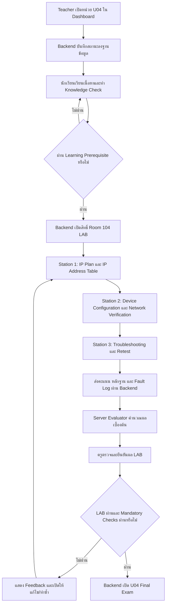

# แผนการสร้างห้องปฏิบัติการจำลอง 3D Room 104

## CCTV Network Configuration, IP Addressing & Troubleshooting

**ฉบับจัดทำต่อจากแผน Room 103:** 18 กันยายน 2569  
**รายวิชา:** วิชากล้องวงจรปิด  
**หน่วยการเรียนรู้:** หน่วยที่ 4 เครือข่ายสำหรับกล้อง IP  
**สถานะเอกสาร:** แผนเป้าหมายสำหรับการพัฒนาและตรวจรับ  
**เอกสารอ้างอิงหลัก:** [รายงานสถานะเว็บไซต์กลางการเรียนรู้](<E:/งานปี 2026/แผนการสอน หน่วยการสอน วิชาสอน คะแนน/ภาคเรียน2-69/กล้องวงจรปิด/IMPLEMENTATION_STATUS_REPORT_CCTV_LEARNING_CENTER_2026-09-18.md>)

> แผนฉบับนี้จัดทำต่อจาก Room 103 โดยใช้หลัก “ฐานข้อมูลชุดเดียว หลายมุมมอง” เช่นเดียวกัน การเปิดหน่วย การเข้า LAB คะแนน การตรวจงาน และการเปิดแบบทดสอบต้องทำผ่าน Backend และฐานข้อมูลเป็นหลัก ส่วน Teacher Dashboard เป็นช่องทางให้ครูตรวจสอบและอนุมัติข้อมูล

---

## 1. จุดประสงค์ของห้องปฏิบัติการ

Room 104 เป็นห้องปฏิบัติการจำลอง 3D สำหรับฝึกตั้งค่า ตรวจสอบ และแก้ไขปัญหาเครือข่ายของระบบ CCTV โดยเน้นกล้อง IP, NVR, PoE Switch, DHCP และ Static IP

ผู้เรียนต้องสามารถ

- กำหนดและตรวจสอบ IP Address, Subnet Mask, Default Gateway และ DNS
- อธิบายความแตกต่างระหว่าง DHCP, DHCP Reservation และ Static IP
- ตั้งค่าเครือข่ายให้กล้อง IP, NVR และอุปกรณ์เครือข่ายอยู่ในระบบเดียวกันอย่างถูกต้อง
- จัดทำและอ่าน IP Address Table
- ตรวจสอบ IP ซ้ำ ความผิดพลาดของ Subnet และ Gateway
- ใช้เครื่องมือตรวจสอบเครือข่าย เช่น Ping, ARP, IP Configuration, Traceroute และ DNS Lookup
- ตรวจสอบสถานะการเชื่อมต่อระหว่างกล้อง NVR Switch และ Gateway
- คำนวณและตรวจสอบ PoE Power Budget ของ Switch ในสถานการณ์จำลอง
- แก้ไขปัญหาการเชื่อมต่ออย่างเป็นลำดับขั้น
- บันทึกปัญหา สาเหตุ การทดสอบ ผลการแก้ไข และผล Retest
- ส่งผลการปฏิบัติและหลักฐานเข้าสู่ระบบเพื่อให้ครูตรวจสอบ

---

## 2. หัวข้อการปฏิบัติหลักของทั้ง 3 สถานี

| สถานี | หัวข้อปฏิบัติหลัก | ผลงานที่ต้องส่ง |
|---|---|---|
| Station 1 | การวางแผน IP Address และจัดทำ IP Address Table: IP Address, Subnet Mask, Gateway, DNS, DHCP และ Static IP | IP Address Table, Network Plan และเหตุผลการเลือก DHCP/Static |
| Station 2 | การตั้งค่าอุปกรณ์และตรวจสอบเครือข่าย: กล้อง IP, NVR, PoE Switch, DHCP/Static IP และเครื่องมือ Network Test | ค่าการตั้งค่าอุปกรณ์, ผล Ping/ARP/DNS/Route และผลตรวจ PoE |
| Station 3 | การแก้ไขปัญหาการเชื่อมต่ออย่างเป็นลำดับขั้น: IP ผิด, Subnet ผิด, Gateway/DNS ผิด, DHCP ล้มเหลว, IP ซ้ำ และ PoE ไม่พอ | Fault Log, ลำดับการวิเคราะห์, วิธีแก้ไข, ผล Retest และ Reflection |

Room 104 ใช้การประเมิน 3 สถานี รวม 100 คะแนน โดยให้ผู้เรียนปฏิบัติจากการวางแผน ไปสู่การตั้งค่าจริงในสถานการณ์จำลอง และจบด้วยการวินิจฉัยปัญหาอย่างมีหลักฐาน

---

## 3. หลักการสำคัญของระบบข้อมูลและการปลดล็อก

### 3.1 ฐานข้อมูลเป็นแหล่งข้อมูลกลางชุดเดียว

ข้อมูลของ Room 104 ต้องถูกจัดเก็บและยืนยันผ่าน Backend/ฐานข้อมูล ได้แก่

- สถานะการเปิดหน่วย U04
- สิทธิ์การเข้าใช้งาน Room 104 LAB
- IP Address Table ของผู้เรียน
- ค่าการตั้งค่า IP ของกล้อง NVR และ Switch
- ผลการทดสอบ Ping, ARP, DNS และเส้นทางเครือข่าย
- ผลการคำนวณ PoE Budget
- Fault Log และผล Retest
- คะแนนแต่ละสถานีและคะแนนรวม
- หลักฐานการปฏิบัติ
- ผลการตรวจและอนุมัติของครู
- ประวัติ Teacher Override และ Audit Log

Student Dashboard และ Teacher Dashboard ต้องอ่านข้อมูลจากชุดข้อมูลเดียวกัน แต่แสดงผลคนละมุมมอง

### 3.2 Teacher Dashboard เป็นช่องทางอนุมัติ

ครูสามารถดำเนินการผ่าน Teacher Dashboard ได้ เช่น

- เปิดหน่วย U04 ให้ห้องเรียนหรือผู้เรียน
- อนุมัติสิทธิ์เข้า LAB
- ตรวจ IP Address Table และหลักฐานการตั้งค่า
- ตรวจและยืนยันผล LAB
- ขอให้ผู้เรียนแก้ไขหรือส่งใหม่
- ปลดล็อกแบบทดสอบ U04 เป็นกรณีพิเศษ
- Override สถานะรายบุคคลพร้อมเหตุผล

ทุกการดำเนินการต้องส่งผ่าน Backend ไปยังฐานข้อมูล และต้องบันทึกผู้ดำเนินการ เวลา เหตุผล ขอบเขต และ Audit Log

### 3.3 LocalStorage ไม่ใช่แหล่งยืนยันผล

LocalStorage ใช้ได้เฉพาะข้อมูลชั่วคราวของหน้าจอหรือเกม เช่น ค่าในฟอร์มก่อนกดส่ง ตำแหน่งอุปกรณ์ หรือ UI State

ห้ามใช้ LocalStorage ยืนยันหลักสำหรับ

- IP Address Table ที่ผ่านแล้ว
- คะแนนการปฏิบัติ
- การผ่าน LAB
- การเปิดแบบทดสอบ U04
- การปลดล็อกหน่วยถัดไป

---

## 4. ลำดับการเรียนรู้และการเปิดใช้งาน



### กติกาการเปิดใช้งาน

| รายการ | เงื่อนไขหลัก | ผู้ยืนยัน |
|---|---|---|
| หน่วย U04 | ครูเปิดหน่วยหรือมี Teacher Override ที่บันทึกในฐานข้อมูล | Backend + Teacher Dashboard |
| เนื้อหา U04 | หน่วยเปิดและผู้เรียนอยู่ในชั้นเรียนที่มีสิทธิ์ | Backend |
| Room 104 LAB | ผ่าน Learning Prerequisite และ Pre-LAB Gate | Backend |
| Station 1–3 | LAB เปิดและมี Attempt ที่ถูกต้อง | Backend |
| ผล LAB ผ่าน | คะแนนถึงเกณฑ์, IP Table ถูกต้อง, Mandatory Checks ผ่าน และครูยืนยันเมื่อจำเป็น | Backend + Teacher Review |
| U04 Final Exam | LAB ผ่าน หรือมี Teacher Override ที่บันทึกเหตุผล | Backend |

หากครูต้องการเปิดข้ามขั้นตอน ต้องดำเนินการผ่าน Teacher Dashboard และบันทึกลงฐานข้อมูล ไม่ควรเปลี่ยนสถานะเฉพาะใน Browser

---

## 5. โครงสร้างการประเมิน Room 104

| สถานี | รายการ | คะแนน |
|---|---|---:|
| Station 1 | IP Address Planning และ IP Address Table | 35 |
| Station 2 | Device Configuration และ Network Verification | 35 |
| Station 3 | Systematic Troubleshooting, Fault Log และ Retest | 30 |
| **รวม** |  | **100** |

### เกณฑ์ผ่าน LAB เบื้องต้น

- คะแนนรวมไม่น้อยกว่า 70/100
- IP Address Table ไม่มี IP ซ้ำและค่าอุปกรณ์สอดคล้องกัน
- Mandatory Checks ผ่านครบ
- ไม่เกิด Critical Failure จากการตั้งค่าเครือข่ายหรือ PoE
- มี Fault Log และผล Retest เมื่อได้รับโจทย์ปัญหา
- ผลงานถูกส่งและบันทึกในฐานข้อมูล
- ครูตรวจและยืนยันตาม Workflow

คะแนน 35/35/30 เป็นคะแนนภายใน Room 104 LAB ไม่ใช่น้ำหนักคะแนนรายวิชาทั้งหมด การนำไปคำนวณผลรวมรายวิชาให้ใช้ Course Rubric กลางของระบบ

---

## 6. การแยกขอบเขต LAB กับ U04 Final Exam

| มิติการประเมิน | 3D LAB Room 104 | U04 Final Exam |
|---|---|---|
| บริบท | ช่างตั้งค่าและแก้ปัญหาอุปกรณ์ใน Network Workbench | ผู้ออกแบบระบบ CCTV วางแผนเครือข่ายระดับโครงการ |
| จุดเน้น | ปฏิบัติจริง ตรวจค่าจากเครื่องมือ และแก้ Fault ตามลำดับ | ออกแบบ Addressing Plan, Subnet, DHCP/Static Policy, DNS และเหตุผลเชิงระบบ |
| ผลลัพธ์ | IP Table, Device Config, Test Result, Fault Log และ Retest | Network Design, การคำนวณ Subnet/จำนวน Host, Policy และคำอธิบาย |
| หลักฐาน | ค่า Config, ผล Ping/ARP/DNS/Route และภาพสถานะอุปกรณ์ | ตาราง แผนผัง คำตอบอัตนัย และเหตุผล |

### ขอบเขตของ LAB

- ตั้งค่า IP Address และตรวจสอบค่าจริง
- ตรวจ Subnet Mask, Gateway และ DNS
- เปรียบเทียบ DHCP กับ Static IP จากสถานการณ์จำลอง
- จัดทำ IP Address Table
- ใช้เครื่องมือ Network Test
- วิเคราะห์ปัญหาและทำ Retest

### ขอบเขตของ U04 Final Exam

- ออกแบบ Addressing Plan สำหรับกล้องและ NVR หลายกลุ่ม
- คำนวณ Subnet และจำนวน Host ที่เหมาะสม
- กำหนดนโยบาย DHCP, Reservation และ Static IP
- อธิบายบทบาทของ Gateway และ DNS
- เสนอการแบ่งเครือข่ายหรือ VLAN ตามบริบทของระบบ
- อธิบายผลกระทบด้านความปลอดภัยและการบำรุงรักษา

---

## 7. รายละเอียดสถานีปฏิบัติการ

### Station 1: IP Address Planning และ IP Address Table — 35 คะแนน

#### จุดประสงค์

ฝึกวางแผนเครือข่ายและจัดทำตาราง IP สำหรับกล้อง IP, NVR, PoE Switch, Gateway และอุปกรณ์ที่เกี่ยวข้อง โดยตรวจสอบไม่ให้เกิด IP ซ้ำหรืออยู่คนละ Subnet โดยไม่ตั้งใจ

#### กิจกรรม Interactive Simulation

1. อ่าน Network Scenario และกำหนดจำนวนอุปกรณ์
2. ระบุ Network Address, Subnet Mask หรือ CIDR และจำนวน Host ที่ใช้ได้
3. จัดสรร IP ให้กล้อง NVR Switch และ Gateway
4. ระบุวิธีรับ IP ของแต่ละอุปกรณ์ว่าเป็น DHCP, DHCP Reservation หรือ Static IP
5. กำหนด Default Gateway และ DNS ให้เหมาะสมกับ Scenario
6. ตรวจว่า IP อยู่ใน Subnet เดียวกันเมื่อระบบกำหนดให้สื่อสารวงเดียวกัน
7. ตรวจสอบ IP ซ้ำและจัดทำ IP Address Table
8. ส่งตารางพร้อมเหตุผลเข้าสู่ระบบ

#### รูปแบบ IP Address Table

| Device ID | Device Type | MAC/Identifier | IP Address | Method | Subnet Mask/CIDR | Gateway | DNS | VLAN/Segment | Switch Port | Status |
|---|---|---|---|---|---|---|---|---|---|---|
| CAM-01 | IP Camera | จำลองจากโจทย์ | กำหนดตาม Scenario | Static/DHCP | กำหนดตาม Scenario | กำหนดตาม Scenario | กำหนดตาม Scenario | CCTV | กำหนดตาม Scenario | Planned |
| NVR-01 | NVR | จำลองจากโจทย์ | กำหนดตาม Scenario | Static | กำหนดตาม Scenario | กำหนดตาม Scenario | กำหนดตาม Scenario | CCTV | Uplink | Planned |

ค่าตัวเลขในตารางต้องเปลี่ยนตาม Scenario ของแต่ละ Attempt ไม่ควรล็อกให้ผู้เรียนใช้คำตอบเดียวทุกครั้ง

#### เกณฑ์คะแนน

| รายการ | คะแนน |
|---|---:|
| IP Address และการจัดสรรอุปกรณ์ไม่ซ้ำ | 12 |
| Subnet Mask/CIDR และการตรวจ Subnet | 8 |
| Gateway และ DNS | 5 |
| การเลือก DHCP, Reservation หรือ Static IP | 5 |
| ความครบถ้วนของ IP Address Table และเหตุผล | 5 |
| **รวม** | **35** |

#### Mandatory Checks

- ห้ามมี IP Address ซ้ำ
- ห้ามกำหนด Network Address หรือ Broadcast Address ให้เป็น Host โดยไม่ใช่กรณีที่โจทย์กำหนด
- อุปกรณ์ที่ต้องสื่อสารกันต้องอยู่ใน Subnet ที่ถูกต้อง
- ต้องกรอก Gateway และ DNS ตาม Scenario
- ต้องระบุวิธีรับ IP ของทุกอุปกรณ์
- ต้องส่ง IP Address Table พร้อม Cable/Device ID ที่ตรวจสอบย้อนกลับได้

---

### Station 2: Device Configuration และ Network Verification — 35 คะแนน

#### จุดประสงค์

ฝึกตั้งค่าเครือข่ายให้กล้อง IP, NVR และ PoE Switch แล้วใช้เครื่องมือตรวจสอบว่าการสื่อสารทำงานตาม IP Address Table

#### อุปกรณ์จำลอง

- IP Camera
- NVR
- PoE Switch
- DHCP Service หรือ DHCP Pool
- Gateway/Router
- DNS Service จำลอง
- Network Test Console

#### กิจกรรมปฏิบัติ

1. ตั้งค่าอุปกรณ์แบบ DHCP และตรวจสอบ Lease ที่ได้รับ
2. เปลี่ยนกล้องหรือ NVR เป็น Static IP ตาม IP Address Table
3. ตั้งค่า Subnet Mask, Gateway และ DNS
4. ตรวจสอบ IP Conflict และตรวจว่าค่าอุปกรณ์ตรงกับตาราง
5. ใช้ Ping ทดสอบการสื่อสารระหว่างกล้อง NVR Switch และ Gateway
6. ใช้ ARP ตรวจสอบการจับคู่ IP กับ MAC/Identifier
7. ใช้ IP Configuration ตรวจค่าที่อุปกรณ์ได้รับ
8. ใช้ DNS Lookup ตรวจการแปลงชื่อ หาก Scenario มี DNS Service
9. ใช้ Traceroute/Route View วิเคราะห์เส้นทางเมื่ออุปกรณ์อยู่คนละ Segment
10. ตรวจสอบสถานะ Link/Port และ PoE Budget ของ Switch

#### เครื่องมือที่ใช้ในสถานี

| เครื่องมือ | จุดประสงค์ |
|---|---|
| IP Configuration | ตรวจ IP, Mask, Gateway, DNS และ DHCP Lease |
| Ping | ตรวจการเข้าถึงปลายทางและ Packet Loss |
| ARP | ตรวจ IP-to-MAC/Identifier และค้นหาความผิดปกติ |
| DNS Lookup | ตรวจว่าชื่ออุปกรณ์แปลงเป็น IP ได้หรือไม่ |
| Traceroute/Route View | ตรวจเส้นทางและจุดที่การสื่อสารหยุด |
| IP Scanner | ค้นหาอุปกรณ์และตรวจ IP ซ้ำใน Scenario |
| Port/Link Status | ตรวจสถานะพอร์ตและการเชื่อมต่อกับ Switch |
| PoE Budget Meter | ตรวจโหลดกำลังไฟรวมของ Switch |

เครื่องมือในห้อง 3D เป็นเครื่องมือจำลองเพื่อการเรียนรู้ ผลลัพธ์ต้องถูกส่งเป็นหลักฐานหรือ Event ให้ Backend ตรวจสอบ ไม่ให้ Client เป็นผู้กำหนดคะแนนสุดท้ายเอง

#### PoE Budget ที่เกี่ยวข้องกับสถานี

หาก Scenario กำหนดให้ตรวจ PoE ให้คำนวณดังนี้

```text
Total PoE Requirement
= ผลรวมกำลังไฟของกล้องและอุปกรณ์ปลายทาง
  รวม Safety Margin ตามโจทย์

เงื่อนไขผ่านเบื้องต้น
= PoE Budget ของ Switch ต้องไม่น้อยกว่าความต้องการรวม
```

ผู้เรียนต้องใช้ค่า Power Consumption จากอุปกรณ์จำลองหรือ Datasheet ที่โจทย์กำหนด ไม่ใช้การเดาค่า

#### เกณฑ์คะแนน

| รายการ | คะแนน |
|---|---:|
| ตั้งค่า IP/Mask/Gateway/DNS ถูกต้อง | 10 |
| ตั้งค่า DHCP/Static IP ตาม IP Address Table | 7 |
| ใช้เครื่องมือ Ping/ARP/DNS/Route ได้ถูกต้อง | 8 |
| ตรวจ IP Conflict, Link/Port และ PoE Budget | 5 |
| บันทึกผลการทดสอบและอธิบายผล | 5 |
| **รวม** | **35** |

#### Mandatory Checks

- ต้องตรวจค่า Config หลังการตั้งค่า ไม่ถือว่าการกรอกค่าเป็นหลักฐานว่าระบบทำงาน
- ต้องมีผล Ping หรือ Test ที่ตรงกับ Scenario
- หากใช้ DHCP ต้องบันทึก Lease/ผลที่ได้รับ
- หากใช้ Static IP ต้องตรวจว่าไม่ซ้ำกับอุปกรณ์อื่น
- ต้องตรวจ PoE Budget เมื่อ Scenario มีอุปกรณ์ PoE
- ต้องบันทึกผลทดสอบตาม Device ID ใน IP Address Table

---

### Station 3: Systematic Troubleshooting, Fault Log และ Retest — 30 คะแนน

#### จุดประสงค์

ฝึกแก้ไขปัญหาการเชื่อมต่ออย่างเป็นลำดับขั้น ไม่แก้โดยการสุ่มเปลี่ยนค่า และต้องมีหลักฐานก่อนและหลังการแก้ไข

#### รูปแบบ Fault Challenge

ระบบสุ่มหรือกำหนดสถานการณ์ปัญหา เช่น

1. IP Address ของกล้องอยู่คนละ Subnet กับ NVR
2. Subnet Mask ผิด ทำให้สื่อสารได้เพียงบางอุปกรณ์
3. Default Gateway ผิด ทำให้ไปยังเครือข่ายอื่นไม่ได้
4. DNS ผิด ทำให้เรียกชื่ออุปกรณ์หรือบริการไม่ได้
5. DHCP Service ไม่ทำงานหรือ DHCP Pool เต็ม
6. กล้องตั้ง Static IP ซ้ำกับอุปกรณ์อื่น
7. สายหรือพอร์ต Switch ไม่ Link
8. PoE Budget ไม่พอ ทำให้กล้องรีสตาร์ตหรือ Online/Offline
9. Gateway หรือ Route ผิดในกรณีที่มีหลาย Segment
10. NVR ตั้งค่าปลายทางผิด แม้กล้องจะมี IP ถูกต้อง

#### ขั้นตอนการแก้ไขที่ผู้เรียนต้องปฏิบัติ

1. **Identify:** ระบุอาการและอุปกรณ์ที่ได้รับผลกระทบ
2. **Collect Evidence:** อ่าน IP Configuration, Link/Port, Ping, ARP, DNS หรือ Route ตามความเหมาะสม
3. **Check Physical/Link:** ตรวจสาย พอร์ต สถานะ Link และไฟเลี้ยง/PoE
4. **Check IP:** ตรวจ IP Address, Subnet Mask, Gateway และ DNS เทียบกับ IP Address Table
5. **Check DHCP/Static:** ตรวจ Lease, Reservation, Static IP และ IP Conflict
6. **Isolate:** ระบุจุดที่ปัญหาเริ่มเกิดและตัดสาเหตุที่ไม่เกี่ยวข้องออก
7. **Correct:** แก้ไขค่าเฉพาะจุด พร้อมบันทึกค่าก่อนและหลังแก้
8. **Verify:** ทดสอบ Ping, ARP, DNS, Route หรือ Live View ตามโจทย์
9. **Retest:** ทดสอบซ้ำจากอุปกรณ์ที่เกี่ยวข้องและตรวจว่าอาการไม่กลับมา
10. **Document:** สรุปปัญหา สาเหตุ วิธีแก้ ผลการทดสอบ และข้อเสนอแนะป้องกัน

#### Fault Log ที่ต้องส่ง

| รายการ | รายละเอียด |
|---|---|
| Problem | อาการที่พบและอุปกรณ์ที่ได้รับผลกระทบ |
| Possible Cause | สาเหตุที่เป็นไปได้ |
| Evidence/Test | เครื่องมือและผลการตรวจ |
| Root Cause | สาเหตุที่ยืนยันแล้ว |
| Solution | วิธีแก้และค่าที่เปลี่ยน |
| Verification | ผลการทดสอบหลังแก้ |
| Retest | ผลทดสอบซ้ำจากปลายทางที่เกี่ยวข้อง |
| Prevention | วิธีป้องกันไม่ให้เกิดซ้ำ |

#### เกณฑ์คะแนน

| รายการ | คะแนน |
|---|---:|
| ระบุอาการและเก็บหลักฐานถูกต้อง | 6 |
| วิเคราะห์ตามลำดับและระบุ Root Cause | 8 |
| แก้ไขค่า/อุปกรณ์ได้ตรงจุด | 6 |
| ทดสอบยืนยันและทำ Retest | 6 |
| Fault Log และการสื่อสารผลการแก้ไข | 4 |
| **รวม** | **30** |

#### Mandatory Checks

- ต้องมี Evidence ก่อนการแก้ไข
- ห้ามเปลี่ยนค่าหลายรายการโดยไม่บันทึกว่าเปลี่ยนอะไร
- ต้องตรวจ IP Conflict ก่อนสรุปว่าเป็นปัญหา Gateway
- ต้องแยกปัญหา Network กับปัญหา PoE/Physical Layer
- ต้องมีผล Retest หลังแก้ไข
- ต้องไม่ใช้คำตอบจาก LocalStorage เป็นหลักฐานผ่านงาน

---

## 8. IP Address Table และมาตรฐานข้อมูลการปฏิบัติ

### 8.1 ฟิลด์ข้อมูลที่ต้องมี

Room 104 ต้องจัดเก็บ IP Address Table อย่างน้อยดังนี้

- Device ID
- Device Type
- MAC Address หรือ Identifier ของอุปกรณ์จำลอง
- IP Address
- Address Method: DHCP, DHCP Reservation หรือ Static
- Subnet Mask/CIDR
- Default Gateway
- DNS Server
- VLAN/Network Segment ถ้ามี
- Switch Port/Uplink Port
- Expected Status
- Actual Status
- ผู้จัดทำและเวลาที่บันทึก

### 8.2 กติกาการตรวจ IP Address Table

- Device ID ต้องไม่ซ้ำ
- IP Address ต้องไม่ซ้ำใน Segment เดียวกัน
- IP ต้องอยู่ใน Subnet ที่กำหนด
- Gateway ต้องอยู่ใน Segment เดียวกับอุปกรณ์ที่ใช้ Gateway นั้น
- DNS ต้องตรงกับ Scenario หรือให้ผู้เรียนอธิบายเหตุผล
- อุปกรณ์ที่ใช้ DHCP ต้องมี Lease หรือผลการรับค่าจริง
- อุปกรณ์ที่ใช้ Static ต้องมีเหตุผลและต้องไม่ชนกับ DHCP Pool

### 8.3 ตัวอย่างการจัดสรรสำหรับการฝึก

ค่าตัวอย่างนี้ใช้เพื่อสร้าง Scenario เท่านั้น ต้องให้ระบบเปลี่ยนค่าตาม Attempt และไม่ถือเป็นค่าตายตัวของการติดตั้งจริง

| Device | Example Address | Method | Purpose |
|---|---|---|---|
| Gateway | `192.168.1.1` | Static | Default Gateway ของ Scenario |
| NVR | `192.168.1.10` | Static | ศูนย์กลางบันทึกภาพ |
| PoE Switch | `192.168.1.2` | Static/Management | จัดการ Switch |
| Camera 01 | `192.168.1.101` | DHCP Reservation/Static | กล้อง IP |
| Camera 02 | `192.168.1.102` | DHCP Reservation/Static | กล้อง IP |

การกำหนดค่าใช้งานจริงต้องอ้างอิง Network Plan, อุปกรณ์ และนโยบายของสถานที่ ไม่ใช้ตัวอย่างนี้แทนการออกแบบจริง

---

## 9. การออกแบบข้อมูลผลการปฏิบัติ

### 9.1 ข้อมูลที่ Client ส่ง

Client ส่งคำตอบ เหตุการณ์ และหลักฐาน ไม่ส่งคะแนนรวมที่เชื่อถือได้ เช่น

- Unit ID: `U04`
- Room ID: `ROOM_104`
- Attempt ID
- Station ID
- IP Address Table
- Device Configuration Events
- Tool Test Results
- PoE Budget Inputs และผลการวัดจำลอง
- Fault Log
- Retest Result
- Evidence และ Reflection
- เวลาที่เริ่มและส่งงาน

### 9.2 การคำนวณผลฝั่ง Server

Server Evaluator ต้อง

- ตรวจ Schema และสิทธิ์ผู้เรียน
- ตรวจว่า Unit และ LAB เปิดใช้งานจริง
- ตรวจ IP Address Table และความสอดคล้องของข้อมูล
- ตรวจค่าการตั้งค่า IP, Mask, Gateway, DNS และ DHCP/Static
- ตรวจผล Tool Test ตาม Scenario
- คำนวณ PoE Budget จากข้อมูลที่กำหนด
- ตรวจ Fault Log และ Required Process
- ตรวจ Retest Result
- คำนวณคะแนนแต่ละสถานีใหม่
- บันทึกผลลงฐานข้อมูล
- สร้างสถานะ `submitted`, `needs_review`, `passed` หรือ `failed`

คะแนนที่ส่งจาก Client ใช้เป็นข้อมูลประกอบเท่านั้น ไม่ใช่แหล่งยืนยันคะแนน

### 9.3 การตรวจและยืนยันโดยครู

Teacher Dashboard ต้องแสดงข้อมูลชุดเดียวกับ Backend เพื่อให้ครูตรวจได้

- IP Address Table ก่อนและหลังแก้ไข
- ผลการใช้เครื่องมือ
- PoE Budget
- Fault Log
- Retest
- คะแนนรายสถานี
- เหตุผลที่ระบบตัดสินผ่านหรือไม่ผ่าน

ครูสามารถยืนยันผล แก้ไขตาม Rubric ขอให้ส่งใหม่ หรือ Override สถานะได้ตามสิทธิ์ โดยทุกการแก้ไขต้องบันทึกผู้แก้ไข เวลา เหตุผล และค่าเดิม/ค่าใหม่ใน Audit Log

---

## 10. สถานะปัจจุบันเทียบกับโครงการจริง

จากการตรวจโครงการ พบว่า Room 104 มีต้นแบบและเนื้อหา Unit 04 อยู่แล้ว แต่แผนฉบับนี้ขยายขอบเขตให้ครอบคลุม DNS, DHCP/Static Policy, IP Address Table และ Troubleshooting Workflow อย่างเป็นระบบ

### สิ่งที่มีอยู่ในโครงการ

- [Room104NetworkingProps.tsx](<E:/งานปี 2026/แผนการสอน หน่วยการสอน วิชาสอน คะแนน/ภาคเรียน2-69/กล้องวงจรปิด/cctv-technician-3d-training-center/src/components/labs/3d/props/Room104NetworkingProps.tsx>)
- ช่องกรอก Static IP และ Gateway
- PoE Power Budget Meter และ Load Balance
- Ping Test Tool
- [evaluateUnit4Submission.ts](<E:/งานปี 2026/แผนการสอน หน่วยการสอน วิชาสอน คะแนน/ภาคเรียน2-69/กล้องวงจรปิด/cctv-technician-3d-training-center/src/server/game/evaluateUnit4Submission.ts>)
- Evaluator สำหรับ IP Allocation, Subnet/Gateway, PoE Budget, Load Balance และ Ping
- [unit04.ts](<E:/งานปี 2026/แผนการสอน หน่วยการสอน วิชาสอน คะแนน/ภาคเรียน2-69/กล้องวงจรปิด/cctv-technician-3d-training-center/src/content/courses/21909-2020/unit04.ts>)
- เนื้อหา IPv4, Subnet, Static/DHCP, PoE, Power Budget, Ping, ARP และ IP Scanner
- LAB Contract ที่มี Functional Tests ด้าน IP, PoE, Ping, IP Conflict และ Bandwidth
- Fault Challenge เรื่อง IP Conflict และ PoE ไม่เพียงพอ

### สิ่งที่ต้องขยายตามแผนฉบับนี้

- DNS Configuration และ DNS Lookup ที่ตรวจสอบได้
- IP Address Table ที่ส่งและตรวจจาก Backend
- DHCP Lease, DHCP Reservation และ Static IP Policy
- เครื่องมือ Network Test หลายประเภท
- Fault Challenge แบบเป็นลำดับขั้นพร้อม Evidence
- Fault Log และ Retest ที่บังคับก่อนผ่าน
- ตรวจ Gateway, DNS และ IP Conflict อย่างแยกสาเหตุ
- การตรวจสิทธิ์และการส่งคะแนนผ่านฐานข้อมูลกลาง

ห้ามรายงานว่าส่วนที่อยู่ในรายการเป้าหมายเสร็จแล้ว จนกว่าจะผ่าน Build, Test, Functional Flow และ UAT

---

## 11. แผนการสร้างและแก้ไขไฟล์

### 11.1 Domain Contract

**เป้าหมาย:** กำหนด Type และ Schema กลางของ Room 104

- กำหนด Device, IP Address, Subnet, Gateway และ DNS
- กำหนด Address Method: DHCP, Reservation และ Static
- กำหนด IP Address Table
- กำหนด Network Tool Result
- กำหนด PoE Budget Input/Result
- กำหนด Fault Log, Evidence และ Retest
- กำหนด Rubric และ Mandatory Checks ของ 3 สถานี
- ตรวจว่า Contract ไม่สร้างสถานะปลดล็อกแยกจาก Progress กลาง

### 11.2 Station UI

สร้างหรือปรับปรุงหน้าต่างปฏิบัติการ เช่น

- `Room104IpPlanningModal.tsx`
- `Room104NetworkConfigModal.tsx`
- `Room104NetworkToolsModal.tsx`
- `Room104TroubleshootingModal.tsx`
- `Room104NetworkingLab.tsx` เป็น Controller รวม 3 สถานี

ทุกหน้าต้อง

- อ่านสิทธิ์ LAB จาก Backend
- โหลด Scenario และ IP Address Table จากข้อมูลที่ระบบกำหนด
- ส่งคำตอบและ Event ตาม Schema กลาง
- ไม่คำนวณคะแนนสุดท้ายเอง
- แสดงสถานะการส่งจาก Backend
- รองรับ Feedback, Retry และ Retest

### 11.3 3D Scene Integration

ปรับ [Room104NetworkingProps.tsx](<E:/งานปี 2026/แผนการสอน หน่วยการสอน วิชาสอน คะแนน/ภาคเรียน2-69/กล้องวงจรปิด/cctv-technician-3d-training-center/src/components/labs/3d/props/Room104NetworkingProps.tsx>) ให้มีจุดโต้ตอบสำหรับ IP Planning, Network Configuration, Network Tools และ Troubleshooting โดยไม่สร้างเส้นทางปลดล็อกแยกจากระบบหลัก

### 11.4 Server Evaluation

ปรับ [evaluateUnit4Submission.ts](<E:/งานปี 2026/แผนการสอน หน่วยการสอน วิชาสอน คะแนน/ภาคเรียน2-69/กล้องวงจรปิด/cctv-technician-3d-training-center/src/server/game/evaluateUnit4Submission.ts>) ให้รองรับ

- Station 1: 35 คะแนน
- Station 2: 35 คะแนน
- Station 3: 30 คะแนน
- DNS, DHCP/Static และ IP Address Table
- Network Tool Results
- PoE Budget
- Fault Log และ Retest
- Mandatory Checks
- การตรวจสิทธิ์ Unit/LAB
- การบันทึก Attempt
- การคืนสถานะ `passed`, `failed` หรือ `needs_review`

Server ต้องคำนวณคะแนนจากคำตอบและ Event ที่ส่งมา ไม่รับคะแนนรวมจาก Client เป็นค่าที่เชื่อถือได้

### 11.5 Backend Submission and Teacher Review

เชื่อมผลการประเมินกับระบบกลางเพื่อให้

- สร้าง LAB Submission
- บันทึก IP Address Table และ Evidence
- ส่งผลเข้าสู่ Teacher Review
- บันทึกการอนุมัติหรือ Override
- อัปเดต Unit Progress
- ปลดล็อก U04 Final Exam เมื่อผ่านเงื่อนไข

---

## 12. Verification Plan

### 12.1 Static and Type Checks

1. รัน `npx tsc --noEmit`
2. รัน Lint ตาม Script ของโครงการ
3. ตรวจ Schema และ Type ของ Payload
4. ตรวจว่าไม่มีการใช้ LocalStorage เป็น Authority ของคะแนนหรือ Unlock

### 12.2 Unit and Integration Tests

ต้องมี Test สำหรับ

- IP Address ที่ถูกและผิด
- Subnet Mask/CIDR และการตรวจ Subnet
- Gateway และ DNS
- DHCP Lease, DHCP Reservation และ Static IP
- IP Address Table ไม่ซ้ำและข้อมูลสอดคล้องกัน
- Ping, ARP, DNS Lookup, Traceroute/Route และ IP Scanner
- IP Conflict
- PoE Budget และ Load Balance
- Fault Log และ Required Process
- Retest ก่อนผ่าน
- คะแนนรวม 35/35/30
- คะแนนต่ำกว่า 70
- ครู Override
- ผู้ไม่มีสิทธิ์เข้า LAB
- การส่งซ้ำและ Attempt ใหม่
- การอ่านสถานะหลัง Refresh และ Login ใหม่

### 12.3 Database and Authority Tests

- ตรวจว่าคะแนนสุดท้ายและ IP Table ถูกอ่านจากฐานข้อมูล
- แก้ LocalStorage แล้วสถานะไม่เปลี่ยน
- ส่งคะแนนปลอมจาก Client แล้ว Server ไม่ยอมรับเป็นคะแนนจริง
- Teacher Override ถูกบันทึกและตรวจสอบย้อนหลังได้
- นักเรียนและครูเห็นข้อมูลชุดเดียวกันสำหรับผู้เรียนคนเดียวกัน
- การแก้ไข IP Table หรือ Fault Log มีผู้แก้ไขและเวลาใน Audit Log

### 12.4 Manual Functional Flow

1. ครูเปิด U04 จาก Teacher Dashboard
2. ตรวจว่าฐานข้อมูลมีสถานะการเปิดหน่วย
3. นักเรียนเรียนเนื้อหาและผ่าน Learning Prerequisite
4. ตรวจว่า Backend เปิด Room 104 LAB
5. ทำ Station 1 และส่ง IP Address Table
6. ทำ Station 2 ตั้งค่าอุปกรณ์และตรวจ Network Tools
7. ทำ Station 3 วิเคราะห์ Fault ตามลำดับ
8. แก้ไขปัญหาและทำ Retest
9. ส่งคะแนน หลักฐาน และ Fault Log ผ่าน Backend
10. ตรวจคะแนนที่บันทึกในฐานข้อมูล
11. ให้ครูตรวจและยืนยันผล
12. ตรวจว่า U04 Final Exam เปิดเมื่อผ่านเงื่อนไข
13. Logout/Login ใหม่และตรวจสถานะ
14. เปิดจาก Browser หรืออุปกรณ์อื่นและตรวจว่าข้อมูลตรงกัน

### 12.5 UAT

ต้องทดลองกับครูและนักเรียนจริง โดยครอบคลุม

- ผู้เรียนที่ผ่านทุกขั้นตอน
- ผู้เรียนที่กำหนด IP ผิด
- ผู้เรียนที่ใช้ DHCP ไม่สำเร็จ
- ผู้เรียนที่เกิด IP Conflict
- ผู้เรียนที่ Gateway หรือ DNS ผิด
- ผู้เรียนที่ PoE Budget ไม่เพียงพอ
- ผู้เรียนที่แก้ปัญหาได้แต่ไม่มี Evidence ก่อนแก้
- ครู Override เป็นกรณีพิเศษ
- การทำงานบนเครื่องระดับต่ำ กลาง และสูง
- ความเข้าใจของผู้เรียนต่อ Feedback และเหตุผลการล็อก

---

## 13. เกณฑ์ตรวจรับ Room 104

Room 104 จะถือว่าพร้อมใช้งานเมื่อผ่านเกณฑ์ทั้งหมดต่อไปนี้

- ผู้เรียนไม่สามารถเข้า LAB ก่อนผ่านเงื่อนไขที่ Backend กำหนด
- ครูสามารถเปิดหน่วยและปลดล็อกผ่าน Teacher Dashboard ได้
- การปลดล็อกถูกบันทึกในฐานข้อมูลและมี Audit Log
- Station 1 รองรับ IP Address, Subnet Mask, Gateway, DNS, DHCP, Static IP และ IP Address Table
- Station 2 รองรับการตั้งค่าอุปกรณ์และเครื่องมือตรวจสอบเครือข่าย
- Station 3 รองรับการแก้ไขปัญหาอย่างเป็นลำดับขั้นและมี Retest
- IP Address Table ไม่มี IP ซ้ำและข้อมูลอุปกรณ์สอดคล้องกัน
- ผล Ping/ARP/DNS/Route และ Network Tool ถูกบันทึกตาม Attempt
- PoE Budget ถูกตรวจเมื่อ Scenario กำหนด
- คะแนนรวมถูกคำนวณโดย Server Evaluator
- Client ไม่สามารถกำหนดคะแนนสุดท้ายเอง
- ผล LAB และ Fault Log ถูกบันทึกในฐานข้อมูล
- ครูสามารถตรวจและยืนยันผลได้
- แบบทดสอบ U04 เปิดเฉพาะเมื่อ LAB ผ่านหรือมี Teacher Override ที่บันทึกเหตุผล
- Refresh, Logout/Login และเปลี่ยนอุปกรณ์แล้วยังเห็นข้อมูลชุดเดียวกัน
- Build ผ่าน
- Test ผ่านทั้งหมด
- Functional Flow ผ่าน
- UAT ผ่าน

---

## 14. ความเสี่ยงและแนวทางควบคุม

| ความเสี่ยง | ผลกระทบ | แนวทางควบคุม |
|---|---|---|
| ผู้เรียนกรอก IP Table ถูกแต่ไม่ได้ตั้งค่าจริง | ผลงานไม่สะท้อนทักษะปฏิบัติ | บังคับให้มี Config Evidence และ Network Test |
| IP ซ้ำหรือ DHCP Pool ชนกับ Static IP | กล้อง/NVR สื่อสารไม่เสถียร | ตรวจ Address Method, Lease และ Conflict ฝั่ง Server |
| ใช้ Ping อย่างเดียวแล้วสรุปสาเหตุ | แก้ปัญหาผิดจุด | บังคับ Troubleshooting Workflow และ Fault Log |
| DNS ถูกละเลยเพราะ Ping ด้วย IP ผ่าน | ระบบเรียกชื่อหรือบริการบางส่วนล้มเหลว | เพิ่ม DNS Lookup และกรณี DNS Fault |
| Gateway ผิดแต่ทดสอบเฉพาะวง LAN | ไม่พบปัญหาข้ามเครือข่าย | เพิ่ม Route/Traceroute Scenario |
| PoE Budget ไม่พอ | กล้องรีสตาร์ตหรือ Online/Offline | บังคับคำนวณและตรวจโหลดก่อนสรุปผล |
| LocalStorage ยังมีอำนาจตัดสินสถานะ | ข้อมูลไม่ตรงฐานข้อมูล | จำกัด LocalStorage เป็นข้อมูลชั่วคราว |
| Client ส่งคะแนนรวมมาเอง | คะแนนอาจถูกแก้ไข | ให้ Server คำนวณจากคำตอบและ Event |
| โค้ดต้นแบบยังมีเฉพาะ IP/Gateway/Ping | ไม่ครอบคลุมหัวข้อ DNS/DHCP/Tool/Troubleshooting | ขยาย Contract, UI, Evaluator และ UAT ตามแผนนี้ |

---

## 15. สรุปแผน Room 104

Room 104 ใช้การประเมิน 3 สถานี 35/35/30 เพื่อวัดความสามารถตั้งแต่การวางแผน IP Address การจัดทำ IP Address Table การตั้งค่าอุปกรณ์ การใช้เครื่องมือตรวจสอบเครือข่าย และการแก้ไขปัญหาการเชื่อมต่ออย่างเป็นลำดับขั้น

สาระสำคัญของห้องนี้คือผู้เรียนต้องไม่เพียงกรอกค่า IP ให้ถูก แต่ต้องสามารถอธิบายความสัมพันธ์ระหว่าง IP Address, Subnet Mask, Gateway, DNS, DHCP และ Static IP รวมถึงต้องใช้หลักฐานจากเครื่องมือเพื่อวิเคราะห์ปัญหาและยืนยันผลหลังแก้ไข

Room 104 เป็นส่วนหนึ่งของระบบความก้าวหน้ากลาง โดย

- การเปิดหน่วยมาจาก Teacher Dashboard และถูกบันทึกในฐานข้อมูล
- การเปิด LAB และแบบทดสอบใช้สถานะจาก Backend
- IP Address Table, คะแนน, Tool Results และ Fault Log ถูกส่งเข้าฐานข้อมูล
- Server Evaluator เป็นผู้คำนวณผลเบื้องต้น
- ครูเป็นผู้ตรวจและ Override ได้ตามสิทธิ์
- Student Dashboard และ Teacher Dashboard ใช้ข้อมูลชุดเดียวกัน

สถานะของเอกสารนี้คือ **แผนพัฒนา Room 104 ที่พร้อมใช้เป็นข้อกำหนดงาน** แต่ยังไม่ใช่หลักฐานว่าฟีเจอร์ทั้งหมดเสร็จสมบูรณ์ จนกว่าจะผ่าน Build, Test, Functional Flow และ UAT ตามเกณฑ์ตรวจรับ

**เอกสารฉบับนี้จัดทำเพื่อวางแผนเท่านั้น ยังไม่มีการแก้ไข Source Code หรือฐานข้อมูล**
