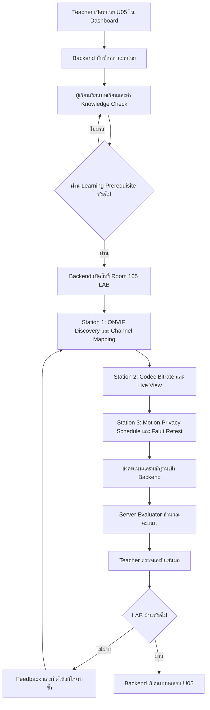

# แผนการสร้างห้องปฏิบัติการจำลอง 3D Room 105

## DVR/NVR Configuration, ONVIF, Video Compression & Recording Management

**ฉบับจัดทำ:** 19 กันยายน 2569  
**รายวิชา:** วิชากล้องวงจรปิด  
**หน่วยการเรียนรู้:** หน่วยที่ 5 การตั้งค่า DVR และ NVR  
**สถานะเอกสาร:** แผนเป้าหมายสำหรับการพัฒนาและตรวจรับ  
**แนวทางอ้างอิง:** โครงสร้าง Room 102–104, `unit05.ts`, `Room105NvrConfigProps.tsx` และ `evaluateUnit5Submission.ts`

> แผนนี้ใช้รูปแบบเดียวกับห้องก่อนหน้า คือให้ผู้เรียนเดินตัวละครไปยัง Station แล้วกด `E` เพื่อเปิด Overlay ปฏิบัติภารกิจ แต่การให้คะแนน การผ่าน LAB และการปลดล็อกแบบทดสอบต้องอ้างอิง Backend และฐานข้อมูลเป็นหลัก

---

## 1. จุดประสงค์ของห้องปฏิบัติการ

Room 105 เป็นห้องปฏิบัติการจำลอง 3D สำหรับฝึกติดตั้งและตั้งค่าเครื่องบันทึก DVR/NVR ให้ค้นพบกล้อง เชื่อมต่อช่องสัญญาณ ตั้งค่าการบีบอัดวิดีโอ จัดการ Live View, Motion Detection, Privacy Mask และ Recording Schedule ได้อย่างเป็นระบบ

ผู้เรียนต้องสามารถ

- อธิบายหน้าที่และโครงสร้างการทำงานของ DVR/NVR
- ค้นหากล้องในเครือข่ายด้วย ONVIF และตรวจสอบสิทธิ์การเชื่อมต่อ
- เพิ่มกล้องและจับคู่ Channel กับ IP Address และตำแหน่งติดตั้ง
- อธิบายความแตกต่างระหว่าง H.264 และ H.265
- ตั้งค่า Resolution, Frame Rate และ Bitrate ให้เหมาะกับระบบ
- ตรวจสอบ Live View แบบหลายช่องสัญญาณ
- ตั้งค่าพื้นที่ Motion Detection และ Sensitivity
- กำหนด Privacy Mask สำหรับพื้นที่ส่วนบุคคล
- ตั้ง Recording Schedule แบบ Continuous, Motion และ Alarm
- วิเคราะห์ปัญหา Account Locked, ภาพกระตุก หรือ Bitrate สูงเกิน
- บันทึก Fault Log และผล Retest อย่างมีลำดับขั้น
- ส่งคะแนน หลักฐาน และผลการปฏิบัติเข้าสู่ระบบเพื่อให้ครูตรวจสอบ

## 2. สาระสำคัญ

การตั้งค่า DVR/NVR ต้องเชื่อมโยงตั้งแต่การค้นหากล้อง การยืนยันตัวตน การจับคู่ Channel การเลือก Codec และการกำหนดวิธีบันทึก หากตั้งค่าผิดอาจทำให้กล้องไม่แสดงภาพ ภาพกระตุก ใช้พื้นที่จัดเก็บมาก หรือเกิดการบันทึกพื้นที่ส่วนบุคคลโดยไม่เหมาะสม

หัวข้อความรู้หลัก:

- DVR/NVR Architecture และเมนูการทำงาน
- ONVIF Profile S/G/T และ RTSP
- Channel Mapping และสถานะ Online/Offline
- H.264, H.265 และ H.265+
- Main Stream, Sub Stream, Resolution, FPS และ Bitrate
- CBR กับ VBR
- Motion Detection Grid และ Sensitivity
- Privacy Masking
- Continuous Recording, Motion Recording และ Alarm Recording
- Fault Log, Retest และการตรวจสอบหลักฐาน

## 3. หัวข้อปฏิบัติของทั้ง 3 Station

| Station | หัวข้อปฏิบัติหลัก | ผลงานที่ต้องส่ง | คะแนนเสนอแนะ |
|---|---|---|---:|
| Station 1 | ค้นหากล้องด้วย ONVIF, ยืนยันตัวตน และจับคู่ Channel | Channel Mapping Table, ผล ONVIF Discovery และหลักฐานสถานะกล้อง | 35 |
| Station 2 | ตั้งค่า Codec, Resolution, FPS, Bitrate และตรวจสอบ Live View | Video Configuration Sheet, ผลเปรียบเทียบ Bandwidth/Storage และ Live View Check | 35 |
| Station 3 | ตั้ง Motion Detection, Privacy Mask, Recording Schedule และแก้ Fault | Motion/Privacy Plan, Recording Schedule, Fault Log และ Retest Result | 30 |
| **รวม** |  |  | **100** |

> คะแนน 35/35/30 เป็นคะแนนภายใน Room 105 LAB สำหรับการปฏิบัติจำลอง ไม่ใช่น้ำหนักคะแนนรวมของรายวิชา การคำนวณผลการเรียนให้ใช้ Course Rubric กลางของระบบ

## 4. หลักการระบบข้อมูลและการปลดล็อก

### 4.1 ฐานข้อมูลเป็นแหล่งข้อมูลกลาง

ข้อมูล Room 105 ที่ต้องบันทึกและยืนยันผ่าน Backend/ฐานข้อมูล ได้แก่

- สถานะการเปิดหน่วย U05
- สิทธิ์การเข้าใช้งาน Room 105 LAB
- ผล ONVIF Discovery และรายชื่อ Channel
- Username/Authentication Status โดยไม่บันทึกรหัสผ่านจริง
- Channel Mapping และสถานะ Online/Offline
- ค่า Codec, Resolution, FPS และ Bitrate
- ผล Live View และการทดสอบการสตรีม
- Motion Detection Grid และ Sensitivity
- Privacy Mask Boundary
- Recording Schedule
- Fault Log, วิธีทดสอบ และผล Retest
- คะแนนราย Station และคะแนนรวม
- หลักฐานการปฏิบัติ
- ผลการตรวจยืนยันของ Teacher
- ประวัติ Teacher Override และ Audit Log

Student Dashboard และ Teacher Dashboard ต้องอ่านข้อมูลจากฐานข้อมูลชุดเดียวกัน แต่แสดงผลคนละมุมมอง

### 4.2 Teacher Dashboard

Teacher สามารถดำเนินการได้ดังนี้

- เปิดหน่วย U05 ให้ชั้นเรียนหรือผู้เรียน
- อนุมัติสิทธิ์เข้า Room 105 LAB
- ตรวจ Channel Mapping และ Video Configuration Sheet
- ตรวจหลักฐาน Motion, Privacy Mask และ Recording Schedule
- ตรวจ Fault Log และ Retest Result
- ส่ง Feedback ให้ผู้เรียนแก้ไขหรือส่งใหม่
- ยืนยันผล LAB
- ปลดล็อกแบบทดสอบ U05 เมื่อผ่านเงื่อนไข
- Override สถานะรายบุคคลพร้อมเหตุผล

ทุกคำสั่งต้องส่งผ่าน Backend และบันทึกผู้ดำเนินการ เวลา เหตุผล ขอบเขต และ Audit Log

### 4.3 LocalStorage

LocalStorage หรือ Zustand ใช้เก็บสถานะชั่วคราวของหน้าจอ เช่น ค่าที่กำลังกรอก ตำแหน่งตัวละคร และ UI State เท่านั้น

ห้ามใช้เป็นแหล่งยืนยันหลักสำหรับ:

- คะแนน Room 105
- ผล ONVIF ที่ผ่านแล้ว
- การผ่าน LAB
- การเปิดแบบทดสอบ U05
- การปลดล็อกหน่วยถัดไป

## 5. ลำดับการเรียนรู้และการเปิดใช้งาน



### กติกาการเปิดใช้งาน

| รายการ | เงื่อนไขหลัก | ผู้ยืนยัน |
|---|---|---|
| หน่วย U05 | Teacher เปิดหน่วยหรือมี Override ที่บันทึกในฐานข้อมูล | Backend + Teacher Dashboard |
| เนื้อหา U05 | หน่วยเปิดและผู้เรียนมีสิทธิ์ในชั้นเรียน | Backend |
| Room 105 LAB | ผ่าน Knowledge Check และ Pre-LAB Gate | Backend |
| Station 1–3 | LAB เปิดและมี Attempt ที่ถูกต้อง | Backend |
| LAB ผ่าน | คะแนนถึงเกณฑ์, ONVIF ผ่าน, มีหลักฐานครบ และ Teacher ยืนยันตามกติกา | Backend + Teacher |
| แบบทดสอบ U05 | LAB ผ่าน หรือ Teacher Override พร้อมเหตุผล | Backend |

## 6. รูปแบบการสร้างห้อง 3D

Room 105 ใช้สถาปัตยกรรมแบบแยกส่วนตามแม่แบบ Room 102

```text
Cctv3DLabApp
      ↓
Room105NvrConfigProps
      ↓
ผู้เรียนเดินไปยังโต๊ะ Station
      ↓
กด E หรือคลิกป้าย Station
      ↓
Room105NvrLab
      ↓
Station Modal 1 / 2 / 3
      ↓
Room105 State + Submission Payload
      ↓
Server Evaluator
      ↓
Backend / Database
      ↓
Teacher Dashboard
```

### ตำแหน่ง Station ที่เสนอ

| Station | ตำแหน่งโดยประมาณ | องค์ประกอบ 3D |
|---|---|---|
| 1 | `[x: 4, z: -4]` | ONVIF Discovery Console และกล้องจำลอง |
| 2 | `[x: 10, z: -4]` | NVR Monitor และ Video Configuration Desk |
| 3 | `[x: 16, z: -4]` | Motion/Privacy/Recording Workbench |

การจัดตำแหน่งจริงต้องตรวจไม่ให้ชนกับประตู ผนัง หรือสิ่งกีดขวางของห้อง

### ข้อกำหนดของป้าย Station

- ป้ายต้องเป็น Object หรือ HTML Overlay ที่แยกจาก Background
- ต้องมองเห็นได้ชัดจากระยะเดินปกติ
- ต้องมีชื่อ Station และหัวข้อภารกิจ
- ต้องมีสถานะ `ยังไม่เริ่ม`, `กำลังทำ`, `เสร็จแล้ว` และ `รอตรวจ`
- ต้องมีข้อความแนะนำ `กด E เพื่อเริ่มปฏิบัติ`
- ห้ามฝังข้อความ Station ไว้ใน Texture หรือ Background จนแก้ไขแยกไม่ได้

## 7. รายละเอียด Station 1

### ONVIF Discovery และ Channel Mapping — 35 คะแนน

#### จุดประสงค์

ให้ผู้เรียนค้นหากล้องในวง LAN ด้วย ONVIF ตรวจสอบ Profile และ Authentication แล้วจับคู่กล้องกับ Channel ใน NVR ได้อย่างถูกต้อง

#### ขั้นตอนปฏิบัติ

1. เดินทางไป Station 1 และกด `E`
2. อ่าน Network Scenario และรายชื่อกล้องที่อยู่ในระบบ
3. กดค้นหาอุปกรณ์ด้วย ONVIF
4. ตรวจสอบ IP Address, Device Name, MAC/Identifier และ Profile
5. กรอกข้อมูล Authentication ตามบัญชีจำลอง
6. เลือกกล้องและจับคู่กับ Channel ของ NVR
7. ตรวจสอบสถานะ Online และภาพ Preview
8. บันทึก Channel Mapping Table
9. ส่งผล Station 1

#### ข้อมูลที่ต้องบันทึก

| Device ID | IP Address | ONVIF Profile | NVR Channel | Authentication | Status |
|---|---|---|---|---|---|
| CAM-01 | `[ ]` | `[S/G/T]` | `[ ]` | `[ผ่าน/ไม่ผ่าน]` | `[Online/Offline]` |
| CAM-02 | `[ ]` | `[S/G/T]` | `[ ]` | `[ผ่าน/ไม่ผ่าน]` | `[Online/Offline]` |

#### เกณฑ์คะแนน

| รายการ | คะแนน |
|---|---:|
| ONVIF Discovery และพบอุปกรณ์ถูกต้อง | 10 |
| Authentication และตรวจสอบ Profile | 8 |
| Channel Mapping ตรงกับ IP/ตำแหน่งกล้อง | 10 |
| ตรวจสอบสถานะ Online และภาพ Preview | 7 |
| **รวม** | **35** |

#### Mandatory Checks

- ต้องพบกล้องอย่างน้อย `[2]` ช่อง
- ห้ามจับกล้องซ้ำ Channel
- Channel ต้องตรงกับ Device ID และ IP Address
- ต้องตรวจสอบสถานะ Online ก่อนส่งผล
- ห้ามเก็บรหัสผ่านจริงใน Payload หรือ Log

## 8. รายละเอียด Station 2

### Video Codec, Bitrate และ Live View — 35 คะแนน

#### จุดประสงค์

ให้ผู้เรียนเลือก Codec และตั้งค่าคุณภาพภาพให้สมดุลระหว่างรายละเอียดภาพ Bandwidth และพื้นที่จัดเก็บ พร้อมตรวจสอบ Live View แบบหลายช่องสัญญาณ

#### ขั้นตอนปฏิบัติ

1. เดินทางไป Station 2 และกด `E`
2. เลือกกล้องหรือ Channel ที่ต้องการตั้งค่า
3. เปรียบเทียบ H.264 กับ H.265 จากสถานการณ์ที่กำหนด
4. ตั้งค่า Main Stream และ Sub Stream
5. กำหนด Resolution, FPS และ Bitrate
6. เลือก CBR หรือ VBR พร้อมระบุเหตุผล
7. ตรวจสอบ Bandwidth และ Storage Estimate
8. เปิด Live View แบบ Multi-Split
9. ตรวจสอบภาพกระตุก ภาพไม่ขึ้น หรือความหน่วง
10. บันทึก Video Configuration Sheet และส่งผล

#### เกณฑ์คะแนน

| รายการ | คะแนน |
|---|---:|
| เลือก Codec เหมาะสมกับ Scenario | 10 |
| ตั้ง Resolution และ FPS เหมาะสม | 8 |
| ตั้ง Bitrate/CBR/VBR และอธิบายเหตุผล | 8 |
| ตรวจสอบ Bandwidth/Storage และ Live View | 9 |
| **รวม** | **35** |

#### ผลงานที่ต้องส่ง

- Video Configuration Sheet
- ค่า Codec, Resolution, FPS และ Bitrate
- ผลเปรียบเทียบ H.264/H.265
- ผล Live View ของแต่ละ Channel
- ภาพหรือข้อมูลหลักฐานการตั้งค่า

## 9. รายละเอียด Station 3

### Motion Detection, Privacy Mask, Schedule และ Fault Retest — 30 คะแนน

#### จุดประสงค์

ให้ผู้เรียนตั้งค่าการตรวจจับการเคลื่อนไหว ปิดบังพื้นที่ส่วนบุคคล กำหนดตารางการบันทึก และแก้ปัญหา NVR อย่างเป็นลำดับขั้น

#### ขั้นตอนปฏิบัติ

1. เดินทางไป Station 3 และกด `E`
2. วาด Motion Detection Grid ให้ตรงกับพื้นที่เกิดเหตุ
3. ตั้งค่า Sensitivity และลด False Alarm จากใบไม้หรือแสงเงา
4. กำหนด Privacy Mask ในพื้นที่ที่ไม่ควรบันทึก
5. ตั้ง Recording Schedule แบบ Continuous, Motion หรือ Alarm
6. ทดสอบ Trigger และตรวจสอบสถานะการบันทึก
7. รับ Fault Scenario เช่น Account Locked หรือ Bitrate สูงเกิน
8. บันทึก Problem, Possible Cause, Test, Result และ Solution
9. แก้ไขระบบและทำ Retest
10. ส่ง Fault Log และผล Station 3

#### เกณฑ์คะแนน

| รายการ | คะแนน |
|---|---:|
| Motion Detection Grid และ Sensitivity | 8 |
| Privacy Mask Boundary | 7 |
| Recording Schedule และ Trigger Test | 7 |
| Fault Log, วิธีแก้ และ Retest Result | 8 |
| **รวม** | **30** |

#### รูปแบบ Fault Log

| หัวข้อ | รายละเอียด |
|---|---|
| Problem | `[อาการที่พบ]` |
| Possible Cause | `[สาเหตุที่เป็นไปได้]` |
| Test | `[เครื่องมือหรือขั้นตอนตรวจสอบ]` |
| Result | `[ผลที่ตรวจพบ]` |
| Solution | `[วิธีแก้ไข]` |
| Retest | `[ผลทดสอบหลังแก้ไข]` |

## 10. การออกแบบ Overlay

แต่ละ Station ต้องมีโครงสร้าง Overlay ดังนี้

1. Header แสดงชื่อ Station และคะแนนปัจจุบัน
2. Scenario และคำสั่งงาน
3. พื้นที่จำลอง NVR หรือแผงตั้งค่า
4. ตารางหรือฟอร์มบันทึกข้อมูล
5. แถบสถานะความครบถ้วนของงาน
6. ปุ่มคำใบ้ ถ้ามีการกำหนดไว้
7. ปุ่มบันทึกผล Station
8. ปุ่มปิดและกลับไปห้อง 3D

ข้อกำหนด:

- เปิด Overlay ได้เมื่อ Backend ยืนยันสิทธิ์เข้า LAB แล้ว
- เมื่อเปิด Overlay ต้องหยุดการเคลื่อนที่ของตัวละคร
- ห้ามบันทึกผลก่อนกรอกข้อมูลสำคัญครบ
- ปิด Overlay แล้วต้องกลับสู่ตำแหน่งเดิม
- รองรับการกด `E` และการคลิกปุ่มที่เห็นชัด
- ไม่เปิดเผยรหัสผ่านกล้องจริงหรือข้อมูลลับในหน้าจอและ Payload

## 11. โครงสร้างข้อมูลที่เสนอ

```ts
type Room105LabState = {
  station1: {
    completed: boolean;
    score: number;
    onvifDiscovered: boolean;
    discoveredChannels: string[];
    channelMapping: Record<string, string>;
    evidence: Record<string, unknown>;
  };
  station2: {
    completed: boolean;
    score: number;
    videoCodec: 'H.264' | 'H.265';
    resolution: string;
    frameRate: number;
    bitrate: number;
    bitrateMode: 'CBR' | 'VBR';
    liveViewVerified: boolean;
    evidence: Record<string, unknown>;
  };
  station3: {
    completed: boolean;
    score: number;
    motionGrid: Record<string, unknown>;
    sensitivity: number;
    privacyMask: Record<string, unknown>;
    recordingSchedule: Record<string, unknown>;
    faultLog: Record<string, string>;
    retestPassed: boolean;
    evidence: Record<string, unknown>;
  };
};
```

### Submission Payload

```ts
type Room105SubmissionPayload = {
  roomId: 'room-105';
  unitNumber: 5;
  station1: Room105LabState['station1'];
  station2: Room105LabState['station2'];
  station3: Room105LabState['station3'];
  clientScore?: number;
  timestamp: string;
};
```

> `clientScore` ใช้แสดงผลเบื้องต้นเท่านั้น Server ต้องคำนวณคะแนนใหม่จากข้อมูลดิบและหลักฐานที่ส่งมา

## 12. การประเมินผลฝั่ง Server

ไฟล์ประเมินผลที่มีอยู่แล้วคือ `evaluateUnit5Submission.ts` โดยปัจจุบันตรวจข้อมูลหลักดังนี้

- ONVIF Discovery และจำนวน Channel
- Video Codec H.264/H.265
- Privacy Masking
- คะแนนรวมและ Hint Penalty
- Mandatory Checks ได้แก่ Camera Online, NVR Reachable และ Client Live View

เกณฑ์ปัจจุบันของ Evaluator:

| รายการ | คะแนนสูงสุด |
|---|---:|
| ONVIF Discovery | 20 |
| Channel Assignment | 20 |
| H.265 Compression | 20 |
| Bitrate Optimization | 20 |
| Privacy Masking | 20 |
| **รวม** | **100** |

เงื่อนไขผ่านปัจจุบันคือคะแนนไม่น้อยกว่า 70 และต้องค้นพบ ONVIF สำเร็จ

### งานที่ต้องปรับให้ตรงกับแผน 3 Station

- เพิ่มข้อมูล Station 1–3 ให้ Evaluator ตรวจจากข้อมูลดิบ ไม่รับเฉพาะคะแนนที่ Client ส่งมา
- เพิ่มการตรวจ Channel Mapping ซ้ำและ Channel Collision
- เพิ่มการตรวจ Resolution, FPS, Bitrate และ CBR/VBR
- เพิ่มการตรวจ Motion Grid, Sensitivity และ Recording Schedule
- เพิ่มการตรวจ Fault Log และ Retest Result
- แยกคะแนนภายใน Station ให้ตรงกับ 35/35/30 หรือระบุ Mapping กับ Evaluator ให้ชัดเจน
- เพิ่ม Test Case สำหรับ Room 105 โดยเฉพาะ

## 13. กิจกรรมการเรียนรู้

### จุดประสงค์

ผู้เรียนสามารถตั้งค่า NVR เชื่อมต่อกล้องผ่าน ONVIF ปรับ Video Compression และจัดการการบันทึกได้อย่างถูกต้องและปลอดภัย

### กิจกรรม

1. ครูอธิบายสถาปัตยกรรม DVR/NVR และการเชื่อมต่อกล้อง
2. ผู้เรียนศึกษา ONVIF, RTSP, Codec และ Recording Mode
3. ผู้เรียนตอบคำถามระหว่างเรียน
4. ระบบตรวจสอบ Learning Prerequisite และ Pre-LAB Gate
5. ผู้เรียนเข้าห้อง Room 105 เมื่อ Backend เปิดสิทธิ์
6. ผู้เรียนเดินไป Station 1–3 และปฏิบัติตาม Work Order
7. ผู้เรียนส่งผลและหลักฐานเข้า Backend
8. Teacher ตรวจผลจาก Dashboard
9. ผู้เรียนทำแบบทดสอบ U05 หลัง LAB ผ่าน

### ใบงาน

- ใบงานที่ 1: ONVIF Discovery และ Channel Mapping Table
- ใบงานที่ 2: Video Configuration และ Codec Comparison
- ใบงานที่ 3: Motion/Privacy/Recording Schedule Plan
- ใบงานที่ 4: Fault Log และ Retest Report

### แบบฝึกหัด

- แบบปรนัยเรื่อง DVR/NVR, ONVIF, RTSP และ Codec
- แบบจับคู่ Recording Mode กับสถานการณ์
- แบบวาด Channel Mapping และ Motion Grid
- แบบอัตนัยอธิบายผลกระทบของ H.264/H.265 ต่อ Bandwidth และ Storage

## 14. สถานะของโค้ดปัจจุบันและขอบเขตที่ต้องพัฒนา

### สิ่งที่มีอยู่แล้ว

- `Room105NvrConfigProps.tsx` แสดงโต๊ะ NVR, Monitor และ Control Pad ในฉาก 3D
- มีปุ่ม ONVIF Discovery
- มีตัวเลือก H.264/H.265
- มีปุ่ม Privacy Masking
- มี State ของ Room 105 ใน `useCctvTrainingStore.ts`
- มี `evaluateUnit5Submission.ts`
- มีเนื้อหาหลักสูตรใน `unit05.ts`
- `Cctv3DLabApp.tsx` เรียกใช้ Room 105 Props เมื่อเปิด Room 105

### สิ่งที่ยังต้องพัฒนาให้ตรงกับรูปแบบ Room 102–104

- สร้าง `Room105NvrLab.tsx` เป็นตัวควบคุมกิจกรรมรวม
- เพิ่ม `activeStation105Modal` ใน Store
- สร้าง Station Props แยกเป็น 3 จุด
- สร้าง Modal ของ Station 1, 2 และ 3
- เพิ่มการเดินไป Station แล้วกด `E` เพื่อเปิด Modal
- เพิ่มข้อมูล Motion Detection, Recording Schedule และ Fault Log
- เพิ่ม Submission Payload แบบแยก Station
- เชื่อมการส่งผลกับ Server Session และฐานข้อมูล
- เพิ่ม Teacher Verification และ Teacher Override ใน Workflow
- เพิ่ม Test Case และ Acceptance Evidence ของ Room 105

## 15. โครงสร้างไฟล์ที่เสนอ

```text
src/
├─ components/
│  └─ labs/
│     ├─ 3d/
│     │  └─ props/
│     │     ├─ Room105NvrConfigProps.tsx
│     │     └─ Room105StationProps.tsx
│     └─ room105/
│        ├─ Room105NvrLab.tsx
│        ├─ Room105OnvifStationModal.tsx
│        ├─ Room105CodecStationModal.tsx
│        ├─ Room105RecordingFaultModal.tsx
│        └─ Room105NvrScene.tsx
├─ server/
│  └─ game/
│     └─ evaluateUnit5Submission.ts
├─ shared/
│  └─ domain/
│     └─ room105Types.ts
├─ store/
│  └─ useCctvTrainingStore.ts
└─ tests/
   └─ room105Evaluation.test.ts
```

## 16. เกณฑ์ประเมิน Room 105 LAB

### เกณฑ์ผ่านเบื้องต้น

- คะแนนรวมไม่น้อยกว่า 70/100
- Station 1 พบกล้องผ่าน ONVIF และจับคู่ Channel ถูกต้อง
- Station 2 ตรวจสอบ Codec และ Live View ได้
- Station 3 มี Motion/Privacy/Schedule และ Fault Retest ตามโจทย์
- มีหลักฐานการปฏิบัติครบ
- ไม่มีรหัสผ่านจริงอยู่ในข้อมูลที่ส่ง
- Backend บันทึกผลสำเร็จ
- Teacher ตรวจและยืนยันตาม Workflow

### Rubric

| ด้านประเมิน | ดีมาก | ผ่าน | ต้องปรับปรุง |
|---|---|---|---|
| ONVIF/Channel | ค้นพบและจับคู่ถูกทั้งหมด | ผิดเล็กน้อยแต่แก้ไขได้ | ค้นหา/จับคู่ไม่ได้ |
| Codec/Bitrate | เลือกเหมาะสมและอธิบายเหตุผลได้ | ตั้งค่าได้บางส่วน | ตั้งค่าไม่สัมพันธ์กับโจทย์ |
| Motion/Privacy | กำหนดพื้นที่และ Schedule ถูกต้อง | มีข้อผิดพลาดเล็กน้อย | ไม่สามารถตรวจสอบผลได้ |
| Fault/Retest | วิเคราะห์เป็นขั้นตอนและมีหลักฐานครบ | แก้ปัญหาได้แต่บันทึกไม่ครบ | ไม่มีลำดับการวิเคราะห์ |
| ความปลอดภัยข้อมูล | ไม่เปิดเผยข้อมูลลับและส่งหลักฐานครบ | มีข้อผิดพลาดเล็กน้อย | ส่งข้อมูลลับหรือหลักฐานไม่ครบ |

## 17. แผนการพัฒนาเป็นลำดับ

### ลำดับที่ 1: กำหนด Contract

- ยืนยัน Station 1–3
- ยืนยันคะแนน 35/35/30
- ยืนยันข้อมูลที่ต้องส่งและหลักฐาน
- ยืนยันเกณฑ์ผ่านและ Mandatory Checks

### ลำดับที่ 2: สร้าง Domain และ Store

- สร้าง `room105Types.ts`
- กำหนด State ของแต่ละ Station
- กำหนด Submission Payload
- เพิ่มสถานะ `activeStation105Modal`

### ลำดับที่ 3: สร้าง 3D Interaction

- แยกโต๊ะเป็น 3 Station
- เพิ่มป้ายที่ไม่ฝังอยู่ใน Background
- เพิ่มระยะตรวจจับและการกด `E`
- ทดสอบการเดินชนและการเปิด Station

### ลำดับที่ 4: สร้าง Overlay Modal

- สร้าง Modal Station 1
- สร้าง Modal Station 2
- สร้าง Modal Station 3
- เพิ่ม Validation และสถานะบันทึกผล

### ลำดับที่ 5: เชื่อมการประเมินและ Backend

- ปรับ Evaluator ให้ตรวจข้อมูลดิบ
- ส่งผลผ่าน Session Finalize
- บันทึกคะแนนและหลักฐานลงฐานข้อมูล
- เชื่อม Teacher Verification และ Unlock Rule

### ลำดับที่ 6: ทดสอบและตรวจรับ

- ทดสอบสถานีรายจุด
- ทดสอบคำตอบถูก/ผิด
- ทดสอบคะแนนไม่ผ่าน
- ทดสอบส่งข้อมูลไม่ครบ
- ทดสอบเปิดซ้ำและทำซ้ำ
- ทดสอบ Teacher Override
- บันทึก Acceptance Evidence

## 18. รายการตรวจสอบก่อนเปิดใช้งาน

### ด้านเนื้อหา

- [ ] เนื้อหาตรงกับ Unit 5 และหลักสูตร 21909-2020
- [ ] จุดประสงค์วัดผลได้
- [ ] Station สอดคล้องกับทักษะงาน DVR/NVR
- [ ] แบบทดสอบและ Rubric ตรวจสอบแล้ว

### ด้าน 3D และ Interaction

- [ ] เดินไป Station 1–3 ได้
- [ ] กด `E` แล้วเปิด Overlay ถูก Station
- [ ] ป้าย Station ไม่ฝังอยู่ใน Background
- [ ] ตัวละครหยุดเคลื่อนที่เมื่อเปิด Overlay
- [ ] ปิด Overlay แล้วกลับห้องได้
- [ ] ไม่มี Station ซ้อนทับกับโต๊ะหรือกำแพง

### ด้านข้อมูลและ Backend

- [ ] Server คำนวณคะแนนใหม่จาก Submission
- [ ] ไม่เชื่อถือคะแนนจาก Client โดยตรง
- [ ] บันทึก Channel Mapping และหลักฐาน
- [ ] บันทึก Fault Log และ Retest
- [ ] สถานะ LAB อ้างอิงฐานข้อมูล
- [ ] Teacher ตรวจและปลดล็อกจาก Dashboard ได้
- [ ] ทุก Override มีเหตุผลและ Audit Log

### ด้านความปลอดภัย

- [ ] ไม่ใช้รหัสผ่านกล้องจริง
- [ ] ไม่ส่ง Secret หรือ Token ใน Payload
- [ ] ตรวจสิทธิ์ผู้เรียนก่อนเปิด LAB
- [ ] ตรวจสิทธิ์ Teacher ก่อน Override
- [ ] ป้องกันผู้เรียนเปิดแบบทดสอบก่อน LAB ผ่าน

## 19. เกณฑ์ตรวจรับขั้นสุดท้าย

Room 105 ถือว่าพร้อมใช้งานเมื่อ

1. ผู้เรียนเข้าห้องได้เฉพาะเมื่อ Backend อนุมัติ
2. ผู้เรียนเดินไปแต่ละ Station และเปิด Overlay ได้
3. Station 1 ตรวจ ONVIF และ Channel Mapping ได้
4. Station 2 ตรวจ Codec, Bitrate และ Live View ได้
5. Station 3 ตรวจ Motion, Privacy, Schedule และ Fault Retest ได้
6. ผลงานและหลักฐานถูกส่งไป Backend สำเร็จ
7. Server คำนวณคะแนนและสถานะผ่านใหม่จากข้อมูลจริง
8. Teacher ตรวจและยืนยันผลจาก Dashboard ได้
9. ผู้เรียนที่ไม่ผ่านยังไม่สามารถเปิดแบบทดสอบหรือหน่วยถัดไปได้
10. การ Override ถูกบันทึกพร้อมเหตุผลและตรวจสอบย้อนหลังได้

