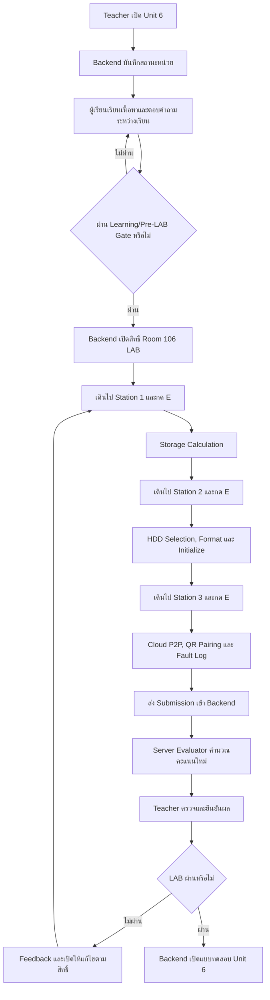

# แผนการสร้างห้องปฏิบัติการจำลอง 3D Room 106

## Storage Calculation, HDD Management & Cloud P2P Remote Viewing

**ฉบับจัดทำ:** 19 กันยายน 2569  
**รายวิชา:** วิชากล้องวงจรปิด  
**หน่วยการเรียนรู้:** หน่วยที่ 6 การบันทึก พื้นที่จัดเก็บ และการดูระยะไกล  
**สถานะเอกสาร:** Implementation Plan สำหรับพัฒนาและตรวจสอบเป็นส่วน ๆ  
**เอกสารอ้างอิงหลัก:** `unit06.ts`, `evaluateUnit6Submission.ts`, `workstationTypes.ts`, `useCctvTrainingStore.ts` และรูปแบบ Room 102–105

> Room 106 ใช้รูปแบบเดียวกับห้องก่อนหน้า: ผู้เรียนเดินตัวละครไปยัง Station แล้วกด `E` เพื่อเปิด Overlay ปฏิบัติภารกิจ การส่งคะแนน การตัดสินผ่าน และการปลดล็อกต้องอ้างอิง Backend/ฐานข้อมูล ไม่ใช้ Zustand หรือ LocalStorage เป็นแหล่งยืนยันหลัก

---

## 1. เป้าหมายของห้อง

Room 106 เป็นห้องปฏิบัติการจำลองสำหรับฝึกวางแผนพื้นที่จัดเก็บ ติดตั้งและเตรียม HDD สำหรับงานบันทึกภาพ CCTV และเปิดใช้งานการดูภาพระยะไกลผ่าน Cloud P2P/QR Code อย่างปลอดภัย

ผู้เรียนต้องสามารถ

- เปรียบเทียบ Surveillance HDD กับ Desktop HDD สำหรับงานบันทึก 24/7
- อธิบายความสัมพันธ์ของ Bitrate, Codec, Resolution, FPS, จำนวนกล้อง และ Retention Days
- คำนวณพื้นที่จัดเก็บและเลือกความจุ HDD ให้เหมาะสม
- ติดตั้ง/เลือก HDD, ตรวจสอบสถานะ, Format และ Initialize ดิสก์
- อธิบายแนวคิด RAID, Disk Quota, S.M.A.R.T. และการสำรองข้อมูล
- เปิดใช้งาน Cloud P2P และจับคู่ NVR กับ Mobile App ผ่าน QR Code
- แยกความแตกต่างระหว่าง Cloud P2P กับ DDNS/Port Forwarding
- วิเคราะห์กรณี HDD Not Found หรือ Cloud P2P Offline อย่างเป็นลำดับขั้น
- บันทึกผลการปฏิบัติและหลักฐานเพื่อส่งให้ Teacher ตรวจสอบ

---

## 2. ขอบเขตงาน

### 2.1 อยู่ในขอบเขต

- ฉาก 3D Room 106 และโต๊ะปฏิบัติการ 3 จุด
- การเดินไป Station และการกด `E` เพื่อเปิด Overlay
- Overlay สำหรับ Station 1–3 พร้อม Validation และสถานะงาน
- State ชั่วคราวของหน้าจอและตัวละครใน Store
- Submission Payload ของ Unit 6
- การประเมินผลจากข้อมูลดิบฝั่ง Server
- การส่งผลไป Backend/ฐานข้อมูลและการตรวจสอบโดย Teacher Dashboard
- กติกาไม่ให้เปิด LAB หรือแบบทดสอบก่อนผ่าน Gate
- ป้าย Station แยกจาก Background และแก้ไขข้อความได้เป็นอิสระ

### 2.2 ไม่อยู่ในขอบเขตแผนฉบับนี้

- การสร้างฮาร์ดแวร์ NVR/HDD จริง
- การเปิด Port Forwarding หรือเชื่อมต่อ Cloud Provider จริง
- การเก็บรหัสผ่านหรือ Token จริงของอุปกรณ์
- การนำหัวข้อ “ตรวจรับระบบจริง” แบบทดสอบข้าม Browser/อุปกรณ์/ระดับเครื่องกลับมาใช้ในแผนนี้
- การให้ Client เป็นผู้ตัดสินคะแนนหรือสิทธิ์ปลดล็อก

---

## 3. ความสอดคล้องกับ Unit 6

Unit 6 มีหัวข้อบทเรียน 10 เรื่อง ได้แก่ Surveillance HDD, ปัจจัยที่มีผลต่อขนาดไฟล์, Storage Formula, Retention Period, RAID, Format/Quota/S.M.A.R.T., Video Export, Cloud P2P/QR, DDNS/Port Forwarding และ Cybersecurity

Room 106 จะเน้นส่วนปฏิบัติของหัวข้อเหล่านี้ โดยแยกเป็น 3 Station ดังนี้

| Station | หัวข้อปฏิบัติ | ผลงานหลัก | คะแนนภายใน LAB |
|---|---|---|---:|
| 1 | Storage Calculation & Retention Planning | Storage Calculation Sheet และผลคำนวณ | 20 |
| 2 | HDD Selection, Installation, Format & Initialization | HDD Selection Record และผลตรวจดิสก์ | 40 |
| 3 | Cloud P2P, QR Pairing & Remote Access Fault | Cloud Access Record, QR Pairing และ Fault Log | 40 |
| **รวม** |  |  | **100** |

คะแนน 100 เป็นคะแนนปฏิบัติภายใน Room 106 ส่วนการคิดน้ำหนักรายวิชาให้ใช้ `unit06.ts` ซึ่งกำหนด LAB Weight 30 และต้องผ่าน Teacher Verification ตามกติกาของหลักสูตร

---

## 4. หลักการข้อมูลและสิทธิ์การใช้งาน

### 4.1 Backend/ฐานข้อมูลเป็นแหล่งข้อมูลกลาง

ข้อมูลต่อไปนี้ต้องอ่านและบันทึกผ่าน Backend/ฐานข้อมูล

- สถานะการเปิด Unit 6
- สิทธิ์ของผู้เรียนในการเข้า Room 106 LAB
- สถานะผ่าน Learning Gate และ Pre-LAB Gate
- ผลการปฏิบัติราย Station
- ค่า Camera Count, Retention Days และ Storage Calculation
- HDD Size, HDD Grade, Format/Initialization Status
- Cloud P2P Status และ Mobile QR Pairing Status
- คะแนนจาก Server Evaluator
- หลักฐานและ Teacher Verification
- สถานะ LAB ผ่าน/ไม่ผ่าน
- การปลดล็อกแบบทดสอบ Unit 6
- Teacher Override และ Audit Log

Student Dashboard และ Teacher Dashboard ต้องอ่านข้อมูลชุดเดียวกันจาก Backend แต่แสดงคนละมุมมอง

### 4.2 Teacher Dashboard

Teacher สามารถ

- เปิด Unit 6 ให้ผู้เรียนหรือชั้นเรียน
- อนุมัติสิทธิ์เข้า Room 106 LAB
- ตรวจ Storage Calculation และเหตุผลการเลือก HDD
- ตรวจผล Format/Initialization และ Cloud P2P Pairing
- ตรวจ Fault Log และผล Retest
- ส่ง Feedback หรือให้ทำซ้ำ
- ยืนยันผล LAB
- ปลดล็อกแบบทดสอบ Unit 6 เมื่อผ่านเงื่อนไข
- Override เฉพาะรายพร้อมเหตุผลและ Audit Log

ทุกคำสั่งปลดล็อกหรือ Override ต้องส่งผ่าน Backend พร้อมผู้ดำเนินการ เวลา เหตุผล และขอบเขตการอนุมัติ

### 4.3 ขอบเขต Store และ LocalStorage

Zustand/LocalStorage ใช้ได้เฉพาะ

- ค่าที่กำลังกรอกใน Overlay
- ตำแหน่งตัวละคร
- สถานะเปิด/ปิด Overlay
- สถานะการแสดงผลชั่วคราว

ห้ามใช้เป็นแหล่งยืนยันหลักของคะแนน การผ่าน LAB การเปิดแบบทดสอบ หรือการปลดล็อก Unit ถัดไป

---

## 5. Learning Gate และ Workflow



### กติกาการเปิดใช้งาน

| รายการ | เงื่อนไข | ผู้ยืนยัน |
|---|---|---|
| Unit 6 | Teacher เปิดหน่วยหรือมี Override ที่บันทึกในฐานข้อมูล | Backend + Teacher Dashboard |
| เนื้อหา | Unit เปิดและผู้เรียนมีสิทธิ์ในชั้นเรียน | Backend |
| Room 106 LAB | ผ่าน Knowledge Check และ Pre-LAB Gate | Backend |
| Station 1–3 | LAB เปิดและมี Attempt ที่ถูกต้อง | Backend |
| LAB ผ่าน | คะแนนถึงเกณฑ์, Mandatory Checks ผ่าน, หลักฐานครบ และ Teacher ยืนยัน | Backend + Teacher |
| แบบทดสอบ Unit 6 | LAB ผ่าน หรือ Teacher Override พร้อมเหตุผล | Backend |

---

## 6. รูปแบบฉาก 3D และตำแหน่ง Station

โครงสร้างการเชื่อมต่อที่ต้องการ

```text
Cctv3DLabApp
      ↓
Room106StorageProps
      ↓
ผู้เรียนเดินตัวละครไปยังโต๊ะ
      ↓
กด E หรือคลิก Station
      ↓
Room106StorageLab
      ↓
Station Overlay 1 / 2 / 3
      ↓
Room 106 State + Submission Payload
      ↓
Server Evaluator
      ↓
Backend / Database
      ↓
Teacher Dashboard
```

| Station | ตำแหน่งเป้าหมาย | อุปกรณ์จำลอง |
|---|---|---|
| 1 | `[-6, 0, -3]` | NVR, จอคำนวณ และ Storage Planning Desk |
| 2 | `[0, 0, -3]` | NVR, HDD, SATA/Format Workbench |
| 3 | `[6, 0, -3]` | NVR, Router/Cloud Panel และ Smartphone |

ข้อกำหนดของทุก Station

- มีขอบเขตพื้นที่บนพื้นให้มองเห็นจุดปฏิบัติ
- ป้าย Station เป็น HTML Overlay/Object แยกจาก Background
- ข้อความป้ายแก้ไขได้โดยไม่ต้องแก้ Texture ของฉาก
- แสดงชื่อ Station หัวข้อ และสถานะงาน
- แสดงข้อความ `เดินมาที่โต๊ะ แล้วกด E เพื่อเริ่มปฏิบัติ`
- เมื่อ Overlay เปิด ตัวละครต้องหยุดเคลื่อนที่
- ปิด Overlay แล้วกลับสู่ฉากเดิมได้
- ห้ามมีแถบอุปกรณ์ค้างด้านล่างของทุกด่าน; Inventory ใช้เฉพาะห้องที่กำหนดไว้เท่านั้น

---

## 7. รายละเอียด Station 1: Storage Calculation & Retention

### จุดประสงค์

ให้ผู้เรียนแปลงโจทย์จำนวนกล้อง Bitrate และ Retention Days เป็นความจุที่ต้องใช้ พร้อมอธิบายการเผื่อพื้นที่และผลของ Codec ต่อพื้นที่จัดเก็บ

### ขั้นตอนปฏิบัติ

1. เดินไป Station 1 และกด `E`
2. อ่าน Scenario จำนวนกล้อง Bitrate และระยะเวลาเก็บภาพ
3. ระบุ Camera Count และ Retention Days
4. ใช้สูตร Storage Calculation ตามหน่วยที่กำหนดในโจทย์
5. ปัดค่าตามกติกาของรายวิชาและบันทึกพื้นที่ที่คำนวณได้
6. อธิบายผลกระทบของ Bitrate, Codec และ FPS
7. ส่ง Storage Calculation Sheet

### ข้อมูลที่ต้องส่ง

| ฟิลด์ | ตัวอย่าง |
|---|---:|
| Camera Count | 8 |
| Retention Days | 30 |
| Bitrate ต่อกล้อง | ตาม Scenario |
| Codec | H.265 หรือค่าที่โจทย์กำหนด |
| Calculated Storage | ค่าที่ผู้เรียนคำนวณ |
| Rounding/Capacity Reasoning | คำอธิบายสั้น ๆ |

### เกณฑ์คะแนน

| รายการ | คะแนน |
|---|---:|
| ระบุจำนวนกล้องและ Retention ถูกต้อง | 5 |
| ใช้สูตรและหน่วยถูกต้อง | 8 |
| คำนวณ/ปัดค่าและอธิบายการเผื่อพื้นที่ | 5 |
| อธิบายผลของ Codec/Bitrate/FPS | 2 |
| **รวม** | **20** |

### Mandatory Checks

- ต้องมี Camera Count และ Retention Days เป็นค่าที่ตรวจสอบได้
- ต้องส่งค่าคำนวณดิบ ไม่ส่งเฉพาะคะแนน
- Server ต้องคำนวณซ้ำจาก Scenario ที่กำหนด
- หากค่าที่ปรากฏใน UI ต่างจากค่าที่ Server คำนวณ ให้ใช้ผล Server เป็นหลัก

---

## 8. รายละเอียด Station 2: HDD Selection, Format & Initialization

### จุดประสงค์

ให้ผู้เรียนเลือก HDD ให้เหมาะกับการทำงาน 24/7 ตรวจสอบการเชื่อมต่อ จัดเตรียมดิสก์ และเข้าใจ RAID/SMART/Quota ในระดับที่สอดคล้องกับ Unit 6

### ขั้นตอนปฏิบัติ

1. เดินไป Station 2 และกด `E`
2. ตรวจสอบโจทย์ความจุที่ต้องรองรับ
3. เปรียบเทียบ Desktop HDD กับ Surveillance HDD
4. เลือกขนาดและเกรด HDD
5. จำลองการเชื่อมต่อ SATA และตรวจสอบว่าระบบพบดิสก์
6. สั่ง Format/Initialize และตรวจสอบสถานะสำเร็จ
7. ระบุแนวคิด RAID ที่เหมาะสมกับความต้องการสำรองข้อมูล
8. บันทึก HDD Selection Record และส่งผล Station 2

### เกณฑ์คะแนน

| รายการ | คะแนน |
|---|---:|
| เลือกขนาด HDD สอดคล้องกับ Storage Requirement | 10 |
| เลือก Surveillance Grade สำหรับงาน 24/7 พร้อมเหตุผล | 10 |
| ตรวจ SATA/พบดิสก์/Format/Initialize ถูกต้อง | 15 |
| อธิบาย RAID, Quota หรือ S.M.A.R.T. ได้ถูกต้อง | 5 |
| **รวม** | **40** |

### Mandatory Checks

- ต้องมีขนาด HDD และ Grade ใน Submission
- ต้องไม่ถือว่า Format สำเร็จจากค่าที่ Client ส่งเพียงอย่างเดียว
- Server ต้องตรวจ `hddFormatted` และสถานะที่เกี่ยวข้อง
- ห้ามบันทึก Serial Number จริงหรือข้อมูลระบุตัวอุปกรณ์จริงที่ไม่จำเป็น

---

## 9. รายละเอียด Station 3: Cloud P2P, QR Pairing & Fault Log

### จุดประสงค์

ให้ผู้เรียนเปิดใช้บริการ Cloud P2P ตรวจสอบสถานะ Online จับคู่ Mobile App ผ่าน QR Code และวิเคราะห์ปัญหา Remote Access อย่างปลอดภัย

### ขั้นตอนปฏิบัติ

1. เดินไป Station 3 และกด `E`
2. ตรวจสอบ Network/Internet Readiness ของ NVR
3. เปิด Cloud P2P และตรวจสอบสถานะ Online
4. จำลองการสแกน QR Code ใน Mobile App
5. ตรวจสอบ Remote Live View/Playback ตาม Scenario
6. เปรียบเทียบ Cloud P2P กับ DDNS/Port Forwarding
7. รับ Fault Scenario เช่น Cloud P2P Offline หรือ Device Offline
8. บันทึก Problem, Possible Cause, Test, Result, Solution และ Retest
9. ส่ง Cloud Access Record และ Fault Log

### เกณฑ์คะแนน

| รายการ | คะแนน |
|---|---:|
| เปิด Cloud P2P และยืนยันสถานะ Online | 20 |
| สแกน QR และจับคู่ Mobile App สำเร็จ | 10 |
| วิเคราะห์ Cloud P2P/DDNS และความปลอดภัย | 5 |
| Fault Log และ Retest Result เป็นลำดับขั้น | 5 |
| **รวม** | **40** |

### Mandatory Checks

- ต้องเปิด P2P และมีสถานะ Online ก่อนสแกน QR
- ต้องมีผล Mobile QR Pairing
- ต้องไม่ส่ง QR Token, Password หรือ Secret จริง
- ต้องมี Retest Result หากได้รับ Fault Scenario
- Server ต้องบังคับเงื่อนไข `cloudP2pStatus === ONLINE` ตามกติกา Unit 6

---

## 10. รูปแบบ Overlay

ทุก Overlay ต้องประกอบด้วย

1. Header: Room, Station และคะแนน/สถานะปัจจุบัน
2. Scenario และ Work Order
3. แบบฟอร์มหรือแผงอุปกรณ์จำลอง
4. คำอธิบายหลักการที่จำเป็นต่อการตัดสินใจ
5. Validation ของข้อมูลสำคัญ
6. สถานะ `ยังไม่เริ่ม`, `กำลังทำ`, `บันทึกแล้ว`, `รอตรวจ`
7. ปุ่มบันทึกผล Station
8. ปุ่มปิด Overlay

กติกา UI

- เปิดได้เมื่อ Backend อนุมัติ LAB แล้ว
- กด `E` จากระยะ Station หรือคลิกป้าย Station เพื่อเปิด
- การคลิกบน Overlay ต้องไม่ทำให้ตัวละครเดินหรือเปิด Station อื่น
- ปุ่มส่งผลต้องไม่แสดงเป็นการ “ผ่าน” จนกว่า Server จะประเมิน
- การปิดและเปิดซ้ำต้องไม่ทำให้ผลที่ Backend ยืนยันแล้วหาย

---

## 11. โครงสร้างข้อมูลที่เสนอ

```ts
type Room106SubmissionPayload = {
  roomId: 'room-106';
  unitNumber: 6;
  cameraCount: number;
  retentionDays: number;
  calculatedStorageTb: number;
  selectedHddSize: string;
  hddGrade: 'Desktop' | 'Surveillance';
  hddFormatted: boolean;
  cloudP2pEnabled: boolean;
  cloudP2pStatus: 'OFFLINE' | 'ONLINE';
  mobileQrScanned: boolean;
  evidence?: {
    storageCalculation?: Record<string, unknown>;
    hddInitialization?: Record<string, unknown>;
    remoteAccess?: Record<string, unknown>;
    faultLog?: Record<string, unknown>;
  };
  totalHintsUsed?: number;
  timestamp: string;
  clientScore?: number; // ใช้แสดงผลเบื้องต้นเท่านั้น
};
```

ข้อกำหนดสำคัญ

- `clientScore` ไม่ใช่แหล่งยืนยันผล
- Server ต้องคำนวณคะแนนจากข้อมูลดิบใหม่
- ข้อมูลหลักที่ใช้ตัดสินต้องมี Schema กลางร่วมกันระหว่าง Client, API และ Evaluator
- ห้ามส่ง Password, Token, QR Secret หรือ Service Key

---

## 12. การประเมินผลฝั่ง Server

ไฟล์เป้าหมายคือ `src/server/game/evaluateUnit6Submission.ts` และ Router กลาง `evaluateRoomSubmission.ts`

### Mapping กับ Mission Score

| Mission | เงื่อนไข | คะแนน |
|---|---|---:|
| M1_STORAGE_CALCULATION | ค่าคำนวณอยู่ในช่วงที่ Server ยอมรับ | 20 |
| M2_SURVEILLANCE_HDD_GRADE | 8TB และ Surveillance ตาม Scenario | 20 |
| M3_HDD_INITIALIZATION | Format/Initialize สำเร็จ | 20 |
| M4_CLOUD_P2P_ACTIVATION | เปิดใช้งานและสถานะ Online | 20 |
| M5_MOBILE_REMOTE_ACCESS | QR Pairing สำเร็จ | 20 |
| **รวม** |  | **100** |

### กติกาผ่าน

- คะแนน Server ไม่น้อยกว่า 70/100
- ต้อง Format HDD สำเร็จ
- ต้องมีสถานะ Cloud P2P เป็น `ONLINE`
- ต้องผ่าน Mandatory Checks
- ต้องมี Teacher Verification ก่อนปลดล็อกแบบทดสอบตาม Course Rule

### ประเด็นที่ต้องยืนยันก่อนลงรหัสถาวร

ปัจจุบัน Evaluator มีค่าอ้างอิง `calculatedStorageTb ≈ 7.8` แต่โจทย์ Unit 6 มีตัวเลข Bitrate/จำนวนกล้อง/วันเก็บข้อมูลที่อาจทำให้ผลคำนวณต่างกันตามหน่วย Decimal/TiB และการปัดเศษ จึงต้องเลือกให้ชัดเจนหนึ่งแบบก่อนใช้งานจริง

1. ยืนยันสูตร หน่วย และค่าปัดเศษใน `unit06.ts`
2. ปรับ `evaluateUnit6Submission.ts` ให้ใช้สูตรเดียวกัน
3. ให้ UI, ใบงาน, Test Case และ Teacher Rubric ใช้ค่ามาตรฐานเดียวกัน

ห้ามแก้เฉพาะ UI เพื่อให้ตรงกับคะแนน โดยไม่แก้ Contract และ Evaluator ให้สอดคล้องกัน

---

## 13. โครงสร้างไฟล์เป้าหมาย

```text
src/
├─ components/
│  └─ labs/
│     ├─ 3d/props/
│     │  └─ Room106StorageProps.tsx
│     └─ room106/
│        ├─ Room106StorageLab.tsx
│        ├─ Room106StorageCalculationModal.tsx
│        ├─ Room106HddManagementModal.tsx
│        └─ Room106RemoteAccessModal.tsx
├─ content/courses/21909-2020/
│  └─ unit06.ts
├─ server/game/
│  ├─ evaluateUnit6Submission.ts
│  └─ evaluateRoomSubmission.ts
├─ shared/domain/
│  ├─ workstationTypes.ts
│  └─ room106Types.ts
├─ store/
│  └─ useCctvTrainingStore.ts
└─ tests/
   ├─ room106Evaluation.test.ts
   ├─ room106Lab.test.tsx
   └─ room106Unlock.test.ts
```

หมายเหตุ: หากใช้ Modal รวมไฟล์เดียวเพื่อลดความซ้ำซ้อน ต้องยังคงแยก Contract และสถานะของทั้ง 3 Station ให้ตรวจสอบได้ชัดเจน

---

## 14. แผนการพัฒนาเป็นลำดับ

### ลำดับที่ 1: ยืนยัน Contract และสูตรคำนวณ

- ยืนยัน Station 1–3
- ยืนยันสูตร Storage และหน่วยที่ใช้
- ยืนยันคะแนนภายใน LAB และน้ำหนัก Unit 6
- ยืนยัน Mandatory Checks และเกณฑ์ผ่าน

### ลำดับที่ 2: สร้าง Domain และ Store

- สร้าง/ปรับ `room106Types.ts`
- เพิ่ม `activeStation106Modal`
- เพิ่มสถานะการทำงานราย Station
- เพิ่ม `buildRoomSubmission('room-106')`
- แยก UI State ออกจากข้อมูลที่ต้องส่ง Server

### ลำดับที่ 3: สร้างฉาก 3D และ Interaction

- แยกโต๊ะเป็น Station 1–3
- เพิ่มตำแหน่งตรวจจับระยะสำหรับการกด `E`
- เพิ่มการคลิกป้าย/โต๊ะให้เรียก Action เดียวกับการกด `E`
- นำป้ายที่ฝังอยู่ใน Background ออก
- ตรวจการชนและพื้นที่เดินของตัวละคร

### ลำดับที่ 4: สร้าง Overlay

- สร้าง Overlay Station 1 สำหรับ Storage Calculation
- สร้าง Overlay Station 2 สำหรับ HDD
- สร้าง Overlay Station 3 สำหรับ Cloud P2P/QR/Fault Log
- เพิ่ม Validation และสถานะบันทึกผล
- เพิ่มการหยุดตัวละครขณะ Overlay เปิด

### ลำดับที่ 5: เชื่อม Evaluator และ Backend

- ตรวจ Schema ก่อนรับ Submission
- ประเมินคะแนนใหม่ฝั่ง Server
- บันทึกคะแนนและหลักฐานลงฐานข้อมูล
- เชื่อม Teacher Verification
- เชื่อมกติกาเปิดแบบทดสอบหลัง LAB ผ่าน
- บันทึก Override และ Audit Log

### ลำดับที่ 6: ตรวจสอบเชิงเทคนิคตามขอบเขต

- ตรวจ TypeScript และการนำเข้าไฟล์
- ตรวจ Unit Test ของ Evaluator
- ตรวจ Integration Test ของ Store, Overlay และ Submission Builder
- ตรวจ Gate ว่าป้องกันการเปิด LAB/แบบทดสอบก่อนสิทธิ์
- ตรวจ Negative Case: คะแนนไม่ผ่าน, HDD ไม่ Format, P2P Offline, QR ยังไม่สแกน, Payload ไม่ครบ

---

## 15. แผนการทดสอบ

### 15.1 Domain/Evaluator Tests

- Submission ที่ถูกต้องได้คะแนนตาม Mission Mapping
- ค่าคะแนนจาก Client ถูกแก้ไขแล้ว Server ยังประเมินจากข้อมูลดิบ
- HDD เป็น Desktop แล้วคะแนนและสถานะเปลี่ยนตามกติกา
- HDD ยังไม่ Format ไม่ผ่าน Mandatory Check
- Cloud P2P เปิดแต่ Offline ไม่ผ่านเงื่อนไข Remote Access
- QR ยังไม่สแกนไม่ผ่าน Mission 5
- Hint Penalty ถูกคำนวณฝั่ง Server

### 15.2 Store/Overlay Tests

- เปิด Station 1–3 ได้จาก Active Station ที่ถูกต้อง
- กดปิด Overlay แล้ว Active Station กลับเป็น `null`
- บันทึกแต่ละ Station แล้วสถานะเสร็จเฉพาะ Station นั้น
- ครบ 3 Station จึงแสดงคำสั่งส่งผลรวม
- การเปิด Overlay ไม่ทำให้ Inventory Bar ปรากฏใน Room 106

### 15.3 Gate/Authority Tests

- ผู้เรียนที่ยังไม่ผ่าน Pre-LAB เข้า Room 106 LAB ไม่ได้
- ผู้เรียนทำแบบทดสอบ Unit 6 ก่อน LAB ผ่านไม่ได้
- Teacher ปลดล็อกผ่าน Dashboard ได้เมื่อ Backend ตรวจสิทธิ์
- Teacher Override ต้องมีเหตุผลและ Audit Log
- แก้ค่าฝั่ง Browser/Store แล้วสถานะฐานข้อมูลไม่เปลี่ยนโดยอัตโนมัติ

> แผนฉบับนี้ไม่รวมชุดทดสอบ “ตรวจรับระบบจริง” แบบข้ามอุปกรณ์/ระดับเครื่องตามรายการที่ถูกนำออกจากแผนก่อนหน้านี้

---

## 16. เกณฑ์ส่งมอบ Room 106 ในขอบเขตแผน

ถือว่างานพัฒนา Room 106 ครบตามแผนเมื่อ

1. มี Station 3 จุดตรงกับ Unit 6
2. ผู้เรียนเดินไปแต่ละ Station แล้วกด `E` เพื่อเปิด Overlay ได้
3. ป้าย Station แยกจาก Background และแก้ไขได้
4. Overlay รับข้อมูล Storage, HDD และ Cloud P2P ตามลำดับ
5. Submission มีข้อมูลดิบเพียงพอให้ Server ประเมินใหม่
6. Evaluator ตรวจ M1–M5 และ Mandatory Checks ได้
7. Store/Client ไม่เป็น Authority ของคะแนนหรือ Unlock
8. Backend/ฐานข้อมูลเป็นแหล่งข้อมูลชุดเดียวสำหรับ Student และ Teacher Dashboard
9. Teacher ตรวจ ยืนยัน หรือ Override ผ่าน Dashboard ได้ตามสิทธิ์
10. แบบทดสอบ Unit 6 เปิดได้ต่อเมื่อ LAB ผ่านหรือมี Override ที่ตรวจสอบย้อนหลังได้
11. มี Test Case สำหรับเส้นทางสำเร็จและ Negative Case ที่สำคัญ

---

## 17. สรุปการตัดสินใจเชิงสถาปัตยกรรม

- ใช้ Room 106 เป็นห้องแยกเชิงโมดูล แต่ใช้ Contract, Gate และ Backend ชุดเดียวกับระบบกลาง
- แยกงาน 3D Scene, Overlay, Store, Evaluator และ Backend ออกจากกัน
- ใช้ข้อมูลชุดเดียวกันจากฐานข้อมูล แต่แสดง Student Dashboard และ Teacher Dashboard คนละมุมมอง
- ให้ Teacher เป็นผู้มีอำนาจอนุมัติ/ปลดล็อกผ่าน Dashboard โดย Backend ตรวจสอบสิทธิ์และบันทึก Audit Log
- คงการตรวจคะแนนฝั่ง Server เป็นหลัก
- ไม่ฝังป้าย Station ลงใน Background
- ไม่รวมการตรวจรับระบบจริงแบบข้ามอุปกรณ์ในแผนพัฒนาห้องฉบับนี้
