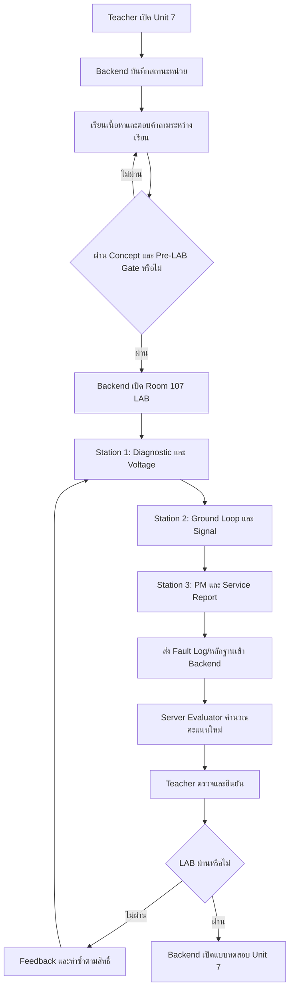

# แผนการสร้างห้องปฏิบัติการจำลอง 3D Room 107

## Troubleshooting, Fault Isolation & Preventive Maintenance

**ฉบับจัดทำ:** 19 กันยายน 2569  
**รายวิชา:** วิชากล้องวงจรปิด  
**หน่วยการเรียนรู้:** หน่วยที่ 7 การตรวจสอบ แก้ไขปัญหา และบำรุงรักษา  
**สถานะเอกสาร:** Implementation Plan สำหรับพัฒนาแยกเป็นส่วน ๆ  
**เอกสารอ้างอิงหลัก:** `unit07.ts`, `evaluateUnit7Submission.ts`, `workstationTypes.ts`, `useCctvTrainingStore.ts` และรูปแบบ Room 103–106

> Room 107 ใช้รูปแบบเดียวกับห้องก่อนหน้า: ผู้เรียนเดินตัวละครไปยัง Station แล้วกด `E` เพื่อเปิด Overlay ปฏิบัติภารกิจ การให้คะแนน การผ่าน LAB และการปลดล็อกแบบทดสอบต้องยืนยันผ่าน Backend/ฐานข้อมูล โดยไม่ใช้ Client State เป็นแหล่งตัดสินหลัก

---

## 1. เป้าหมายของห้อง

Room 107 เป็นห้องจำลองสำหรับฝึกวิเคราะห์และแก้ไขปัญหาระบบ CCTV อย่างเป็นขั้นตอน ตั้งแต่ Power, Physical Layer, Signal Quality, Network ไปจนถึง Preventive Maintenance และ Service Report

ผู้เรียนต้องสามารถ

- ใช้กระบวนการ 6-Step Troubleshooting และ Diagnostic Tree
- ตรวจอาการ NO VIDEO โดยเริ่มจาก Power และ Physical Layer
- ตรวจแรงดันไฟตกและประเมินผลกระทบของระยะสาย/โหลด
- วิเคราะห์ Hum Bars และ Ground Loop
- ใช้ Multimeter, CCTV Tester, Cable Tester และ Ping Tool ให้เหมาะกับอาการ
- ตรวจเลนส์ โฟกัส ไอน้ำ ข้อต่อ และอุปกรณ์ภายนอก
- แก้ไข IP Conflict หรือ Packet Loss ตามลำดับขั้น
- ทำ Preventive Maintenance Checklist
- บันทึก Fault Log, Retest Result และ Service Report
- ทำงานอย่างปลอดภัยและไม่เปลี่ยนอุปกรณ์โดยไม่มีหลักฐานการตรวจสอบ

---

## 2. ขอบเขตงาน

### 2.1 อยู่ในขอบเขต

- ฉาก 3D Room 107 และโต๊ะปฏิบัติการ 3 จุด
- การเดินไป Station และกด `E` เพื่อเปิด Overlay
- การจำลอง Fault Scenario ที่ควบคุมได้
- การตรวจ Voltage, Ground Loop, Lens และ PM Checklist
- การสร้าง Fault Log และ Retest Evidence
- การส่งข้อมูลดิบไป Server Evaluator และฐานข้อมูล
- การตรวจสอบสถานะโดย Teacher Dashboard
- การควบคุมสิทธิ์ LAB และแบบทดสอบผ่าน Backend
- ป้าย Station แบบ Overlay ที่ไม่ฝังอยู่ใน Background

### 2.2 ไม่อยู่ในขอบเขตแผนฉบับนี้

- การซ่อมอุปกรณ์ CCTV จริงหน้างาน
- การต่อไฟหรือวัดแรงดันกับอุปกรณ์จริง
- การทดสอบข้าม Browser อุปกรณ์ หรือระดับเครื่องแบบหัวข้อ “ตรวจรับระบบจริง” ที่ถูกนำออกจากแผนก่อนหน้า
- การตัดสินคะแนนจากข้อความหรือสถานะใน Browser เพียงอย่างเดียว

---

## 3. ความสอดคล้องกับ Unit 7

Unit 7 ครอบคลุม Diagnostic Tree, NO VIDEO, Hum Bars/Ground Loop, Voltage Drop, ภาพเบลอ/ไอน้ำ, Packet Loss, เครื่องมือวัด, Preventive Maintenance และ Service Report

| Station | หัวข้อปฏิบัติ | ผลงานหลัก | คะแนนภายใน LAB |
|---|---|---|---:|
| 1 | Diagnostic Tree, Voltage Drop และ NO VIDEO | Diagnostic Flow, Measurement Record และ Fault Isolation | 40 |
| 2 | Ground Loop, Signal Quality และเครื่องมือทดสอบ | Ground Loop Test, Isolator Record และ Retest | 20 |
| 3 | Preventive Maintenance และ Service Report | PM Checklist, Lens Inspection และ Service Report | 40 |
| **รวม** |  |  | **100** |

การแบ่งคะแนนภายในเป็นการจัดกลุ่ม Mission ของ Evaluator เดิม ซึ่งมี 5 Mission × 20 คะแนน และไม่ใช่น้ำหนักรายวิชาโดยตรง Unit 7 กำหนด LAB Weight 30 และต้องมี Teacher Verification

---

## 4. ระบบข้อมูลและสิทธิ์

### 4.1 ฐานข้อมูลเป็นแหล่งข้อมูลกลาง

ต้องบันทึกและตรวจสอบผ่าน Backend/ฐานข้อมูล ได้แก่

- สถานะเปิด Unit 7 และสิทธิ์เข้า Room 107
- Pre-LAB Safety Gate
- Fault Scenario ที่ได้รับ
- ค่าแรงดันที่วัดและเครื่องมือที่ใช้
- สถานะ Ground Loop Isolator
- ผล Lens Inspection และ PM Checklist
- Faults ที่แก้ไขและ Retest Result
- คะแนนราย Mission/Station และคะแนนรวม
- Evidence, Teacher Verification และ Audit Log
- สถานะผ่าน LAB และการปลดล็อกแบบทดสอบ

Student Dashboard และ Teacher Dashboard ต้องอ่านข้อมูลชุดเดียวกันจาก Backend แต่ใช้คนละมุมมอง

### 4.2 Teacher Dashboard

Teacher สามารถ

- เปิด Unit 7 และ Room 107 LAB
- ตรวจ Diagnostic Flow และ Measurement Record
- ตรวจ Fault Log และ Retest Evidence
- ตรวจ PM Checklist และ Service Report
- ส่ง Feedback หรืออนุญาตให้ทำซ้ำ
- ยืนยันผล LAB
- ปลดล็อกแบบทดสอบ Unit 7
- Override ตามสิทธิ์พร้อมเหตุผลและ Audit Log

### 4.3 Store/LocalStorage

ใช้สำหรับ UI State, ตำแหน่งตัวละคร, สถานะเปิด Overlay และค่าที่กำลังกรอกเท่านั้น ห้ามใช้เป็น Authority ของคะแนน, Fault Clearance, LAB Pass หรือ Unlock

---

## 5. Workflow การเรียนรู้และ Gate



| รายการ | เงื่อนไข | ผู้ยืนยัน |
|---|---|---|
| Unit 7 | Teacher เปิดหน่วยหรือมี Override | Backend + Teacher Dashboard |
| Room 107 LAB | ผ่าน U07-A03 และ U07-A04 | Backend |
| Station 1–3 | LAB เปิดและมี Attempt | Backend |
| LAB ผ่าน | คะแนนถึงเกณฑ์, Fault Clearance และ PM Sign-off ผ่าน, Teacher ยืนยัน | Backend + Teacher |
| แบบทดสอบ U07 | LAB ผ่านหรือ Override พร้อมเหตุผล | Backend |

---

## 6. ฉาก 3D และตำแหน่ง Station

```text
Cctv3DLabApp
      ↓
Room107TroubleshootingProps
      ↓
ผู้เรียนเดินไปโต๊ะ Station
      ↓
กด E หรือคลิกป้าย
      ↓
Room107TroubleshootingLab
      ↓
Station Overlay 1 / 2 / 3
      ↓
Submission + Evidence
      ↓
Server Evaluator → Backend/Database → Teacher Dashboard
```

| Station | ตำแหน่งเป้าหมาย | อุปกรณ์จำลอง |
|---|---|---|
| 1 | `[-6, 0, -3]` | CAM-03, PoE Tester, Multimeter และ Diagnostic Monitor |
| 2 | `[0, 0, -3]` | Coaxial/Signal Panel, Ground Loop Isolator และ CCTV Tester |
| 3 | `[6, 0, -3]` | Maintenance Bench, Lens, Gasket, Checklist และ Service Report |

ข้อกำหนด

- ป้าย Station ต้องเป็น Overlay/Object แยกจาก Background
- แสดงชื่อภารกิจ คำอธิบาย และสถานะ `ยังไม่เริ่ม/กำลังทำ/บันทึกแล้ว/รอตรวจ`
- แสดงคำแนะนำ `เดินมาที่โต๊ะ แล้วกด E`
- การกด `E` และการคลิกต้องเรียก Action เดียวกัน
- เปิด Overlay แล้วตัวละครหยุดเคลื่อนที่
- ไม่มีอุปกรณ์ Inventory Bar ติดด้านล่างทุก Station

---

## 7. Station 1: Diagnostic Tree, Voltage Drop & NO VIDEO

### จุดประสงค์

ฝึกแยกสาเหตุของ NO VIDEO ด้วยลำดับ Power → Physical → Signal → Network → Device และบันทึกค่าการวัดก่อนเลือกวิธีแก้ไข

### ขั้นตอนปฏิบัติ

1. เดินไป Station 1 และกด `E`
2. อ่านอาการและเงื่อนไขของ CAM-03
3. ตรวจ Power/PoE และวัดแรงดันที่ปลายสาย
4. ตรวจสาย สายต่อ และสถานะ Link
5. แยกสาเหตุ NO VIDEO จากผลตรวจ ไม่เดาสุ่ม
6. บันทึกเครื่องมือ ค่าที่วัด และผลการตรวจ
7. แก้สาเหตุจำลองและทำ Retest
8. ส่ง Diagnostic Record และ Fault Log

### เกณฑ์คะแนน

| รายการ | คะแนน |
|---|---:|
| ตรวจและบันทึก PoE/Voltage Drop | 20 |
| วิเคราะห์ NO VIDEO และแก้ไขตามหลักฐาน | 20 |
| **รวม** | **40** |

### Mandatory Checks

- ต้องมีการตรวจแรงดันก่อนสรุปสาเหตุ
- ต้องบันทึกค่า `step1PoEVoltageValue`
- ต้องมีผล Retest หลังแก้ไข
- Server ต้องคำนวณจากสถานะตรวจจริง ไม่เชื่อ `score` จาก Client

---

## 8. Station 2: Ground Loop, Signal Quality & Tools

### จุดประสงค์

ฝึกวิเคราะห์ Hum Bars/คลื่นรบกวนและเลือกใช้ Ground Loop Isolator พร้อมแยกปัญหาสัญญาณออกจากปัญหา Power หรืออุปกรณ์

### ขั้นตอนปฏิบัติ

1. เดินไป Station 2 และกด `E`
2. ตรวจอาการ Rolling Hum Bars จากจอจำลอง
3. ตรวจจุด Ground และความต่างศักย์
4. เลือก Ground Loop Isolator ตาม Scenario
5. ติดตั้งในตำแหน่งที่ถูกต้อง
6. ทดสอบภาพซ้ำและบันทึก Retest Result
7. อธิบายเหตุผลที่ไม่ควรแก้ด้วยการเปลี่ยนกล้องทันที

### เกณฑ์คะแนน

| รายการ | คะแนน |
|---|---:|
| ระบุอาการและใช้เครื่องมือถูกต้อง | 8 |
| ติดตั้ง Ground Loop Isolator ถูกต้อง | 12 |
| **รวม Mission Ground Loop** | **20** |

หมายเหตุ: ผล Retest ใช้เป็น Mandatory Evidence และเชื่อมกับ Fault Log ของ Station 1 ไม่ควรให้คะแนนซ้ำกับ Mission อื่นโดยไม่กำหนดใน Evaluator

---

## 9. Station 3: Preventive Maintenance & Service Report

### จุดประสงค์

ฝึกตรวจสภาพเลนส์และอุปกรณ์ภายนอก ทำ PM Checklist และจัดทำ Service Report ที่ตรวจสอบย้อนหลังได้

### ขั้นตอนปฏิบัติ

1. เดินไป Station 3 และกด `E`
2. ตรวจเลนส์ โฟกัส ไอน้ำ Housing และ Gasket
3. ทำความสะอาดเลนส์ตามขั้นตอน
4. ตรวจสาย ข้อต่อ และการป้องกันน้ำ
5. ทำเครื่องหมาย PM Checklist
6. บันทึก Fault ที่แก้แล้วและข้อเสนอแนะป้องกันซ้ำ
7. เซ็นรับรอง Checklist แบบจำลอง
8. ส่ง Service Report ให้ Teacher ตรวจ

### เกณฑ์คะแนน

| รายการ | คะแนน |
|---|---:|
| ทำความสะอาดเลนส์และตรวจสภาพภาพ | 20 |
| PM Checklist และ Service Report Sign-off | 20 |
| **รวม** | **40** |

### Mandatory Checks

- ต้องทำ Lens Inspection ก่อนกด Complete
- ต้องมี PM Checklist Sign-off
- ต้องบันทึกผลตรวจและคำแนะนำ Preventive Maintenance
- ห้ามระบุว่าอุปกรณ์ผ่าน หากยังมี Fault ที่ไม่ได้ Retest

---

## 10. รูปแบบ Fault Log

| หัวข้อ | ข้อมูลที่ต้องบันทึก |
|---|---|
| Problem | อาการที่พบ เช่น NO VIDEO/HUM BARS |
| Possible Cause | สาเหตุที่เป็นไปได้ |
| Test | เครื่องมือและขั้นตอนทดสอบ |
| Result | ค่าหรือหลักฐานที่พบ |
| Solution | วิธีแก้ไข |
| Retest | ผลหลังแก้ไข |
| Preventive Action | วิธีป้องกันการเกิดซ้ำ |

---

## 11. โครงสร้างข้อมูลและ Evaluator

ข้อมูลหลักที่ต้องคงความเข้ากันได้กับ `unit7SubmissionSchema`

```ts
type Room107SubmissionPayload = {
  faultDeviceId: string;
  step1PoEVoltageChecked: boolean;
  step1PoEVoltageValue: number;
  step2GroundLoopIsolatorInstalled: boolean;
  step3LensCleaned: boolean;
  step3PmChecklistSigned: boolean;
  resolvedFaults: string[];
  totalHintsUsed?: number;
  evidence?: Record<string, unknown>;
  timestamp: string;
};
```

Evaluator ปัจจุบันมี Mission ดังนี้

| Mission | เงื่อนไขหลัก | คะแนน |
|---|---|---:|
| M1_VOLTAGE_DROP_DIAGNOSTIC | ตรวจแรงดัน PoE | 20 |
| M2_GROUND_LOOP_MITIGATION | ติดตั้ง Isolator | 20 |
| M3_PREVENTIVE_MAINTENANCE | ทำความสะอาดเลนส์ | 20 |
| M4_FAULT_CLEARANCE | แก้ NO_VIDEO และ HUM_BARS | 20 |
| M5_PM_CHECKLIST_SIGNOFF | เซ็น PM Checklist | 20 |
| **รวม** |  | **100** |

เกณฑ์ผ่านปัจจุบันคือคะแนนไม่น้อยกว่า 70, ต้องแก้ Fault สำคัญ และต้องเซ็น PM Checklist

งานที่ต้องทำให้สมบูรณ์

- แยก Evidence ราย Station โดยไม่ทำลาย Schema เดิม
- ตรวจค่า Voltage Range ตาม Scenario แทนการตรวจเพียง Boolean หากต้องการความละเอียด
- ตรวจลำดับการวัดก่อนการแก้ไข
- ตรวจ Fault Log และ Retest ให้เป็นข้อมูลบังคับ
- ไม่รับ `clientScore` เป็นคะแนนจริง

---

## 12. โครงสร้างไฟล์เป้าหมาย

```text
src/
├─ components/labs/
│  ├─ 3d/props/Room107TroubleshootingProps.tsx
│  └─ room107/
│     ├─ Room107TroubleshootingLab.tsx
│     ├─ Room107DiagnosticStationModal.tsx
│     ├─ Room107SignalStationModal.tsx
│     └─ Room107MaintenanceStationModal.tsx
├─ content/courses/21909-2020/unit07.ts
├─ server/game/evaluateUnit7Submission.ts
├─ shared/domain/workstationTypes.ts
├─ store/useCctvTrainingStore.ts
└─ tests/
   ├─ room107Evaluation.test.ts
   ├─ room107Lab.test.tsx
   └─ room107Unlock.test.ts
```

---

## 13. ลำดับการพัฒนา

### ลำดับที่ 1: ยืนยัน Fault Scenario และ Contract

- ยืนยันค่าแรงดันและหน่วยวัด
- ยืนยันรายการ Fault ที่ต้องแก้
- ยืนยันคะแนน 5 Mission
- ยืนยัน Evidence และ Retest ที่ต้องบังคับ

### ลำดับที่ 2: แยก 3D Station

- แยก Station 1–3 ออกจาก Control Pad เดี่ยว
- เพิ่มระยะตรวจจับสำหรับการกด `E`
- แยกป้ายออกจาก Background
- ปรับ Collision/พื้นที่เดิน

### ลำดับที่ 3: สร้าง Overlay และ State

- สร้าง Overlay ราย Station
- เพิ่ม Diagnostic Form และ Fault Log
- เพิ่มสถานะ Completed/Needs Review
- หยุดตัวละครขณะ Overlay เปิด

### ลำดับที่ 4: เชื่อม Evaluator และ Backend

- ส่งข้อมูลดิบและ Evidence
- ประเมินคะแนนใหม่ฝั่ง Server
- บันทึกผล Teacher Verification
- เชื่อม Unlock Rule ของ Unit 7

### ลำดับที่ 5: ทดสอบเชิงเทคนิค

- Test เส้นทางถูกต้องและเส้นทางผิด
- Test ค่า Voltage ไม่ผ่าน
- Test ยังไม่แก้ Fault
- Test ยังไม่เซ็น PM Checklist
- Test Client ส่งคะแนนปลอม
- Test ป้องกันการเปิดแบบทดสอบก่อน LAB ผ่าน

---

## 14. เกณฑ์ส่งมอบตามแผน

1. มี Station 3 จุดและหัวข้อสอดคล้องกับ Unit 7
2. กด `E` จากระยะ Station แล้วเปิด Overlay ได้
3. Diagnostic, Ground Loop และ PM แยกเป็นภารกิจตรวจสอบได้
4. มี Fault Log และ Retest Evidence
5. Server Evaluator ตรวจ M1–M5 ใหม่จากข้อมูลดิบ
6. Teacher ตรวจและยืนยันผลจาก Dashboard ได้
7. ผู้เรียนที่ยังไม่ผ่านไม่สามารถเปิดแบบทดสอบ Unit 7 ได้
8. ป้าย Station ไม่ฝังอยู่ใน Background
9. ไม่มีข้อมูลลับหรือรหัสผ่านจริงใน Payload
