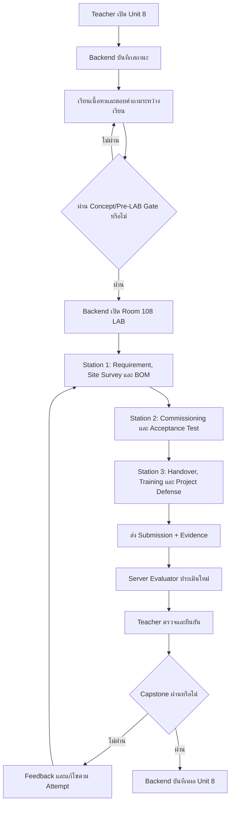

# แผนการสร้างห้องปฏิบัติการจำลอง 3D Room 108

## Integrated CCTV Capstone, Commissioning & Handover

**ฉบับจัดทำ:** 19 กันยายน 2569  
**รายวิชา:** วิชากล้องวงจรปิด  
**หน่วยการเรียนรู้:** หน่วยที่ 8 โครงงานบูรณาการระบบ CCTV  
**สถานะเอกสาร:** Implementation Plan สำหรับพัฒนาแยกเป็นส่วน ๆ  
**เอกสารอ้างอิงหลัก:** `unit08.ts`, `evaluateUnit8Submission.ts`, `workstationTypes.ts`, `useCctvTrainingStore.ts` และรูปแบบ Room 102–107

> Room 108 เป็นห้อง Capstone จำลอง ผู้เรียนต้องบูรณาการความรู้จากหน่วยก่อนหน้า ตั้งแต่รับความต้องการ ออกแบบระบบ จัดทำ BOM ตรวจสอบการทำงาน และจัดทำเอกสารส่งมอบ การให้คะแนนและสิทธิ์ปลดล็อกต้องยืนยันผ่าน Backend/ฐานข้อมูล และ Teacher Dashboard

---

## 1. เป้าหมายของห้อง

Room 108 เป็นห้องปฏิบัติการขั้นสรุปสำหรับจำลองการส่งมอบโครงการ CCTV แบบครบวงจร โดยเน้นการตัดสินใจเชิงช่าง การตรวจสอบตาม Acceptance Criteria และเอกสารส่งมอบที่ตรวจสอบย้อนหลังได้

ผู้เรียนต้องสามารถ

- วิเคราะห์ความต้องการลูกค้าและความเสี่ยงของพื้นที่
- สำรวจพื้นที่และจัดทำ Floor Plan/Camera Coverage Plan
- เลือกกล้อง NVR PoE Switch HDD UPS และอุปกรณ์ประกอบให้เข้ากันได้
- จัดทำ Bill of Materials และประมาณการต้นทุน
- จัดทำ Cabling, Power และ Network/Cybersecurity Plan
- ตรวจสอบ Camera Online, NVR Reachable และ Live View
- ตรวจสอบ Continuous/Event Recording และ Remote Access
- ทำ Commissioning Checklist ตาม Acceptance Criteria
- จัดทำ As-Built/ระบบส่งมอบ คู่มือ และ Warranty Information
- ฝึกอบรมผู้ใช้งานและรับลายเซ็นส่งมอบ
- นำเสนอเหตุผลของแบบระบบและตอบคำถามเชิงวิชาชีพ

---

## 2. ขอบเขตงาน

### 2.1 อยู่ในขอบเขต

- ฉาก 3D Room 108 สำหรับโครงงาน Capstone
- การเดินไป Station 1–3 และกด `E` เพื่อเปิด Overlay
- BOM/งบประมาณจำลองและการตรวจรายการวัสดุ
- Commissioning Checks และ Acceptance Criteria แบบจำลอง
- Remote Access, Recording และ Cybersecurity Checklist
- Handover Certificate, User Training และ Service Documentation
- การส่ง Submission พร้อม Evidence ให้ Backend
- Server Evaluation และ Teacher Verification
- การปลดล็อกแบบทดสอบ/สถานะจบ Unit 8 ตามฐานข้อมูล
- ป้าย Station ที่แก้ไขแยกจาก Background ได้

### 2.2 ไม่อยู่ในขอบเขตแผนฉบับนี้

- การติดตั้งระบบจริงให้ลูกค้า
- การเซ็นสัญญาหรือรับประกันจริง
- การส่งอีเมลหรือเอกสารออกไปยังลูกค้าจริงโดยอัตโนมัติ
- การทดสอบข้าม Browser/อุปกรณ์/ระดับเครื่องในหัวข้อ “ตรวจรับระบบจริง” ที่ถูกนำออกจากแผนก่อนหน้า
- การให้ Client เป็นผู้ยืนยันว่าโครงงานผ่านเอง

---

## 3. ความสอดคล้องกับ Unit 8

Unit 8 ครอบคลุม Customer Needs, Site Survey, Compatibility, BOM, Cabling/Power, Cybersecurity, Project Management, Commissioning, User Training และ Project Defense

| Station | หัวข้อปฏิบัติ | ผลงานหลัก | คะแนนตาม Evaluator ปัจจุบัน |
|---|---|---|---:|
| 1 | Customer Needs, Site Survey, BOM & Budget Review | Requirement Brief, Floor Plan และ BOM | 20 |
| 2 | System Commissioning & Acceptance Tests | Commissioning Checklist และ Test Evidence | 40 |
| 3 | Handover, User Training & Project Governance | Handover Certificate, คู่มือ และ Project Defense Record | 25 |
| **รวมตาม Evaluator ปัจจุบัน** |  |  | **85** |

หมายเหตุสำคัญ: `evaluateUnit8Submission.ts` ปัจจุบันกำหนดคะแนนเต็มตาม Mission เป็น 85/100 ได้แก่ 20 + 20 + 20 + 15 + 10 และเกณฑ์ผ่าน 70 ดังนั้น UI และเอกสารต้องระบุให้ตรงกัน หรือผู้รับผิดชอบต้องอนุมัติการ Normalize เป็น 100 ก่อนแก้ Evaluator

Unit 8 ใน `unit08.ts` กำหนด LAB Weight 30 และต้องมี Teacher Verification

---

## 4. ระบบข้อมูลและอำนาจการอนุมัติ

### 4.1 Backend/ฐานข้อมูลเป็นแหล่งข้อมูลกลาง

ต้องบันทึกและตรวจสอบผ่าน Backend/ฐานข้อมูล ได้แก่

- สถานะ Unit 8 และสิทธิ์เข้า Room 108
- Pre-LAB Project Commissioning Safety Gate
- Requirement Brief และ Site Survey
- BOM รายการ จำนวน สถานะ และเหตุผลการเลือก
- Commissioning Checks ทุกหัวข้อ
- Acceptance Criteria และ Test Evidence
- Handover Certificate และ User Training Record
- คะแนน Mission, Submission Attempt และ Teacher Feedback
- Teacher Verification, Override และ Audit Log
- สถานะจบ Unit 8 และสิทธิ์เปิดแบบทดสอบ/กิจกรรมถัดไป

Student Dashboard และ Teacher Dashboard ต้องใช้ข้อมูลชุดเดียวกันจาก Backend แต่แสดงผลคนละมุมมอง

### 4.2 Teacher Dashboard

Teacher สามารถ

- เปิด Unit 8 และอนุมัติเข้า LAB
- ตรวจ Requirement, Floor Plan, BOM และงบประมาณ
- ตรวจ Commissioning/Acceptance Evidence
- ตรวจ Handover Document และ User Training Record
- ส่ง Feedback ให้แก้ไขส่วนที่ไม่ผ่าน
- ยืนยันผล LAB และผล Project Defense
- ปลดล็อกแบบทดสอบ Unit 8 หรือปิดสิทธิ์ตามผล
- Override รายบุคคลพร้อมเหตุผลและ Audit Log

### 4.3 LocalStorage/Client State

ใช้ได้เฉพาะค่าที่กำลังกรอก ตำแหน่งตัวละคร สถานะ Overlay และการแสดงผลชั่วคราว ห้ามใช้ยืนยัน BOM Approved, Commissioning Passed, Handover Signed หรือ Unlock

---

## 5. Workflow การเรียนรู้และ Gate



| รายการ | เงื่อนไข | ผู้ยืนยัน |
|---|---|---|
| Unit 8 | Teacher เปิดหน่วยหรือ Override ที่ตรวจสอบได้ | Backend + Teacher Dashboard |
| Room 108 LAB | ผ่าน U08-A03 และ U08-A04 | Backend |
| Station 1–3 | LAB เปิดและมี Attempt | Backend |
| Capstone ผ่าน | คะแนนถึงเกณฑ์, Handover Signed และ Mandatory Checks ผ่าน | Backend + Teacher |
| แบบทดสอบ Unit 8 | Capstone ผ่านหรือ Teacher Override พร้อมเหตุผล | Backend |

---

## 6. ฉาก 3D และตำแหน่ง Station

```text
Cctv3DLabApp
      ↓
Room108CapstoneProps
      ↓
ผู้เรียนเดินไปยังโต๊ะ/พื้นที่ Station
      ↓
กด E หรือคลิกป้าย
      ↓
Room108CapstoneLab
      ↓
Station Overlay 1 / 2 / 3
      ↓
Submission + Evidence
      ↓
Server Evaluator → Backend/Database → Teacher Dashboard
```

| Station | ตำแหน่งเป้าหมาย | อุปกรณ์/พื้นที่จำลอง |
|---|---|---|
| 1 | `[-6, 0, -3]` | Project Brief Desk, Floor Plan และ BOM Board |
| 2 | `[0, 0, -3]` | Rack/NVR/PoE/Monitor และ Commissioning Console |
| 3 | `[6, 0, -3]` | Handover Desk, User Manual และ Certificate Board |

ข้อกำหนดฉาก

- แยกโต๊ะ/พื้นที่เป็น 3 Station ที่เดินถึงได้
- ป้าย Station ต้องเป็น HTML Overlay/Object แยกจาก Background
- ห้ามฝังชื่อหรือคำสั่งงานใน Texture ของผนัง/พื้น
- การคลิกและการกด `E` ต้องเปิด Overlay เดียวกัน
- Overlay เปิดแล้วตัวละครต้องหยุดเคลื่อนที่
- แสดงสถานะ `ยังไม่เริ่ม`, `กำลังทำ`, `รอตรวจ`, `ผ่าน/ต้องแก้ไข`
- ไม่แสดง Inventory Bar ด้านล่างทุก Station

---

## 7. Station 1: Customer Needs, Site Survey, BOM & Budget

### จุดประสงค์

ให้ผู้เรียนเริ่มโครงงานจากความต้องการและข้อจำกัดของลูกค้า ไม่เลือกอุปกรณ์จากรายการสำเร็จเพียงอย่างเดียว และสามารถจัดทำ BOM ที่ตรวจสอบจำนวน/สถานะได้

### Scenario จำลอง

ระบบต้องรองรับกล้อง IP 8 ตัว, PoE Switch, 4K NVR, Surveillance HDD 8TB และ UPS 1000VA โดยผู้เรียนต้องตรวจ Compatibility และความเหมาะสมของอุปกรณ์ก่อนอนุมัติ BOM

### ขั้นตอนปฏิบัติ

1. เดินไป Station 1 และกด `E`
2. อ่าน Customer Requirement และ Risk Brief
3. สำรวจจุดติดตั้งจำลองและวางตำแหน่งกล้อง
4. เลือกอุปกรณ์หลักและวัสดุประกอบ
5. ตรวจจำนวน อุปกรณ์ที่ขาด และ Compatibility
6. คำนวณต้นทุนตามงบประมาณจำลอง
7. อนุมัติ BOM พร้อมบันทึกเหตุผล
8. ส่ง Requirement Brief, Floor Plan และ BOM

### เกณฑ์คะแนน

| รายการ | คะแนน |
|---|---:|
| BOM มีรายการหลักครบและจำนวนถูกต้อง | 10 |
| ตรวจ Compatibility และงบประมาณ | 5 |
| อธิบายเหตุผลด้านความคุ้มค่า/ความปลอดภัย | 5 |
| **รวม M1** | **20** |

### Mandatory Checks

- BOM ต้องมีรายการอย่างน้อยตาม Scenario
- ห้ามอนุมัติ BOM ที่มีรายการสถานะ `MISSING`
- ต้องบันทึกเหตุผลการเลือกอุปกรณ์
- Server ต้องตรวจรายการ BOM จากข้อมูลดิบ ไม่เชื่อเฉพาะ `bomApproved`

---

## 8. Station 2: System Commissioning & Acceptance Tests

### จุดประสงค์

ให้ผู้เรียนตรวจระบบหลังติดตั้งตามลำดับจาก Hardware/Network ไปยัง Live View, Recording และ Remote Access พร้อมบันทึกผลตาม Acceptance Criteria

### ขั้นตอนปฏิบัติ

1. เดินไป Station 2 และกด `E`
2. ตรวจ Hardware/Rack และสายเชื่อมต่อ
3. ตรวจ Camera Online และ NVR Reachable
4. ตรวจ Live View ครบตามจำนวนที่กำหนด
5. ตรวจ Continuous Recording และ Event Recording
6. ตรวจ Cloud P2P/Remote Access ตามสิทธิ์ผู้ใช้
7. จำลองไฟดับและตรวจ UPS Failover
8. ตรวจ Cyber Hardening เช่น Default Password และสิทธิ์ผู้ใช้
9. บันทึก Test Result และข้อผิดพลาด
10. ส่ง Commissioning Checklist

### เกณฑ์คะแนน

| Mission | รายการ | คะแนน |
|---|---|---:|
| M2 | Camera Online และ NVR Reachable | 20 |
| M3 | Live View และ Recording Validation | 20 |
| **รวม** |  | **40** |

### Acceptance Criteria จำลอง

| รายการ | ผลที่ต้องได้ |
|---|---|
| Camera Online | กล้องที่กำหนดเชื่อมต่อครบ |
| NVR Reachable | เข้าถึง NVR ได้ |
| Live View | เปิดดูภาพได้ตามช่องที่กำหนด |
| Recording | มี Continuous/Event Recording |
| Remote Access | เข้าถึงจาก Client ที่ได้รับอนุญาต |
| UPS Failover | ระบบจำลองยังทำงานตามเวลาที่กำหนด |
| Cyber Hardening | ไม่มี Default Password ในผลส่งมอบ |

หมายเหตุ: เป็นการ Commissioning ใน Simulation ไม่ใช่การตรวจรับระบบจริงนอกระบบตามหัวข้อที่ถูกนำออกจากแผน

---

## 9. Station 3: Handover, User Training & Project Governance

### จุดประสงค์

ให้ผู้เรียนสรุปผลโครงงาน จัดทำเอกสารส่งมอบ ฝึกอบรมผู้ใช้งาน และรับรองผลการทำงานตามบทบาทช่างมืออาชีพ

### ขั้นตอนปฏิบัติ

1. เดินไป Station 3 และกด `E`
2. ตรวจว่าผล Station 1–2 พร้อมเข้าสู่การส่งมอบ
3. จัดทำ As-Built Summary, IP Table และ Storage Scheme
4. จัดทำ User Manual แบบย่อ
5. ระบุ Warranty/Service Scope ในรูปแบบจำลอง
6. ฝึกอบรมการดู Live View, Playback และการแจ้งปัญหา
7. ทบทวนรายการ Punch List และสถานะการแก้ไข
8. เซ็น Handover Certificate แบบจำลอง
9. นำเสนอเหตุผลการออกแบบและตอบคำถาม Project Defense

### เกณฑ์คะแนนตาม Evaluator ปัจจุบัน

| Mission | รายการ | คะแนน |
|---|---|---:|
| M4 | Handover Certificate | 15 |
| M5 | Project Governance / Quality Record | 10 |
| **รวม** |  | **25** |

### Mandatory Checks

- Station 1 และ Station 2 ต้องมีผลก่อนเซ็นส่งมอบ
- Handover Certificate ต้องมีผู้เรียน เวลา และรายการตรวจที่อ้างอิงได้
- ต้องมี User Training Record หรือคู่มืออย่างน้อยหนึ่งรายการ
- ต้องบันทึก Punch List ที่ยังไม่เสร็จ ไม่ลบเพื่อทำให้ระบบดูผ่าน
- Server ต้องตรวจ `handoverCertificateSigned` และข้อมูลประกอบ

---

## 10. โครงสร้างข้อมูลและ Evaluator

ข้อมูลหลักต้องสอดคล้องกับ `unit8SubmissionSchema`

```ts
type Room108SubmissionPayload = {
  bomApproved: boolean;
  bomItems: Array<{
    item: string;
    quantity: number;
    status: 'VERIFIED' | 'MISSING';
  }>;
  commissioningChecks: {
    cameraOnline: boolean;
    nvrReachable: boolean;
    liveViewActive: boolean;
    recordingActive: boolean;
    remoteAccessOnline: boolean;
  };
  handoverCertificateSigned: boolean;
  evidence?: {
    requirementBrief?: Record<string, unknown>;
    floorPlan?: Record<string, unknown>;
    commissioning?: Record<string, unknown>;
    handover?: Record<string, unknown>;
    projectDefense?: Record<string, unknown>;
  };
  totalHintsUsed?: number;
  timestamp: string;
  clientScore?: number;
};
```

### Mission Mapping ปัจจุบัน

| Mission | เงื่อนไขหลัก | คะแนนสูงสุด |
|---|---|---:|
| M1_BOM_BUDGET_REVIEW | BOM Approved และรายการครบ | 20 |
| M2_SYSTEM_COMMISSIONING | Camera Online และ NVR Reachable | 20 |
| M3_ACCEPTANCE_TESTING | Live View และ Recording Active | 20 |
| M4_HANDOVER_CERTIFICATION | Handover Certificate Signed | 15 |
| M5_PROJECT_GOVERNANCE | Quality/Governance Record | 10 |
| **รวม** |  | **85** |

เกณฑ์ผ่านปัจจุบันคือคะแนนไม่น้อยกว่า 70 และต้องมี Handover Certificate

### งานที่ต้องยืนยันก่อนพัฒนา

- จะใช้คะแนนเต็ม 85 ตาม Evaluator เดิม หรือ Normalize เป็น 100
- จะบังคับ Remote Access และ UPS Failover เป็น Mandatory Check หรือเป็น Evidence ของ Station 2
- จะให้ Project Defense เป็น Evidence แยกหรือรวมใน M5
- จะเก็บราคาจำลองและต้นทุนรวมไว้ใน Schema หรือเก็บเฉพาะ BOM/จำนวน

ห้ามแก้เฉพาะหน้าจอให้แสดง 100 คะแนน หาก Evaluator และ Course Rubric ยังใช้ 85 คะแนน

---

## 11. รูปแบบ Overlay

ทุก Station ต้องมี

1. Header แสดง Room, Station และสถานะ
2. Scenario/Requirement ที่ชัดเจน
3. พื้นที่ทำงานแบบฟอร์มหรือ Board
4. Validation ของข้อมูลสำคัญ
5. Evidence Checklist
6. ปุ่มบันทึกผล Station
7. ปุ่มปิด Overlay
8. ข้อความแจ้งว่า Server เป็นผู้ประเมินผลจริง

ข้อกำหนด

- เปิด Overlay ได้เมื่อ Backend อนุมัติสิทธิ์ LAB
- การปิด Overlay ไม่ลบ Submission ที่ Backend บันทึกแล้ว
- ห้ามให้ปุ่ม `Approve BOM` หรือ `Sign Handover` เปลี่ยนสถานะผ่านของระบบโดยตรง
- ทุกการ Approve/Sign ต้องส่งผ่าน Backend และบันทึก Actor/เวลา/เหตุผล
- ไม่มี Secret, Password หรือ Token จริงในหน้าจอและ Payload

---

## 12. โครงสร้างไฟล์เป้าหมาย

```text
src/
├─ components/labs/
│  ├─ 3d/props/Room108CapstoneProps.tsx
│  └─ room108/
│     ├─ Room108CapstoneLab.tsx
│     ├─ Room108ProjectPlanningModal.tsx
│     ├─ Room108CommissioningModal.tsx
│     └─ Room108HandoverModal.tsx
├─ content/courses/21909-2020/unit08.ts
├─ server/game/evaluateUnit8Submission.ts
├─ shared/domain/workstationTypes.ts
├─ store/useCctvTrainingStore.ts
└─ tests/
   ├─ room108Evaluation.test.ts
   ├─ room108Lab.test.tsx
   └─ room108Unlock.test.ts
```

---

## 13. ลำดับการพัฒนา

### ลำดับที่ 1: ยืนยัน Capstone Contract

- ยืนยัน Scenario, BOM และงบประมาณ
- ยืนยัน Acceptance Criteria
- ตัดสินใจเรื่องคะแนนเต็ม 85 หรือ Normalize 100
- ยืนยัน Evidence และ Handover Document

### ลำดับที่ 2: แยกฉาก 3D เป็น 3 Station

- แยก Planning/BOM Desk
- แยก Commissioning Console
- แยก Handover Desk
- เพิ่มระยะตรวจจับสำหรับ `E`
- นำป้ายที่ฝังใน Background ออก

### ลำดับที่ 3: สร้าง Overlay และ State

- สร้าง Overlay Station 1–3
- เก็บสถานะงานแยกแต่ละ Station
- เพิ่ม Evidence Checklist
- หยุดตัวละครเมื่อ Overlay เปิด

### ลำดับที่ 4: เชื่อม Server Evaluation

- ตรวจ Schema และรายการ BOM
- ประเมิน Commissioning Checks ใหม่จากข้อมูลดิบ
- ตรวจ Handover และ Governance Evidence
- ไม่รับ Client Score เป็นคะแนนจริง

### ลำดับที่ 5: เชื่อม Backend/Teacher Dashboard

- ส่ง Submission และ Evidence
- บันทึก Teacher Review
- เชื่อม Unlock Rule U08
- บันทึก Override และ Audit Log

### ลำดับที่ 6: ทดสอบเชิงเทคนิค

- Test BOM ครบ/ไม่ครบ
- Test Camera/NVR/Live View/Recording ผ่านและไม่ผ่าน
- Test Handover ยังไม่เซ็น
- Test Client Score Tampering
- Test เปิด Room/LAB/แบบทดสอบก่อนสิทธิ์
- Test Submission ซ้ำและการแก้ไขตาม Feedback

---

## 14. แผนการทดสอบ

### Domain/Evaluator

- BOM ครบได้ M1 ตามกติกา
- BOM ขาดหรือมี `MISSING` ไม่ได้คะแนนเต็ม
- Commissioning ไม่ครบถูกหักคะแนน
- Live View หรือ Recording ไม่ผ่านทำให้ M3 ไม่ผ่าน
- Handover ยังไม่เซ็นไม่ผ่าน Capstone
- คะแนน Client ถูกแก้ไขแล้ว Server ยังประเมินจากข้อมูลดิบ
- Hint Penalty ทำงานฝั่ง Server

### Station/Overlay

- เดินไป Station 1–3 แล้วกด `E` เปิด Overlay ตรงสถานี
- คลิกป้ายและกด `E` ใช้ Action เดียวกัน
- ปิด Overlay แล้วตัวละครกลับมาเดินได้
- ครบ Station ตามเงื่อนไขแล้วจึงแสดงคำสั่งส่งผล
- Inventory Bar ไม่ปรากฏใน Room 108

### Gate/Authority

- ก่อนผ่าน Pre-LAB เข้า Room 108 LAB ไม่ได้
- ก่อน Capstone ผ่านเปิดแบบทดสอบไม่ได้
- Teacher ตรวจและปลดล็อกได้ผ่าน Dashboard
- Override ต้องมีเหตุผลและ Audit Log
- แก้สถานะใน Browser ไม่ทำให้ฐานข้อมูลเปลี่ยนโดยไม่ได้ส่ง Backend

> แผนนี้ไม่รวมชุดทดสอบ “ตรวจรับระบบจริง” แบบข้ามอุปกรณ์หรือระดับเครื่องที่ถูกนำออกจากแผนก่อนหน้า

---

## 15. เกณฑ์ส่งมอบตามแผน

1. มี Station 3 จุดสำหรับ Planning/BOM, Commissioning และ Handover
2. ผู้เรียนเดินไป Station แล้วกด `E` เพื่อเปิด Overlay ได้
3. BOM และ Commissioning Checks ส่งเป็นข้อมูลดิบตรวจสอบได้
4. มี Handover Certificate และ Evidence ของการอบรมผู้ใช้
5. Server Evaluator ตรวจ M1–M5 ใหม่โดยไม่เชื่อคะแนน Client
6. ข้อมูล Student/Teacher มาจากฐานข้อมูลชุดเดียวกัน
7. Teacher ตรวจ ยืนยัน หรือ Override ได้ตามสิทธิ์
8. ผู้เรียนที่ยังไม่ผ่านไม่สามารถเปิดแบบทดสอบ Unit 8 ได้
9. ป้าย Station แยกจาก Background
10. ประเด็นคะแนนเต็ม 85/100 หรือ Normalize 100 ถูกตัดสินและบันทึกใน Contract ก่อนพัฒนา

---

## 16. สรุปการตัดสินใจเชิงสถาปัตยกรรม

- Room 108 เป็น Capstone ที่รวมผลจาก Unit ก่อนหน้า แต่ยังใช้ระบบ Gate และ Backend กลาง
- แยก 3D Scene, Overlay, Store, Evaluator และ Backend เป็นส่วนที่ตรวจสอบได้
- ใช้ฐานข้อมูลเป็นแหล่งข้อมูลชุดเดียวสำหรับ Student Dashboard และ Teacher Dashboard
- Teacher เป็นผู้มีอำนาจอนุมัติผลและปลดล็อกผ่าน Dashboard โดยทุก Override ต้องมี Audit Log
- คง Commissioning/Handover ไว้ใน Simulation LAB แต่ไม่ขยายกลับไปเป็นรายการ “ตรวจรับระบบจริง” ที่ถูกนำออก
- ต้องยืนยัน Contract เรื่องคะแนน 85/100 ก่อนเริ่มแก้ UI และ Evaluator
