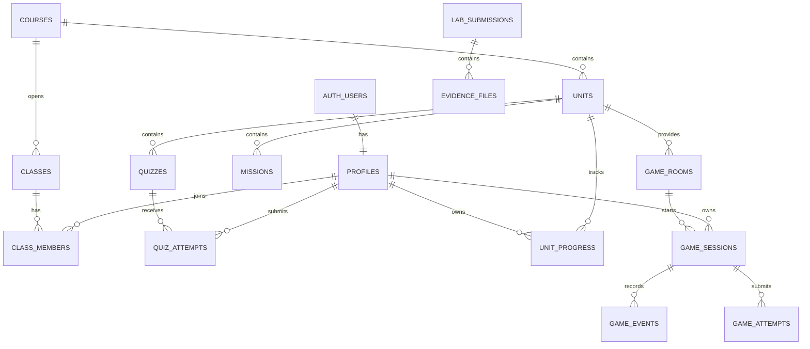

# แผนทดลองออกแบบ Supabase Schema

โครงการ: CCTV Learning Space  
รายวิชา: กล้องวงจรปิดบนระบบเครือข่าย 21909-2020  
เป้าหมาย: เรียนรู้ Supabase Database, Auth, PostgreSQL, RLS และการเก็บผลการเรียนจากระบบจริงทีละขั้น

> เอกสารนี้เป็นแผนทดลองใน Development Project ยังไม่ควรรันกับฐานข้อมูล Production

## 1. ผลลัพธ์การเรียนรู้

เมื่อทำครบ ผู้เรียนจะสามารถ:

1. อธิบายความแตกต่างระหว่าง Authentication, Authorization และ Row Level Security
2. ออกแบบ Primary Key, Foreign Key, Unique Constraint และ Check Constraint
3. เชื่อม `auth.users` กับ `public.profiles` อย่างปลอดภัย
4. ออกแบบความสัมพันธ์ Course → Unit → Mission → Attempt → Progress
5. เขียน RLS ให้ผู้เรียนเห็นเฉพาะข้อมูลของตน และครูเห็นเฉพาะชั้นที่สอน
6. อธิบายเหตุผลที่ Browser ไม่ควรกำหนดคะแนนจริง
7. เก็บ Pre-test, Post-test, เวลาเรียน, จำนวนครั้ง และหลักฐานเกมสำหรับงานวิจัยในชั้นเรียน
8. ทดสอบทั้งกรณีที่อนุญาตและกรณีที่ต้องถูกปฏิเสธ

## 2. หลักการออกแบบก่อนเริ่ม

- `auth.users` เป็นแหล่งตัวตน แต่ข้อมูลที่แอปอ่านใช้ `public.profiles`
- ทุกตารางใน `public` เปิด RLS และให้สิทธิ์เท่าที่จำเป็น
- ผู้เรียนส่งคำตอบหรือ Event ได้ แต่ห้ามเขียน `approved_score`, `passed` และ Certificate โดยตรง
- คะแนนจริงคำนวณซ้ำใน Next.js Server/Database Transaction
- ใช้ UUID เป็น Key ภายใน และใช้ `code`/`slug` เป็นค่าที่มนุษย์อ่านได้
- เก็บ `content_version` และ `scoring_version` เพื่ออธิบายได้ว่าคะแนนเกิดจากกติกาชุดใด
- ห้ามเก็บรหัสผ่านกล้อง, Service Role Key หรือภาพบุคคลจริงโดยไม่จำเป็น
- ใช้ Development, Staging และ Production แยกกัน

## 3. ภาพรวม Schema เป้าหมาย



## 4. แบ่ง Schema เป็น 3 ระดับ

### ระดับ A: MVP สำหรับเรียนรู้

| ตาราง | หน้าที่ |
|---|---|
| `profiles` | ข้อมูลผู้ใช้ที่เชื่อมกับ Supabase Auth |
| `courses` | รายวิชา |
| `units` | หน่วยการเรียนรู้ 8 หน่วย |
| `classes` | ห้องเรียนตามปีการศึกษา/ภาคเรียน |
| `class_members` | ความสัมพันธ์ผู้เรียนและครูกับห้องเรียน |
| `unit_progress` | สถานะและเวลาเรียนของผู้เรียน |

### ระดับ B: การวัดผลและงานวิจัย

| ตาราง | หน้าที่ |
|---|---|
| `quizzes` | แบบทดสอบ Pre/Post และ Version |
| `quiz_attempts` | คะแนนดิบ ร้อยละ เวลาเริ่ม/ส่ง และจำนวนครั้ง |
| `lab_submissions` | งาน LAB จริง สถานะตรวจ และ Feedback |
| `evidence_files` | Metadata ของไฟล์ใน Supabase Storage |
| `audit_logs` | ประวัติการแก้คะแนน สิทธิ์ และสถานะสำคัญ |

### ระดับ C: เกม 3D

| ตาราง | หน้าที่ |
|---|---|
| `missions` | กติกาภารกิจและ Version คะแนน |
| `game_rooms` | ห้อง 3D เช่น `room-101` |
| `game_sessions` | รอบการเล่นของผู้เรียน |
| `game_checkpoints` | จุดบันทึกเพื่อ Resume |
| `game_events` | Event ตามลำดับเวลา |
| `game_attempts` | ผลที่ Backend ตรวจและอนุมัติแล้ว |
| `game_mission_results` | ผลแยก M1–M5, Attempts และ Hints |
| `certificates` | ใบรับรองที่อ้างอิง Attempt ที่ผ่าน |

## 5. ห้องปฏิบัติการเรียนรู้

## LAB 0 — รู้จัก Project และ SQL Editor

เวลา: 30–45 นาที

### หลักการ

Supabase ให้ PostgreSQL Database, Auth, Storage และ Data API ใน Project เดียวกัน แต่แต่ละส่วนมีหน้าที่ต่างกัน

### ทดลอง

1. สร้าง Supabase Development Project
2. เปิด Table Editor, SQL Editor และ Authentication Users
3. รัน Query อ่านค่าเวลา:

```sql
select now() as database_time;
```

4. ตรวจ Postgres Version:

```sql
select version();
```

### ใบงาน

- บันทึก Project Name และ Region โดยไม่บันทึกรหัสผ่านฐานข้อมูลลง Git
- อธิบายว่า SQL Editor ต่างจาก Table Editor อย่างไร
- ระบุว่าส่วนใดเก็บ User และส่วนใดเก็บไฟล์หลักฐาน

### คำถามตรวจความเข้าใจ

1. Supabase เป็นฐานข้อมูลชนิดใด
2. `auth.users` ควรถูกอ่านตรงจาก Browser หรือไม่ เพราะเหตุใด
3. Development Project ต่างจาก Production Project อย่างไร

## LAB 1 — Profiles, Courses และ Units

เวลา: 60–90 นาที

### Observable Result

- มี Profile ที่อ้างอิง User จริง
- มีรายวิชา `21909-2020`
- มีหน่วยการเรียนรู้ 8 หน่วย และลำดับไม่ซ้ำกัน

### Schema ที่ทดลอง

```sql
create type public.app_role as enum ('student', 'teacher', 'admin');

create table public.profiles (
  id uuid primary key references auth.users(id) on delete cascade,
  student_code text unique,
  display_name text not null,
  role public.app_role not null default 'student',
  active boolean not null default true,
  created_at timestamptz not null default now(),
  updated_at timestamptz not null default now()
);

create table public.courses (
  id uuid primary key default gen_random_uuid(),
  code text not null unique,
  title text not null,
  curriculum text,
  total_hours integer not null check (total_hours > 0),
  published_version integer not null default 1,
  created_at timestamptz not null default now()
);

create table public.units (
  id uuid primary key default gen_random_uuid(),
  course_id uuid not null references public.courses(id) on delete cascade,
  sequence_no smallint not null check (sequence_no > 0),
  title text not null,
  estimated_minutes integer not null check (estimated_minutes > 0),
  content_version integer not null default 1,
  status text not null default 'draft'
    check (status in ('draft', 'published', 'archived')),
  unique (course_id, sequence_no)
);

create index units_course_id_idx on public.units(course_id);
```

### ข้อควรสังเกต

- `profiles.id` ใช้ Primary Key ของ `auth.users`
- `unique(course_id, sequence_no)` ป้องกันหน่วยลำดับเดียวกันซ้ำในรายวิชา
- Foreign Key ที่ใช้ค้นหรือทำ RLS ควรมี Index

### แบบฝึก

1. Insert รายวิชา 72 ชั่วโมง
2. Insert หน่วยที่ 1–8
3. ทดลอง Insert `sequence_no = 1` ซ้ำและบันทึก Error
4. ทดลอง Insert `total_hours = 0` และอธิบาย Check Constraint

## LAB 2 — Classes, Members และ Progress

เวลา: 90 นาที

### Observable Result

ผู้เรียนหนึ่งคนเข้าห้องเรียนได้ และมี Progress แยกตามหน่วยโดยไม่เกิดข้อมูลซ้ำ

### ตารางสำคัญ

```sql
create table public.classes (
  id uuid primary key default gen_random_uuid(),
  course_id uuid not null references public.courses(id),
  name text not null,
  academic_year smallint not null,
  term smallint not null check (term in (1, 2, 3)),
  status text not null default 'active'
    check (status in ('draft', 'active', 'closed')),
  created_at timestamptz not null default now()
);

create table public.class_members (
  class_id uuid not null references public.classes(id) on delete cascade,
  user_id uuid not null references public.profiles(id) on delete cascade,
  member_role public.app_role not null,
  status text not null default 'active'
    check (status in ('invited', 'active', 'inactive')),
  joined_at timestamptz not null default now(),
  primary key (class_id, user_id)
);

create index class_members_user_id_idx on public.class_members(user_id);

create table public.unit_progress (
  user_id uuid not null references public.profiles(id) on delete cascade,
  unit_id uuid not null references public.units(id) on delete cascade,
  status text not null default 'not_started'
    check (status in ('not_started', 'in_progress', 'waiting_review', 'completed')),
  approved_score numeric(5,2)
    check (approved_score between 0 and 100),
  time_on_task_seconds integer not null default 0
    check (time_on_task_seconds >= 0),
  updated_at timestamptz not null default now(),
  primary key (user_id, unit_id)
);
```

### แบบฝึก

1. เพิ่มผู้เรียน 2 คนและครู 1 คนในห้องทดลอง
2. สร้าง Progress หน่วยที่ 1 ให้ผู้เรียนทั้งสองคน
3. ทดลองสร้าง Progress ซ้ำของผู้เรียน/หน่วยเดิม
4. อธิบายว่าทำไม `approved_score` ต้องห้าม Browser Update โดยตรง

## LAB 3 — Pre-test, Post-test และข้อมูลวิจัย

เวลา: 90–120 นาที

### Observable Result

ระบบเก็บคะแนนก่อนเรียนและหลังเรียนโดยอ้างอิง Version ของแบบทดสอบ และคำนวณ Learning Gain ได้โดยไม่เปิดเผยชื่อในชุดส่งออก

### ฟิลด์ที่ต้องมี

`quizzes`:

- `unit_id`, `quiz_type`, `version`, `max_score`, `pass_threshold`, `published_at`

`quiz_attempts`:

- `user_id`, `quiz_id`, `attempt_no`, `raw_score`, `percent`
- `started_at`, `submitted_at`, `duration_seconds`
- `answers_hash`, `scored_by`, `scoring_version`

### Constraints ที่แนะนำ

- `quiz_type in ('pretest', 'posttest', 'practice')`
- `raw_score between 0 and max_score` ตรวจใน Transaction
- `percent between 0 and 100`
- `unique(user_id, quiz_id, attempt_no)`
- เมื่อ Submit แล้ว ผู้เรียนห้าม Update/Delete

### สูตรทดลอง

```text
Learning Gain = Post-test percent - Pre-test percent

Normalized Gain = (Post - Pre) / (100 - Pre)
```

ถ้า Pre-test เท่ากับ 100 ให้ Normalized Gain เป็น `null` และรายงานเหตุผล ไม่หารด้วยศูนย์

### แบบฝึก

1. สร้าง Pre-test และ Post-test Version 1
2. เพิ่ม Attempt ตัวอย่าง 3 คน
3. Query คะแนนต่างก่อน–หลัง
4. Export โดยใช้ `research_code` แทนชื่อ/รหัสนักเรียน
5. ตรวจว่าการเปลี่ยน Quiz Version ไม่ทำให้ข้อมูล Attempt เก่าเสียความหมาย

## LAB 4 — เกม 3D และ Server-authoritative Scoring

เวลา: 120 นาที

### Observable Result

เกมส่ง Event ได้ แต่การแก้คะแนนใน Browser ไม่เปลี่ยนคะแนนที่อนุมัติในฐานข้อมูล

### กติกา Schema

- `game_sessions.user_id` ต้องมาจากผู้ใช้ที่ Login
- หนึ่ง Session มี Event เรียงด้วย `sequence_no`
- `unique(session_id, sequence_no)` ป้องกัน Event ซ้ำ
- `game_attempts.idempotency_key` เป็น Unique ป้องกัน Submit ซ้ำเมื่ออินเทอร์เน็ตหลุด
- `score between 0 and 100`
- `result_json` เก็บผลประกอบ แต่ค่าที่ Query บ่อยต้องเป็น Column
- `certificates.attempt_id` อ้างอิง Attempt ที่ผ่านและไม่แก้ภายหลัง

### Workflow

```text
เกมส่ง Event และ Candidate Result
→ Next.js Route Handler ตรวจ Session
→ Backend โหลด scoring_version
→ คำนวณ M1–M5 ใหม่
→ Transaction บันทึก Attempt + Mission Results + Progress
→ ตอบ Approved Score กลับเกม
```

### แบบฝึก

1. ส่ง Event `camera_connected` ลำดับ 1 และ `nvr_online` ลำดับ 2
2. ทดลองส่งลำดับ 2 ซ้ำและดู Unique Constraint ทำงาน
3. ส่ง Attempt เดิมด้วย Idempotency Key เดิมสองครั้ง
4. แก้ `score` ใน Browser แล้วตรวจว่าฐานข้อมูลไม่ยอมรับ
5. ตัดการเชื่อมต่อและทดสอบ Resume จาก Checkpoint

## LAB 5 — RLS: ผู้เรียน ครู และ Admin

เวลา: 120–180 นาที

### RLS Matrix

| Resource | Student | Teacher | Admin |
|---|---|---|---|
| Profile | อ่าน/แก้เฉพาะข้อมูลที่อนุญาตของตน | อ่านสมาชิกห้องที่สอน | จัดการ |
| Course/Unit Published | อ่าน | อ่าน | จัดการ |
| Class Members | อ่านสมาชิกภาพของตน | อ่านห้องที่สอน | จัดการ |
| Progress | อ่านของตน ห้ามแก้คะแนน | อ่านห้องที่สอน | จัดการ |
| Quiz Attempt | สร้าง Draft/อ่านของตน | อ่านห้องที่สอน | จัดการ |
| Game Event | Insert ของ Session ตน | อ่านห้องที่สอน | จัดการ |
| Approved Score | อ่านของตน | ตรวจตาม Workflow | จัดการพร้อม Audit |

### ตัวอย่าง Policy สำหรับอ่าน Progress ของตน

```sql
alter table public.unit_progress enable row level security;

revoke all on table public.unit_progress from anon, authenticated;
grant select on table public.unit_progress to authenticated;

create policy "students_read_own_progress"
on public.unit_progress
for select
to authenticated
using ((select auth.uid()) = user_id);

create index unit_progress_user_id_idx
on public.unit_progress(user_id);
```

### หลักสำคัญ

- `TO authenticated` อย่างเดียวไม่ป้องกันการอ่านข้อมูลข้ามผู้ใช้
- UPDATE ต้องมีทั้ง SELECT Policy, `USING` และ `WITH CHECK`
- ห้ามใช้ `user_metadata` เป็นแหล่งกำหนดสิทธิ์ เพราะผู้ใช้แก้เองได้
- Function แบบ `SECURITY DEFINER` ต้องใช้เฉพาะเมื่อจำเป็น จำกัดสิทธิ์ Execute และตรวจ `auth.uid()` ภายใน
- View รายงานควรใช้ `security_invoker = true` หรืออยู่ใน Schema ที่ไม่เปิดผ่าน Data API

### Negative Tests ที่ต้องผ่าน

1. ผู้เรียน A อ่าน Progress ของผู้เรียน B ไม่ได้
2. ผู้เรียนแก้ `approved_score` ไม่ได้
3. ครูห้อง 1 อ่านข้อมูลห้อง 2 ไม่ได้
4. ผู้ไม่ Login อ่านรายชื่อและคะแนนไม่ได้
5. Submit ซ้ำด้วย Idempotency Key เดิมไม่เพิ่มคะแนนซ้ำ
6. Admin Action ที่เปลี่ยนคะแนนสร้าง Audit Log

## LAB 6 — Storage และหลักฐาน LAB

เวลา: 90 นาที

### Path Convention

```text
class-evidence/{class_id}/{user_id}/{submission_id}/{filename}
```

### Metadata

เก็บใน `evidence_files`:

- `submission_id`, `owner_id`, `bucket_name`, `storage_path`
- `mime_type`, `size_bytes`, `checksum_sha256`, `uploaded_at`

### แบบฝึก

1. อัปโหลดภาพหลักฐานของผู้เรียน A
2. ตรวจว่าผู้เรียน B เปิดไฟล์ไม่ได้
3. จำกัดชนิดไฟล์และขนาดไฟล์
4. ทดสอบ Upload ใหม่และ Upsert แยกกัน
5. ตรวจว่า Database ลบ Metadata และ Storage Object ตาม Workflow ที่กำหนด

## 6. ลำดับการลงมือที่แนะนำ

### รอบที่ 1: เข้าใจความสัมพันธ์

สร้างเพียง 6 ตารางระดับ MVP แล้ววาด ER Diagram ด้วยตนเอง

### รอบที่ 2: เข้าใจ Constraint

จงใจ Insert ข้อมูลผิด เพื่อดู Primary Key, Foreign Key, Unique และ Check Constraint ปฏิเสธข้อมูล

### รอบที่ 3: เข้าใจสิทธิ์

เปิด RLS แล้วทดสอบเป็น `anon`, Student A, Student B, Teacher และ Admin

### รอบที่ 4: เข้าใจ Backend Authority

ให้ Browser ส่ง Candidate Result แล้วให้ Server คำนวณคะแนนใหม่

### รอบที่ 5: เข้าใจข้อมูลวิจัย

สร้าง Pre/Post Sample Data, Learning Gain และ Export แบบไม่ระบุตัวบุคคล

## 7. Definition of Done สำหรับ Schema ทดลอง

- [ ] Schema สร้างซ้ำจาก Migration บนฐานข้อมูลว่างได้
- [ ] Seed รายวิชา 21909-2020 และ 8 หน่วยได้
- [ ] Foreign Key และ Constraint ปฏิเสธข้อมูลผิดตามที่คาด
- [ ] ทุกตารางใน `public` เปิด RLS
- [ ] Grants มีเฉพาะคำสั่งที่แต่ละ Role ต้องใช้
- [ ] RLS Tests ครบทั้ง Allow และ Deny
- [ ] ผู้เรียนอ่านข้อมูลข้ามคนไม่ได้
- [ ] ผู้เรียนเขียนคะแนนอนุมัติไม่ได้
- [ ] Submit ซ้ำไม่สร้างคะแนนซ้ำ
- [ ] Pre/Post-test อ้างอิง Version และคำนวณ Gain ได้
- [ ] ข้อมูล Export ใช้รหัสวิจัยแทนตัวตน
- [ ] ไม่พบ Service Role Key หรือ `.env` ใน Git
- [ ] Database Advisors ไม่มี Security Finding ที่ยังไม่อธิบาย

## 8. หลักฐานที่ควรเก็บทุก LAB

สร้างโฟลเดอร์หลักฐานแยกตาม LAB และบันทึก:

1. SQL ที่รัน
2. Screenshot ตารางก่อนและหลัง
3. Query ผลลัพธ์ที่ผ่าน
4. Error จาก Negative Test
5. คำอธิบายว่า Constraint/RLS ใดเป็นผู้ปฏิเสธ
6. Migration filename และ Git Commit ID
7. สรุป Predict → Experiment → Observe → Analyze → Conclusion

## 9. คำถามสรุปท้ายหน่วย

1. เพราะเหตุใด `auth.uid()` ต้องเทียบกับ `user_id`
2. Grants กับ RLS ต่างกันอย่างไร
3. เหตุใดผู้เรียนจึงไม่ควร Update คะแนนโดยตรง
4. Idempotency Key ช่วยปัญหาอินเทอร์เน็ตหลุดอย่างไร
5. JSONB เหมาะกับข้อมูลชนิดใด และข้อมูลใดควรแยกเป็น Column
6. เหตุใดต้องเก็บ `content_version` และ `scoring_version`
7. ถ้า Pre-test เท่ากับ 100 จะคำนวณ Normalized Gain อย่างไร
8. View แบบใดอาจทำให้ RLS รั่วไหล
9. ถ้าครูสอนสองห้อง RLS ควรตรวจความสัมพันธ์จากตารางใด
10. หลักฐานใดพิสูจน์ได้ว่า Student A ไม่สามารถอ่านข้อมูล Student B

## 10. ขั้นตอนถัดไปหลังทำแผนนี้

1. สร้าง Supabase Development Project
2. ติดตั้ง Supabase CLI และตรวจคำสั่งจาก `supabase --help`
3. เริ่ม Local Supabase
4. สร้าง Migration แรกสำหรับ LAB 1
5. สร้าง Seed Data รายวิชาและ 8 หน่วย
6. สร้าง RLS Test ก่อนเชื่อม Next.js
7. เมื่อ Schema และ Tests ผ่าน จึงติดตั้ง `@supabase/supabase-js` และแพ็กเกจ SSR ที่เอกสารปัจจุบันแนะนำ

หมายเหตุ ณ กันยายน 2569: Supabase กำลังเปลี่ยนนโยบายการเปิดตารางใหม่ผ่าน Data API จึงต้องตรวจ Data API Settings และกำหนด `GRANT` อย่างชัดเจน ไม่ถือว่าการมี RLS Policy เพียงอย่างเดียวเท่ากับตารางถูกเปิดใช้งานหรือปลอดภัยครบถ้วน
