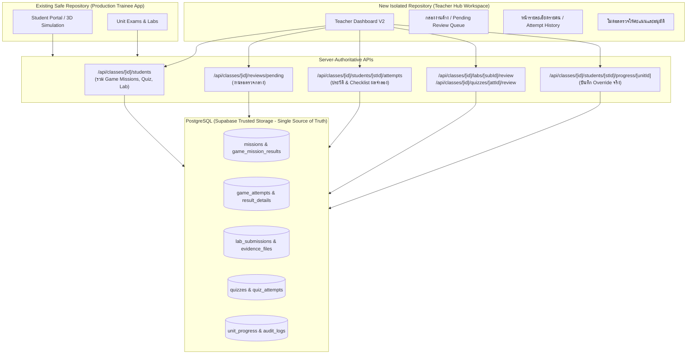

# แผนการพัฒนา Teacher Dashboard สู่ศูนย์ติดตามงานและศูนย์ตรวจ/อนุมัติ (Database Single Source of Truth)

> [!CAUTION]
> **ข้อกำหนดความปลอดภัยสูงสุด (Zero-Regression & Isolation Policy):**
> 1. **ห้ามทำระบบเก่าเสียหายเด็ดขาด**: ฟังก์ชันเดิมที่เปิดใช้งานอยู่ (ห้องเรียน 3D Room 101–108, การล็อกอิน, การส่งแล็บ, การทำข้อสอบของนักเรียน) ต้องทำงานได้ตามปกติ 100%
> 2. **สร้างเป็น Repo / Workspace แยกในการพัฒนา**: พัฒนาบน Repository / ไดเรกทอรีที่แยกขาดจากระบบหลัก เพื่อให้ทดสอบ ปรับแต่ง และตรวจสอบได้อย่างปลอดภัยโดยไม่มีผลกระทบต่อโปรเจกต์ที่ใช้งานอยู่

---

## 1. แนวทางการสร้าง Repo แยกและการป้องกันผลกระทบ (Isolation Strategy)

เพื่อป้องกันไม่ให้กระทบระบบปัจจุบันและไฟล์งานเดิม จึงกำหนดแนวทางไว้ดังนี้:

1. **การสร้าง Repository แยก (Isolated Workspace Directory)**:
   - สร้างโฟลเดอร์สำหรับพัฒนาแยกออกมาที่ระดับเดียวกับโปรเจกต์ปัจจุบัน:
     `../cctv-technician-3d-teacher-dashboard` หรือชื่อตามที่ครูผู้สอนกำหนด
   - โคลน/คัดลอกโครงสร้างโปรเจกต์และ dependencies ที่จำเป็นเข้าไปใน Repo ใหม่
   - สร้าง Git Repository แยกอิสระ พร้อมบันทึกประวัติการพัฒนาเฉพาะของ Teacher Dashboard Center
2. **การแชร์ Database / Configuration อย่างปลอดภัย**:
   - ใช้ Database Environment เดียวกันหรือใช้ Branching/Staging
   - **ห้าม Drop หรือเปลี่ยน Schema เดิมที่ใช้งานอยู่**: การเพิ่มความสามารถใหม่จะใช้การสร้าง Read View, New Functions หรือใช้ตารางที่มีอยู่แล้ว (`game_mission_results`, `game_attempts`, `lab_submissions`, `quiz_attempts`) ซึ่งถูกออกแบบไว้สมบูรณ์แล้วในฐานข้อมูล
   - มี Fallback Logic เสมอ หาก API ข้อมูลใหม่ยังไม่พร้อม ระบบจะไม่ค้างหรือแครช

---

## 2. ภาพรวมปัญหาและสถาปัตยกรรมเป้าหมาย (Architecture Overview)



---

## 3. รายละเอียดแผนการพัฒนารายระยะ (7 Phases Roadmap)

### ระยะที่ 1: วางข้อมูลกลางและมาตรฐานสถานะ (Centralized Data & Status Normalization)
* **เป้าหมาย**: เลิกใช้ค่าคาดเดา (Guessing/Hardcoding) เช่น การประมาณบทเรียนจาก % หรือการสมมติคะแนนแล็บเป็น 90 เมื่อผ่าน ให้แสดงเฉพาะค่าจริงที่บันทึกในฐานข้อมูล
* **โครงสร้างการทำงาน**:
  1. กำหนด Canonical Status Types ให้ตรงกันระหว่าง Backend และ Frontend:
     ```ts
     export type ItemProgressStatus = 
       | 'not_started'       // ยังไม่เริ่ม
       | 'in_progress'       // กำลังทำ
       | 'submitted'         // ส่งแล้ว รอตรวจ (Pending Review)
       | 'reviewing'         // กำลังตรวจ
       | 'passed'            // ผ่านเกณฑ์ (Approved / Graded)
       | 'revision_required' // ขอให้แก้ไข
       | 'failed';           // ไม่ผ่านเกณฑ์
     ```
  2. ปรับการแมปใน `TeacherApprovalDashboard.tsx`:
     - ลบโค้ดคาดเดา: `lessons: uv.progressPercent >= 40 ? 10 : ...` และ `labScore: ... ?? (uv.passed ? 90 : null)`
     - แสดงค่าจริง: หากไม่มีคะแนนบันทึก ให้แสดงสัญลักษณ์ `-` พร้อมป้ายสถานะ (Badge) ชัดเจนว่า "รอตรวจ" หรือ "ยังไม่ส่ง"
     - แยกหมวดอย่างชัดเจน: **ระบบตรวจอัตโนมัติ (Automated)** (ปรนัย, ภารกิจ 3D) กับ **ครูตรวจให้คะแนน (Teacher Evaluation)** (ปฏิบัติการแล็บ, ข้อสอบอัตนัย)

---

### ระยะที่ 2: เพิ่มผลภารกิจเกม 3D ในทะเบียนนักเรียน (Game Mission Integration)
* **เป้าหมาย**: นำข้อมูลจากตาราง `game_mission_results` และ `missions` มาแสดงในหน้าทะเบียนนักเรียน เพื่อให้ครูเห็นผลภารกิจ 3D แต่ละหน่วย
* **โครงสร้างการทำงาน**:
  1. ปรับปรุง Query ใน `src/server/services/classService.ts` (`getClassStudentsService`):
     - เพิ่ม Lateral Join ไปยัง `game_mission_results` และ `missions`:
       ```sql
       left join lateral (
         select 
           gmr.mission_id,
           m.code as mission_code,
           m.title as mission_title,
           m.max_score,
           gmr.best_score,
           gmr.attempt_count,
           gmr.hints_used,
           gmr.passed,
           gmr.first_passed_at,
           gmr.latest_attempt_id
         from public.game_mission_results as gmr
         join public.missions as m on m.id = gmr.mission_id
         where gmr.class_id = cm.class_id
           and gmr.student_id = p.id
           and m.unit_id = u.id
       ) as mission_summary on true
       ```
  2. ขยายโครงสร้าง Interface `ClassStudentRecord`:
     - เพิ่มฟิลด์ `mission?: { missionId: string; code: string; title: string; bestScore: number; maxScore: number; attemptCount: number; hintsUsed: number; passed: boolean } | null`
  3. ปรับ UI ตาราง `TeacherApprovalDashboard`:
     - แสดงแถบคอลัมน์หรือ Badge ภารกิจ 3D รายหน่วย: คะแนนสูงสุดที่ทำได้ / จำนวนครั้ง / จำนวนคำใบ้ที่ใช้ / สถานะผ่าน

---

### ระยะที่ 3: หน้ารายละเอียดรายคนและประวัติความพยายาม (Learner Deep-Dive & Attempt History)
* **เป้าหมาย**: ให้ครูกดดูประวัติการทำภารกิจแต่ละครั้งจาก `game_attempts` ไม่ใช่เห็นแค่คะแนนรวม เพื่อวิเคราะห์จุดผิดพลาดและพัฒนาการของผู้เรียน
* **โครงสร้างการทำงาน**:
  1. สร้าง API ใหม่:
     - `GET /api/classes/[classId]/students/[studentId]/attempts?unitId=...`
     - อ่านข้อมูลจาก `game_attempts`:
       - `attempt_no`, `approved_score`, `max_score_snapshot`, `passed`, `hints_used`
       - `result_details` (JSON Server Evaluation: รายการตรวจ wiring, การคำนวณบิตเรต, การตรวจสอบภาพ, การวิเคราะห์ไฟเลี้ยง)
       - `created_at`, `evaluated_at`
  2. ออกแบบคอมโพเนนต์ `StudentAttemptHistoryDrawer / Modal`:
     - **Timeline**: แสดงพัฒนาการคะแนนตามลำดับครั้งที่ทำ (Attempt 1 -> 2 -> 3)
     - **Diagnostics Checklist**: แสดงรายการที่ทำถูก vs ทำผิด ในการประเมินรอบนั้นๆ จาก Server Evaluator
     - **Hints Audit**: ตรวจสอบว่าผู้เรียนกดเปิดดูคำใบ้ในขั้นตอนใดบ้าง

---

### ระยะที่ 4: รวมกล่องงานที่รอตรวจ (Pending Review Inbox / Work Queue)
* **เป้าหมาย**: ครูมีหน้าศูนย์รวมงานค้าง (Work Box) สำหรับแล็บและข้อสอบอัตนัยที่รอตรวจ สามารถกรองตามหน่วย และเปิดตรวจได้ทันที
* **โครงสร้างการทำงาน**:
  1. สร้าง API รวมงานรอตรวจ:
     - `GET /api/classes/[classId]/reviews/pending`
     - ดึงข้อมูลจาก 2 แหล่งในคำสั่งเดียว:
       - `lab_submissions` ที่มี `status in ('submitted', 'reviewing')`
       - `quiz_attempts` ที่มีคำตอบอัตนัยและสถานะ `submitted`
       - รวมเอกสารหลักฐานแนบ (`evidence_files`: ภาพ/วิดีโอ/ไฟล์การต่อสาย)
  2. เพิ่มส่วนแสดงผล "กล่องงานรอตรวจ (Pending Submissions Queue)":
     - แถบสรุปตัวเลขงานค้างเด่นชัด เช่น `🔴 3 แล็บรอตรวจ · 2 ข้อสอบอัตนัยรอตรวจ`
     - ตัวกรอง: เลือกดูตามหน่วย (U01–U08), ประเภทงาน (แล็บ / อัตนัย)
     - รายการงานค้าง: แสดงชื่อนักศึกษา, วัน-เวลาที่ส่ง, เวลาที่รอตรวจ, ปุ่ม "เปิดตรวจงาน" เพื่อเปิดฟอร์มประเมิน

---

### ระยะที่ 5: บันทึกการตรวจและให้คะแนนในฐานข้อมูล (Server-Authoritative Evaluation)
* **เป้าหมาย**: ยกเลิกการเขียนลง `localStorage` สำหรับการตรวจข้อสอบอัตนัยและแล็บ ให้บันทึกผ่าน API เซิร์ฟเวอร์พร้อมบันทึกผู้ตรวจและประวัติย้อนหลัง
* **โครงสร้างการทำงาน**:
  1. ปรับปรุงฝั่งประเมินผลแล็บ:
     - เรียกใช้ `reviewLabSubmissionService` (`PATCH /api/classes/[classId]/labs/[submissionId]/review`)
     - ส่งสถานะ (`passed` / `revision_required`), คะแนน (`approvedScore`), และข้อเสนอแนะ (`feedback`)
     - บันทึก `reviewed_by = teacherId` และ `reviewed_at = now()`
  2. สร้างบริการตรวจข้อสอบอัตนัย/แบบทดสอบ:
     - สร้าง `reviewQuizAttemptService` ใน `src/server/services/teacherReviewService.ts`
     - สร้าง Endpoint `PATCH /api/classes/[classId]/quizzes/[attemptId]/review`
     - อัปเดตตาราง `quiz_attempts`: `status = 'approved'`, `approved_score`, `approved_by`, `evaluation_reason`
  3. ปรับ `UnitExamModal.tsx`:
     - ส่งคำตอบอัตนัยเข้าเซิร์ฟเวอร์จริงผ่าน `POST /api/learning/submissions` ไม่เก็บเฉพาะในเครื่อง

---

### ระยะที่ 6: ปรับการปลดล็อกและอนุมัติสิทธิ์สู่ระบบฐานข้อมูล (Centralized Unlocking & Access Control)
* **เป้าหมาย**: ย้ายปุ่มสวิตช์ปลดล็อก/ล็อกหน่วย และการ Override สิทธิ์จาก `localStorage` ไปบันทึกลงฐานข้อมูลกลาง พร้อมตรวจสอบสิทธิ์ครู
* **โครงสร้างการทำงาน**:
  1. การปลดล็อกและ Override รายบุคคล:
     - ปรับให้ปุ่ม "อนุมัติผ่าน" ใน Dashboard เรียก `PATCH /api/classes/[classId]/students/[studentId]/progress/[unitId]`
     - ส่งเข้า `overrideStudentProgressService` ที่เรียก `private.override_unit_progress(...)`
     - บันทึกลงตาราง `audit_logs` อัตโนมัติด้วย action `unit_progress.teacher_override` เพื่อความโปร่งใส
  2. การตั้งค่าการเปิด/ล็อกหน่วยระดับชั้นเรียน (Class-wide Access Rule):
     - บันทึกการเปิด-ปิดหน่วยเรียนลงในการตั้งค่าของชั้นเรียน หรือแมปผ่าน Unit Progression Rules ในฐานข้อมูล
     - นำค่าสิทธิ์ที่แท้จริงจากฐานข้อมูลมาแสดงแทนการอ่าน `localStorage.getItem('cctv_teacher_approvals')`

---

### ระยะที่ 7: ระบบติดตาม กรองข้อมูล และส่งออกรายงานสรุป (Monitoring, Analytics & CSV Export)
* **เป้าหมาย**: เพิ่มเครื่องมือค้นหา กรองสถานะ และส่งออกรายงานเกรด/คะแนนสรุปเป็น CSV ภาษาไทยที่เปิดใน Excel ได้ถูกต้อง
* **โครงสร้างการทำงาน**:
  1. เครื่องมือค้นหาและกรอง (Filters & Search Bar):
     - ค้นหาทันทีด้วยรหัสนักศึกษา หรือชื่อ-นามสกุล
     - ตัวกรองสถานะ: "ยังไม่เริ่ม", "กำลังเรียน", "มีงานรอตรวจ", "ผ่านครบทุกหน่วย"
  2. การส่งออกไฟล์ CSV สมบูรณ์ (Authoritative CSV Export):
     - ใส่ UTF-8 BOM (`\uFEFF`) ป้องกันปัญหาฟอนต์ภาษาไทยเพี้ยนใน MS Excel
     - คอลัมน์รายงานครอบคลุม:
       - รหัสนักศึกษา, ชื่อ-นามสกุล
       - สถานะหน่วย (U01–U08)
       - คะแนนแบบทดสอบจริง (Quiz Approved Score)
       - คะแนนแล็บจริง (Lab Approved Score)
       - คะแนนภารกิจ 3D ที่ดีที่สุด (Game Best Score)
       - จำนวนรอบและคำใบ้ที่ใช้ (Attempts & Hints)
       - วันเวลาที่ผ่าน และผู้อนุมัติ (Approved Timestamp & Evaluator)

---

## 4. แผนการทดสอบและความปลอดภัย (Verification & Security Plan)

1. **สิทธิ์และการเข้าถึง (Authorization & RLS)**:
   - ตรวจสอบผ่าน `assertCanManageClass(actorId, classId)` ในทุก Endpoint ของฝั่งครู
   - ตรวจสอบว่าครูผู้สอนมีสถานะเป็น `active` และสังกัดชั้นเรียนนั้นจริง
2. **ความถูกต้องของข้อมูล (Data Integrity)**:
   - บันทึกการอนุมัติและ Override ผ่าน `audit_logs` ใน Trusted Transaction เสมอ
   - ป้องกันการส่งคะแนนหลอก หรือการแทรกแซงคะแนนจาก Client
3. **การทดสอบอัตโนมัติ (Automated Tests)**:
   - รัน Unit / Integration Tests ด้วย `vitest` ทุกขั้นตอนที่มีการแก้ไข Service และ API
   - ตรวจสอบ SSR Hydration และการ Render ของ `TeacherApprovalDashboard` ไม่ให้เกิด Layout Divergence
