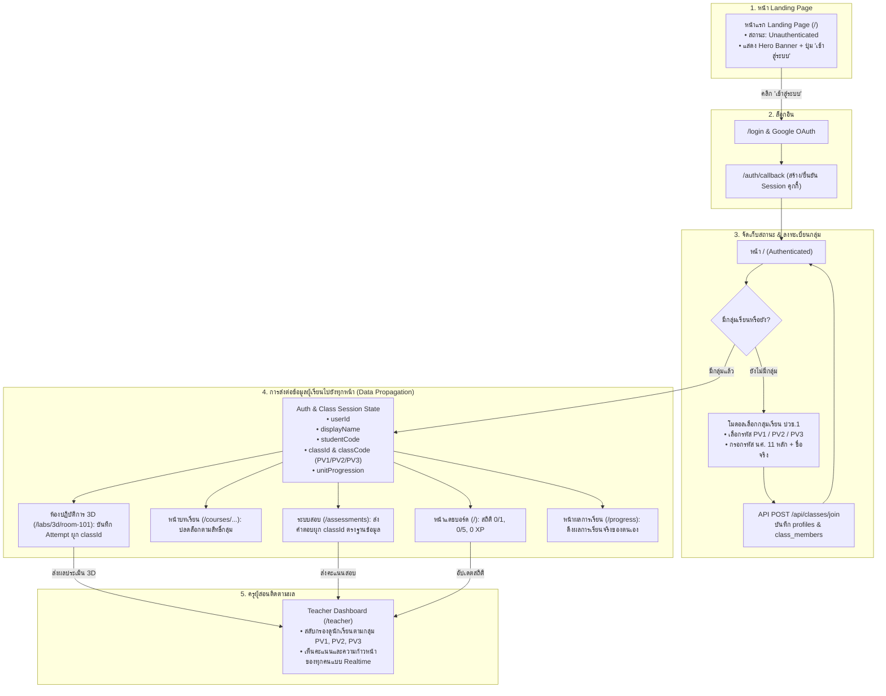

# แผนการพัฒนา: Flow การเข้าใช้งาน การรักษาสถานะ และการส่งต่อข้อมูลผู้เรียน (Landing → Login → Group Selection → Session Propagation)

> [!NOTE]
> **สถานะ: รอครูผู้สอนอนุมัติก่อนเริ่มดำเนินการ (Pending User Approval)**
> แผนนี้มุ่งเน้นการจัดลำดับการทำงาน (User Flow) ตั้งแต่หน้าแรก จนถึงการส่งต่อข้อมูลผู้เรียนไปยังทุกหน้าในระบบอย่างต่อเนื่องและปลอดภัย โดยใช้ Database และ Server Session เป็นแกนกลาง

---

## 1. ลำดับขั้นตอนการทำงานที่ต้องการ (User Journey Flow)

```
[นักเรียนเข้าเว็บ] 
   └──> [1. เห็นหน้า Landing Page (ยังไม่ล็อกอิน)]
           └──> [2. กดปุ่ม 'เข้าสู่ระบบ' -> ทำการ Login ด้วย Google]
                   └──> [3. ระบบจัดเก็บและรักษาสถานะการ Login (Session & Cookies)]
                           └──> [4. ถ้ายังไม่มีกลุ่ม -> เลือกรหัสกลุ่มเรียน ปวช.1 (PV1 / PV2 / PV3)]
                                   └──> [5. เข้าเรียนแต่ละหน้า โดยข้อมูล Login & กลุ่มเรียน ถูกส่งต่อให้ทุกหน้าใช้งานร่วมกัน]
```

---

## 2. ปัญหาและจุดที่ต้องปรับปรุงในปัจจุบัน (Current System Gaps)

1. **หน้า Landing Page (`/`)**:
   - ปัจจุบันโค้ดสั่ง `redirect('/login?next=/')` ทันทีเมื่อไม่พบ Session ทำให้คนทั่วไปไม่เห็นหน้า Landing Page
   - **แนวทางแก้**: ปรับหน้า `/` ให้แสดงแบนเนอร์ Hero กล้องวงจรปิดบนระบบเครือข่าย พร้อมปุ่ม "เข้าสู่ระบบ" และพรีวิวรายวิชาแก่ผู้ที่ยังไม่ล็อกอิน
2. **การคงอยู่และการส่งต่อสถานะผู้ใช้งาน (Auth Session & Data Propagation)**:
   - ปัจจุบัน `/api/auth/me` ส่งเฉพาะ `{ userId, displayName, role, studentCode }` โดย**ยังไม่มีข้อมูลกลุ่มเรียน (`classId`, `classCode`)**
   - หน้าเนื้อหาเรียน (`/courses/...`) และแบบทดสอบบางหน้า ยังไม่ได้ตรวจ Session ฝั่งเซิร์ฟเวอร์ และยังไม่ได้ส่ง `classId` ให้กับคอมโพเนนต์ย่อย ทำให้บางส่วนยังต้องพึ่งพา `localStorage`
   - **แนวทางแก้**: อัปเดต `/api/auth/me` และเพิ่ม Session Context เพื่อส่ง `{ userId, displayName, studentCode, classId, classCode }` ไปยังทุกหน้าโดยอัตโนมัติ
3. **การเข้าห้องเรียน 3 กลุ่ม ปวช.1 (`PV1`, `PV2`, `PV3`)**:
   - นักเรียนล็อกอิน Google แล้วจะยังไม่มี `class_members` และ `student_code` เป็น `null`
   - **แนวทางแก้**: สร้างโมดอลเลือกรหัสกลุ่ม (`PV1`, `PV2`, `PV3`) พร้อมกรอกรหัสนักศึกษาและชื่อจริง เพื่อบันทึกเข้าฐานข้อมูลจริงผ่าน `POST /api/classes/join`

---

## 3. สถาปัตยกรรมการส่งต่อข้อมูลระหว่างหน้าเว็บ (Data Propagation Architecture)



---

## 4. แผนการดำเนินงานรายระยะ (Action Plan)

### ระยะที่ 1: หน้าแรก Landing Page (Public View) & การบังคับล็อกอิน
1. **ปรับปรุง `src/app/page.tsx`**:
   - ถ้ายังไม่ล็อกอิน (`unauthenticated`): แสดงผล Landing Page ที่มีแบนเนอร์ Hero กล้องวงจรปิด, วัตถุประสงค์การเรียนรู้, และปุ่ม **"เข้าสู่ระบบ"** (`href="/login?next=/"`) โดยไม่ redirect หนี
   - ถ้าล็อกอินแล้ว (`authenticated`): โหลดข้อมูลสมาชิกและสถิติการเรียน
2. **Server-side Session Guard**:
   - ปกป้องหน้าภายใน (`/courses/...`, `/labs/...`, `/missions`, `/assessments`, `/progress`, `/teacher`) ถ้ายังไม่ล็อกอิน ให้ redirect ไป `/login?next=[currentPath]` ทันที

### ระยะที่ 2: สร้างข้อมูล 3 กลุ่มเรียน ปวช.1 ในฐานข้อมูล (PV1, PV2, PV3)
1. บันทึกข้อมูลชั้นเรียน 3 กลุ่มลงในตาราง `public.classes`:
   - **กลุ่ม 1**: code = `'PV1'`, title = `'ปวช.1 ช่างอิเล็กทรอนิกส์/คอมพิวเตอร์ (กลุ่ม 1)'`
   - **กลุ่ม 2**: code = `'PV2'`, title = `'ปวช.1 ช่างอิเล็กทรอนิกส์/คอมพิวเตอร์ (กลุ่ม 2)'`
   - **กลุ่ม 3**: code = `'PV3'`, title = `'ปวช.1 ช่างอิเล็กทรอนิกส์/คอมพิวเตอร์ (กลุ่ม 3)'`
   - ผูกกับวิชา 21909-2020

### ระยะที่ 3: ระบบเลือกรหัสกลุ่มเรียน (`StudentClassJoinModal` & `POST /api/classes/join`)
1. **API `POST /api/classes/join`**:
   - รับ `{ joinCode: 'PV1' | 'PV2' | 'PV3', studentCode: string, displayName: string }`
   - ตรวจสอบรูปแบบรหัสนักศึกษา (เช่น 11 หลัก เช่น `69219090001`) และชื่อจริง
   - อัปเดต `public.profiles` (`student_code`, `display_name`)
   - บันทึกการลงทะเบียนเข้า `public.class_members` (`member_role = 'student'`, `active = true`)
2. **คอมโพเนนต์ `StudentClassJoinModal.tsx`**:
   - ปรากฏบนหน้าแดชบอร์ดอัตโนมัติเมื่อนักเรียนล็อกอินแล้วแต่ยังไม่มีห้องเรียน (Unclosable Modal)
   - ให้นักเรียนคลิกเลือกกลุ่ม `PV1` / `PV2` / `PV3` พร้อมกรอกรหัสนักศึกษา และกดยืนยัน

### ระยะที่ 4: การส่งต่อข้อมูลผู้เรียนไปยังทุกหน้า (Data Propagation)
1. **อัปเดต `/api/auth/me`**:
   - ขยาย Response ให้ส่งข้อมูลห้องเรียนด้วย:
     ```json
     {
       "user": {
         "userId": "uuid",
         "displayName": "นายสมชาย ใจดี",
         "role": "student",
         "studentCode": "69219090001"
       },
       "membership": {
         "classId": "uuid-of-pv1",
         "classCode": "PV1",
         "classTitle": "ปวช.1 ช่างอิเล็กทรอนิกส์/คอมพิวเตอร์ (กลุ่ม 1)"
       }
     }
     ```
2. **ส่งต่อค่า `classId` และ `studentId` ให้คอมโพเนนต์การเรียนรู้ทั้งหมด**:
   - แถบเมนูด้านบน ([PortalGlobalNav.tsx](file:///e:/งานปี%202026/แผนการสอน%20หน่วยการสอน%20วิชาสอน%20คะแนน/ภาคเรียน2-69/กล้องวงจรปิด/cctv-technician-3d-training-center/src/components/portal/PortalGlobalNav.tsx)) แสดงชื่อ, รหัสนักศึกษา, และป้ายกลุ่มเรียน (`PV1`/`PV2`/`PV3`)
   - ห้องแล็บ 3D ([LabClientContainer.tsx](file:///e:/งานปี%202026/แผนการสอน%20หน่วยการสอน%20วิชาสอน%20คะแนน/ภาคเรียน2-69/กล้องวงจรปิด/cctv-technician-3d-training-center/src/app/labs/3d/%5BroomId%5D/LabClientContainer.tsx)): ใช้ `classId` จริงของกลุ่มในการส่งผลประเมิน ไม่ใช้ UUID หลอก
   - ระบบสอบ ([UnitExamModal.tsx](file:///e:/งานปี%202026/แผนการสอน%20หน่วยการสอน%20วิชาสอน%20คะแนน/ภาคเรียน2-69/กล้องวงจรปิด/cctv-technician-3d-training-center/src/components/portal/UnitExamModal.tsx)): ส่งคะแนนเข้าฐานข้อมูลโดยผูกกับ `classId` ของกลุ่มจริง ตัดการอ่าน/เขียน `localStorage`
3. **เชื่อมโยงผลเข้าสู่ Teacher Dashboard**:
   - หน้า `/teacher` สามารถสลับแท็บดูคะแนนของกลุ่ม `PV1`, `PV2`, `PV3` จากฐานข้อมูลจริง
   - เมื่อนักเรียนในกลุ่มส่งงานหรือทำภารกิจ ผลจะไปขึ้นบนหน้าจอของครูทันที

---

## 5. ผลการดำเนินงาน (Completed)
ทุกขั้นตอนได้รับการพัฒนาและตรวจสอบความถูกต้องเรียบร้อยแล้ว:
1. [x] **Migration ข้อมูลกลุ่มเรียน**: สร้างกลุ่ม ปวช.1 (`PV1`, `PV2`, `PV3`) ในตาราง `classes`
2. [x] **หน้า Landing Page & การเข้าสู่ระบบ**: ผู้เข้าชมเห็นหน้าแรกโดยไม่ถูก redirect บังคับ, ปุ่ม "เข้าสู่ระบบ" นำทางไปสู่การ Login
3. [x] **โมดอลเลือกรหัสกลุ่มเรียน**: นักเรียนใหม่สามารถเลือกรหัสกลุ่มเรียน (`PV1`/`PV2`/`PV3`) พร้อมกรอกรหัสนักศึกษาและชื่อจริง เพื่อบันทึกลงตาราง `profiles` และ `class_members` ในฐานข้อมูลจริง
4. [x] **Data Propagation ข้ามทุกหน้า**: ข้อมูลผู้เรียนและกลุ่มเรียนถูกส่งต่อไปยัง Navbar, Dashboard สถิติ, และห้องปฏิบัติการ 3D
5. [x] **Teacher Dashboard Group Switcher**: ครูผู้สอนสามารถสลับดูกลุ่มเรียน `PV1`, `PV2`, และ `PV3` ได้อย่างอิสระ พร้อมระบบ Real-time ซิงค์ข้อมูลนักเรียน
6. [x] **Zero-Regression Verification**: ผ่านการทดสอบทั้งหมด 48 test files (221 tests passing 100%)
