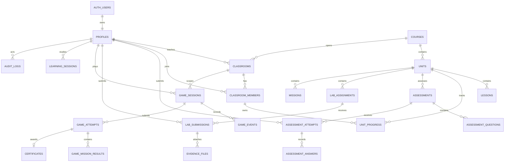

# Supabase Schema Blueprint — CCTV Learning Space

โครงการ Supabase: `cctv-learning-space-dev`  
Project Ref: `sdhyjirmzjxxekezlcxl`  
รายวิชา: `21909-2020 กล้องวงจรปิดบนระบบเครือข่าย`  
สถานะเอกสาร: แบบแม่สำหรับ Development ก่อนสร้าง Migration จริง

## 1. เป้าหมายของฐานข้อมูล

ฐานข้อมูลต้องรองรับงาน 6 ด้านพร้อมกัน:

1. ตัวตนและสิทธิ์ของ Student, Teacher และ Admin
2. รายวิชา หน่วย บทเรียน และเนื้อหาแบบ Versioned
3. ห้องเรียน สมาชิก และความก้าวหน้ารายหน่วย
4. Pre-test, Post-test, Practice และงาน LAB
5. เกมฝึกปฏิบัติ 3D พร้อม Event, Attempt และคะแนนที่ Backend อนุมัติ
6. หลักฐานการเรียนรู้ Audit Log และชุดข้อมูลสำหรับงานวิจัยในชั้นเรียน

## 2. ขอบเขตความเชื่อถือ

```text
React/Browser
  ├─ อ่านข้อมูลที่ RLS อนุญาต
  ├─ ส่งคำตอบ Event และ Candidate Result
  └─ ห้ามกำหนด approved_score, passed และ certificate
                    │
                    ▼
Next.js Server / Route Handler
  ├─ ตรวจ Session และสมาชิกห้อง
  ├─ ตรวจคำตอบ/กติกาเกมตาม Version
  ├─ คำนวณคะแนนและสถานะผ่านใหม่
  └─ Transaction: Attempt + Result + Progress + Audit
                    │
                    ▼
Supabase PostgreSQL
  ├─ Constraint ป้องกันข้อมูลผิดรูป
  ├─ Foreign Key ป้องกันข้อมูลกำพร้า/ข้ามห้อง
  ├─ RLS ป้องกันข้อมูลข้ามผู้ใช้
  └─ Audit เก็บการเปลี่ยนแปลงสำคัญ
```

ห้ามวาง Secret Key หรือ `service_role` ในตัวแปร `NEXT_PUBLIC_*` หรือใน Browser

## 3. ER Diagram เป้าหมาย



## 4. Data Dictionary

ทุกตารางธุรกิจควรมี `created_at`; ตารางที่แก้ไขได้ควรมี `updated_at`

### 4.1 Identity และหลักสูตร

| ตาราง | Primary Key | คอลัมน์สำคัญ | หน้าที่และกฎ |
|---|---|---|---|
| `profiles` | `id uuid` → `auth.users.id` | `student_code`, `display_name`, `role`, `active` | ข้อมูลผู้ใช้ของแอป; Browser แก้ได้เฉพาะชื่อที่กำหนด |
| `courses` | `id bigint identity` | `code`, `title`, `total_hours`, `published_version`, `status` | รายวิชา; `code` ไม่ซ้ำ |
| `units` | `id bigint identity` | `course_id`, `sequence_no`, `slug`, `content_version`, `status` | หน่วยเรียน; ลำดับและ slug ไม่ซ้ำภายใน Course |
| `lessons` | `id bigint identity` | `unit_id`, `sequence_no`, `lesson_type`, `title`, `content_json`, `content_version`, `status` | เนื้อหาแต่ละตอน; JSONB ใช้กับ Block Content ที่โครงสร้างยืดหยุ่น |

### 4.2 ห้องเรียนและความก้าวหน้า

| ตาราง | Primary Key | คอลัมน์สำคัญ | หน้าที่และกฎ |
|---|---|---|---|
| `classrooms` | `id bigint identity` | `course_id`, `teacher_id`, `classroom_code`, `academic_year`, `semester`, `status` | ห้องเรียนหนึ่งห้องผูกหนึ่ง Course และครูเจ้าของ |
| `classroom_members` | `(classroom_id, profile_id)` | `member_role`, `active`, `joined_at` | ห้ามสมาชิกซ้ำในห้องเดียวกัน |
| `unit_progress` | `(classroom_id, profile_id, unit_id)` | `course_id`, `status`, `progress_percent`, `best_score`, `attempt_count` | ต้องอ้างสมาชิกจริงและ Unit ที่อยู่ Course เดียวกับห้อง |
| `learning_sessions` | `id uuid` | `classroom_id`, `profile_id`, `unit_id`, `started_at`, `ended_at`, `active_seconds`, `source` | เก็บเวลาเรียนจาก Server; จำกัด `active_seconds >= 0` |

### 4.3 แบบทดสอบและงานวิจัย

| ตาราง | Primary Key | คอลัมน์สำคัญ | หน้าที่และกฎ |
|---|---|---|---|
| `assessments` | `id bigint identity` | `unit_id`, `assessment_type`, `version`, `max_score`, `pass_percent`, `status` | `assessment_type`: pretest/posttest/practice; Version ห้ามซ้ำใน Unit/Type |
| `assessment_questions` | `id bigint identity` | `assessment_id`, `sequence_no`, `question_type`, `prompt_json`, `answer_key_json`, `points` | Answer Key อ่านได้เฉพาะ Backend/ผู้มีสิทธิ์จัดการ |
| `assessment_attempts` | `id uuid` | `assessment_id`, `classroom_id`, `profile_id`, `attempt_no`, `status`, `raw_score`, `percent`, `scoring_version` | คะแนนอนุมัติเขียนโดย Backend; Attempt ไม่ซ้ำ |
| `assessment_answers` | `id bigint identity` | `attempt_id`, `question_id`, `answer_json`, `awarded_points`, `is_correct` | แยกคำตอบออกจาก Attempt เพื่อวิเคราะห์ข้อผิดพลาด |
| `research_subjects` | `(classroom_id, profile_id)` | `research_code`, `consent_status` | ใช้รหัสนิรนามสำหรับ Export; ห้ามส่งชื่อ/อีเมลไปชุดวิจัย |

สูตรรายงาน:

```text
Learning Gain = Post-test percent - Pre-test percent
Normalized Gain = (Post - Pre) / (100 - Pre)
```

เมื่อ Pre-test = 100 ให้ `normalized_gain = null` เพื่อไม่หารด้วยศูนย์

### 4.4 งาน LAB และหลักฐาน

| ตาราง | Primary Key | คอลัมน์สำคัญ | หน้าที่และกฎ |
|---|---|---|---|
| `lab_assignments` | `id bigint identity` | `unit_id`, `title`, `rubric_json`, `max_score`, `version`, `status` | Rubric ต้องเก็บ Version |
| `lab_submissions` | `id uuid` | `assignment_id`, `classroom_id`, `profile_id`, `attempt_no`, `status`, `approved_score`, `feedback` | ผู้เรียนส่ง Draft ได้ แต่คะแนนและผลตรวจเป็นของ Backend/ครู |
| `evidence_files` | `id uuid` | `submission_id`, `owner_id`, `bucket_name`, `storage_path`, `mime_type`, `size_bytes`, `checksum_sha256` | เก็บ Metadata; ตัวไฟล์อยู่ Supabase Storage |

รูปแบบ Storage Path:

```text
class-evidence/{classroom_id}/{profile_id}/{submission_id}/{filename}
```

### 4.5 เกมฝึกปฏิบัติ 3D

| ตาราง | Primary Key | คอลัมน์สำคัญ | หน้าที่และกฎ |
|---|---|---|---|
| `missions` | `id bigint identity` | `unit_id`, `code`, `title`, `mission_version`, `scoring_version`, `rules_json`, `status` | เก็บกติกาภารกิจแบบมี Version |
| `game_sessions` | `id uuid` | `classroom_id`, `profile_id`, `game_version`, `started_at`, `ended_at`, `status` | Session ต้องเป็นของสมาชิกที่ Login |
| `game_events` | `id bigint identity` | `session_id`, `sequence_no`, `event_type`, `event_at`, `payload_json` | `unique(session_id, sequence_no)` ป้องกัน Event ซ้ำ |
| `game_attempts` | `id uuid` | `session_id`, `mission_id`, `idempotency_key`, `candidate_json`, `approved_score`, `passed`, `scoring_version` | Idempotency Key ไม่ซ้ำ; Browser ส่ง Candidate แต่ห้ามอนุมัติคะแนน |
| `game_mission_results` | `(attempt_id, objective_code)` | `score`, `attempt_count`, `hint_count`, `result_json` | ผลย่อย M1–M5 เพื่อ Dashboard และวิเคราะห์ข้อผิดพลาด |
| `game_checkpoints` | `session_id` | `checkpoint_version`, `state_json`, `saved_at` | หนึ่ง Checkpoint ล่าสุดต่อ Session สำหรับ Resume |
| `certificates` | `id uuid` | `profile_id`, `course_id`, `source_attempt_id`, `certificate_no`, `issued_at`, `revoked_at` | อ้าง Attempt ที่ผ่าน; ผู้เรียนสร้างเองไม่ได้ |

### 4.6 Audit

| ตาราง | Primary Key | คอลัมน์สำคัญ | หน้าที่และกฎ |
|---|---|---|---|
| `audit_logs` | `id bigint identity` | `actor_id`, `action`, `entity_type`, `entity_id`, `before_json`, `after_json`, `request_id`, `created_at` | Append-only; Browser ห้าม Update/Delete |

ข้อมูลลับ เช่น Password, Access Token, Secret Key และภาพบุคคลจริง ห้ามเก็บใน `payload_json`, `result_json` หรือ `audit_logs`

## 5. กฎ Constraint สำคัญ

1. คะแนนและร้อยละต้องอยู่ระหว่าง 0–100
2. `completed` ต้องมี `progress_percent = 100` และ `completed_at`
3. `submitted_at >= started_at` และ `ended_at >= started_at`
4. Attempt Number ต้องมากกว่า 0 และไม่ซ้ำในขอบเขตเดียวกัน
5. Foreign Key แบบผสมป้องกัน Progress ข้าม Classroom/Course
6. Event ใช้ `unique(session_id, sequence_no)`
7. Submission ใช้ `unique(assignment_id, classroom_id, profile_id, attempt_no)`
8. Assessment ใช้ `unique(unit_id, assessment_type, version)`
9. Mission ใช้ `unique(unit_id, code, mission_version)`
10. Certificate Number และ Idempotency Key ต้องไม่ซ้ำ

## 6. RLS Matrix

| Resource | anon | Student | Teacher เจ้าของห้อง | Admin/Backend |
|---|---|---|---|---|
| Published Course/Unit/Lesson | ไม่อ่าน | อ่าน | อ่าน | จัดการ |
| Profile | ไม่อ่าน | อ่านตนเอง/แก้เฉพาะชื่อ | อ่านสมาชิกห้องผ่าน Server | จัดการ |
| Classroom | ไม่อ่าน | อ่านห้องที่เป็นสมาชิก | อ่านห้องตนเอง | จัดการ |
| Classroom Member | ไม่อ่าน | อ่านสมาชิกภาพตนเอง | อ่านห้องตนเอง | จัดการ |
| Progress/Attempt/Submission | ไม่อ่าน | อ่านของตน | อ่านห้องตนเอง | ตรวจและเขียนผล |
| Game Event | ไม่อ่าน | ส่งผ่าน API ที่ตรวจ Session | อ่านสรุปห้อง | ตรวจ/บันทึก |
| Approved Score/Passed | ไม่อ่าน | อ่านอย่างเดียว | อ่าน/อนุมัติตาม Workflow | เขียนพร้อม Audit |
| Research Export | ไม่อ่าน | ไม่อ่าน | อ่านชุดนิรนามที่ได้รับอนุญาต | สร้าง Export |
| Audit Log | ไม่อ่าน | ไม่อ่าน | อ่านเฉพาะเหตุการณ์ที่อนุญาต | Append/ตรวจสอบ |

หลักการ RLS:

- เปิด RLS ทุกตารางใน `public`
- `revoke all` จาก `anon`, `authenticated` แล้วคืนเฉพาะ Operation ที่ต้องใช้
- `TO authenticated` ต้องมีเงื่อนไขเจ้าของ/สมาชิกเสมอ
- ไม่ใช้ `user_metadata` ตัดสินสิทธิ์
- Helper แบบ `security definer` อยู่ใน `private`, ตรวจ `auth.uid()`, ล็อก `search_path = ''`, จำกัด `EXECUTE`
- View ที่เปิดผ่าน Data API ใช้ `security_invoker = true`

## 7. Index Strategy

สร้าง Index ให้ Foreign Key และคอลัมน์ที่ใช้ใน RLS/หน้า Dashboard เช่น:

- `classrooms(teacher_id, status)`
- `classroom_members(profile_id, active)`
- `unit_progress(profile_id, classroom_id)`
- `assessment_attempts(profile_id, assessment_id, submitted_at desc)`
- `lab_submissions(classroom_id, status, submitted_at desc)`
- `game_sessions(profile_id, started_at desc)`
- `game_events(session_id, sequence_no)` ซึ่งได้จาก Unique
- `audit_logs(entity_type, entity_id, created_at desc)`

ไม่สร้าง Index ทุกคอลัมน์โดยอัตโนมัติ ต้องอ้างอิง Query จริงและตรวจด้วย Advisor/`explain analyze`

## 8. ลำดับ Migration ที่ปลอดภัย

| Phase | Migration | ขอบเขต |
|---|---|---|
| 0 | `baseline_existing_lab_01` | จับ Schema ปัจจุบัน 3 ตารางเข้าสู่ประวัติ โดยไม่สร้างซ้ำ |
| 1 | `create_classrooms_members_progress` | LAB 2: ห้อง สมาชิก Progress และ RLS |
| 2 | `create_lessons_assessments_research` | Lesson, Pre/Post, Answers, Learning Sessions, Research Codes |
| 3 | `create_labs_and_evidence_metadata` | LAB Submission และ Storage Metadata |
| 4 | `create_game_training_records` | Mission, Session, Events, Attempts, Checkpoints, Results |
| 5 | `create_audit_and_certificates` | Audit Log และ Certificate |
| 6 | `add_reporting_views_and_rls_tests` | View แบบ Security Invoker และ pgTAP Allow/Deny Tests |

ห้ามนำ Migration ทั้งหมดขึ้น Production พร้อมกัน ให้ผ่าน Development → Test/Branch → Production ทีละ Phase

## 9. Acceptance Tests

ทุก Phase ต้องทดสอบอย่างน้อย:

1. Student A อ่านข้อมูล Student B ไม่ได้
2. Teacher ห้อง A อ่านห้อง B ไม่ได้
3. anon อ่านสมาชิก คะแนน และหลักฐานไม่ได้
4. Browser เขียน `approved_score`, `passed`, `certificate` ไม่ได้
5. Progress ข้าม Course หรือคนที่ไม่ใช่สมาชิกถูก Foreign Key ปฏิเสธ
6. คะแนนนอก 0–100 และลำดับเวลาผิดถูก Check Constraint ปฏิเสธ
7. Idempotency Key/Event Sequence ซ้ำไม่เพิ่มผลซ้ำ
8. การแก้คะแนนที่อนุญาตสร้าง Audit Log
9. Export งานวิจัยไม่มีชื่อ อีเมล หรือ Student Code
10. Migration สร้างฐานข้อมูลใหม่ได้ และ Cleanup/Test ใช้ Transaction/Rollback

## 10. Definition of Done

- Schema และ Migration อยู่ใน Git
- Migration History ของ Local/Remote ตรงกัน
- Seed ใช้ข้อมูลทดลอง ไม่ใช้ข้อมูลนักเรียนจริง
- pgTAP ทดสอบ Allow และ Deny ครบ
- ทุกตาราง Public เปิด RLS และมี GRANT เท่าที่จำเป็น
- Security/Performance Advisors ผ่าน หรือมีเหตุผลกำกับทุก Finding
- TypeScript Types สร้างใหม่หลัง Migration
- ไม่มี Secret Key, Database Password หรือ `.env.local` ใน Commit
- มี Screenshot/Query Result/Commit ID เป็นหลักฐานแต่ละ Phase

